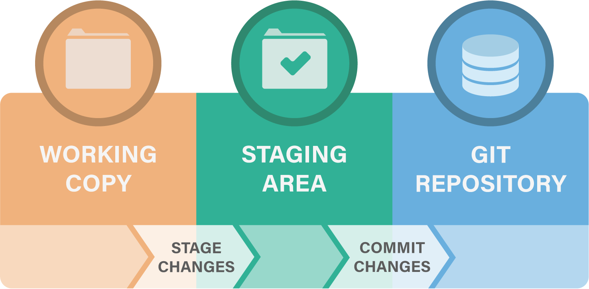
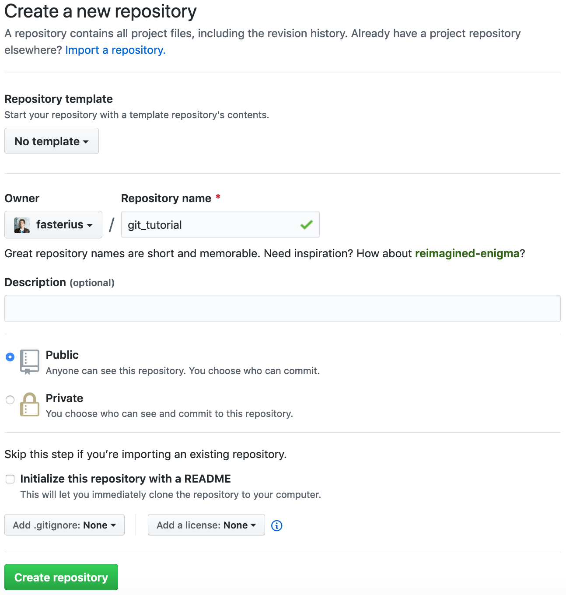
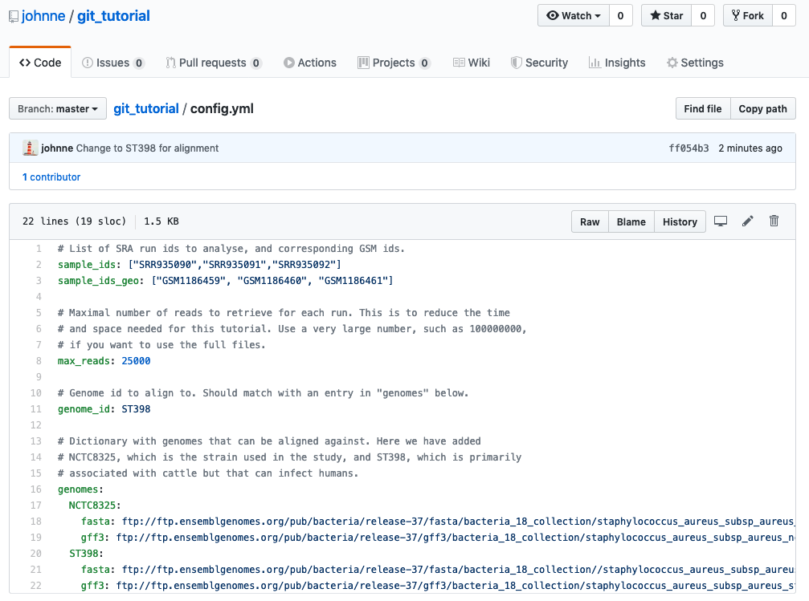
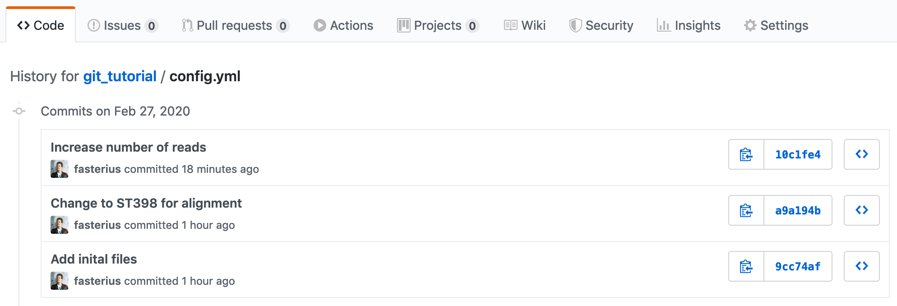
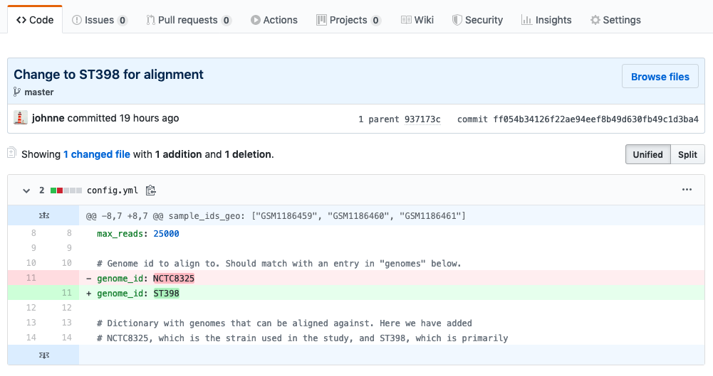
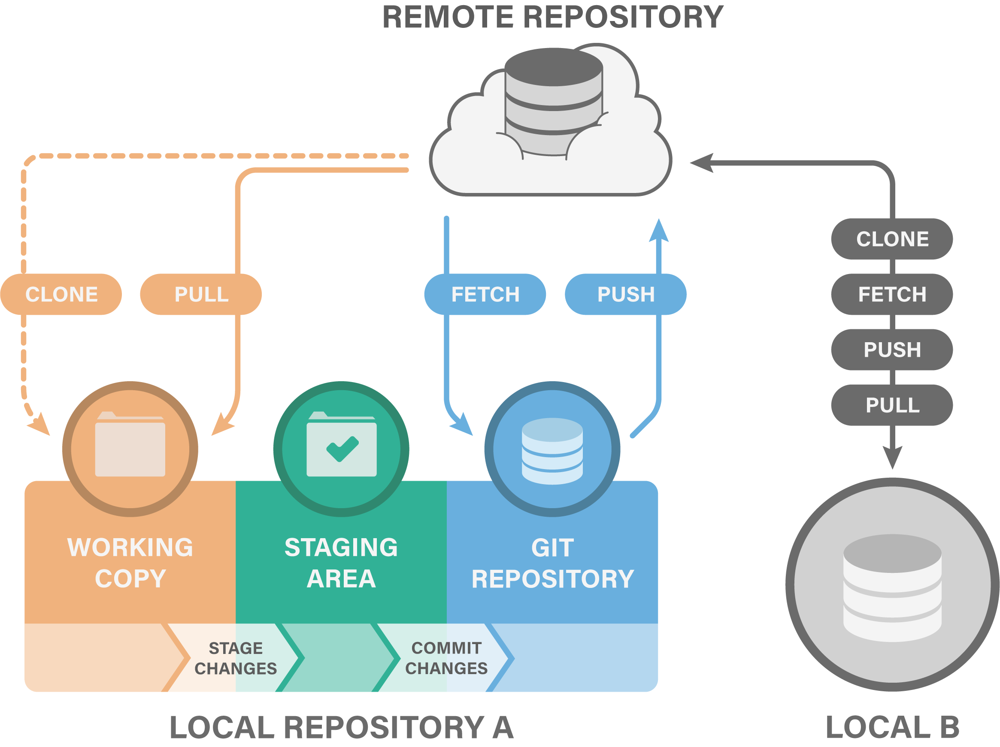
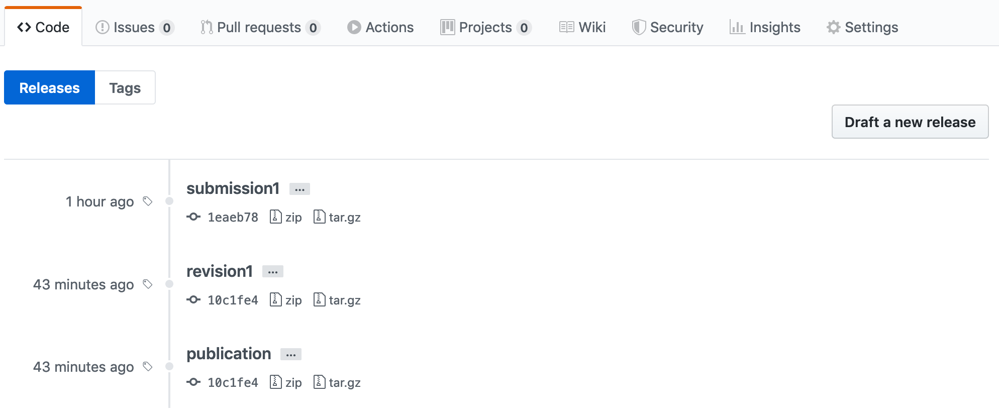

# Introduction

Git is a widely used system (both in academia and industry) for version
controlling files and collaborating on code. It is used to track changes in
(text) files, thereby establishing a history of all edits made to each file,
together with short messages about each change and information about who made
it. Git is mainly run from the command line, but there are several tools that
have implemented a graphical user interface to run git commands.

Using version control for tracking your files, and edits to those, is an
essential step in making your computational research reproducible. A typical git
workflow consists of:

* Making distinct and related edits to one or several files

* Committing those changes (*i.e.* telling git to add those edits to the
  history, together with a message about what those changes involve)

* Pushing the commit to a remote repository (*i.e.* syncing your local project
  directory with one in the cloud)

There are many benefits of using git in your research project:

* You are automatically forced into a more organized way of working, which is
  usually a first step towards reproducibility.

* If you have made some changes to a file and realize that those were probably
  not a good idea after all, it is simple to view exactly what the changes were
  and revert them.

* If there is more than one person involved in the project, git makes it easy
  to collaborate by tracking all edits made by each person. It will also handle
  any potential conflicting edits.

* Using a cloud-based repository hosting service (the one you push your commits
  to), like *e.g.* [GitHub](https://github.com/) or
  [Bitbucket](https://bitbucket.org/), adds additional features, such as being
  able to discuss the project, comment on edits, or report issues.

* If at some point your project will be published GitHub or Bitbucket (or
  similar) are excellent places to publicly distribute your code. Other
  researchers can then use git to access the code needed for reproducing your
  results, in exactly the state it was when used for the publication.

* If needed, you can host private repositories on GitHub and Bitbucket as well.
  This may be convenient during an ongoing research project, before it is
  publicly published.

These tutorials will walk you through the basics of using git as a tool for
reproducible research. The things covered in these tutorials are what you will
be using most of the time in your day-to-day work with git, but git has many
more advanced features that might be of use to you. If you are interested in
learning more about these things, here are some reading tips for you:

* [Git cheat-sheet](https://education.github.com/git-cheat-sheet-education.pdf)
* [A simple Git guide](http://rogerdudler.github.io/git-guide/)
* [Resources to learn Git]( https://try.github.io/levels/1/challenges/1)
* [Git reference manual](https://book.git-scm.com/docs)

This tutorial depends on files from the course GitHub repo. Take a look at the
[setup](setup.) for instructions on how to set it up if you haven't done so
already.

## Creating a git repository

In order to create a new git repository, we first need a directory to track.
For this tutorial, go ahead and create a directory called `git_tutorial`, then
navigate into it.

!!! attention
    The directory should *not* be within the `workshop-reproducible-research`
    directory, since this is itself a git-tracked directory.

Once we are inside the desired directory, we can *initialise*
git with the following command:

```bash
git init
```

The directory is now a version-tracked directory. How can you know? Run the
command `git status`, which will probably return something like this:

```no-highlight
On branch main

No commits yet

nothing to commit (create/copy files and use "git add" to track)
```

!!! tip
    If you try to run `git status` in a non-git directory, it will say
    that it is *not a git repository*. The way this works is that git
    adds a hidden directory `.git/` in the root of a git tracked
    directory (run `ls -a` to see it). This hidden directory contains
    all information and settings git needs in order to run and version
    track your files. This also means that your git-tracked directory
    is self-contained, *i.e.* you can simply delete it and everything that
    has to do with git in connection to that directory will be gone.

The text `nothing to commit (create/copy files and use "git add" to track)`
tells us that while we are inside a directory that git is currently tracking,
there are currently no files being tracked; let's add some!

* Copy the following files from the `workshop-reproducible-research/git`
  directory into your `git_tutorial` directory:
    * `Dockerfile`
    * `Snakefile`
    * `config.yml`
    * `environment.yml`

* Once you have done that, run `git status` again. It will tell you that there
  are files in the directory that are not version tracked by git.

!!! note
    For the purpose of this tutorial, the exact contents of the files you just
    copied are not important. But you will probably recognize many of them, as
    they are all files used in the MRSA case study described in the
    [introduction to the tutorials](tutorial_intro.md). The details of what
    these files do are described in their respective sessions later in the
    course, but we provide a brief overview here:

    * The `environment.yml` file contains the Conda environment with all the
      software used in the analysis (see the [Conda tutorial](conda.md)).
    * The `Snakefile` and `config.yml` are both used to define the Snakemake
      workflow, that we'll go through in the
      [Snakemake tutorial](snakemake.md).
    * The `Dockerfile` contains the recipe for making a Docker container for
      the analysis, which will be covered in detail in the
      [Docker tutorial](docker.md).

!!! note "Quick recap"
    We have used two `git` commands this far:

    * `git init` tells git to track the current directory.
    * `git status` is a command you should use *a lot*. It will tell you,
      amongst other things, the status of your git clone in relation to the
      online remote repository.

## Committing changes

We will now commit the untracked files. A commit is essentially a set of
changes to a set of files. Preferably, the changes making out a commit should
be related to something, *e.g.* a specific bug fix or a new feature.

* Our first commit will be to add the copied files to the repository. Run the
  following: (as suggested by `git status`):

```bash
git add Dockerfile Snakefile
```

* Run `git status` again! See that we have added Dockerfile and Snakefile to
  our upcoming commit (listed under "*Changes to be committed*"). This is
  called the staging area, and the files there are staged to be committed.

* We might as well commit all files in one go! Use `git add` on the remaining
  files as well:

```bash
git add config.yml environment.yml
```

* Run `git status` and see that all files are in the staging area, and that no
  files are listed as untracked.

* We are now ready to commit! Run the following:

```bash
git commit -m "Add initial files"
```

The `-m` option adds a commit message. This should be a short description of
what the commit contains.

!!! tip
    Writing informative and succinct commit messages can be tricky when you're
    just starting out. Here are some general guidelines that can help you write
    good commit messages from the start:

    - Separate subject from body with a blank line
    - Limit the subject line to 50 characters
    - Capitalize the subject line
    - Do not end the subject line with a period
    - Use the [imperative mood](https://en.wikipedia.org/wiki/Imperative_mood)
      in the subject line
    - Wrap the body at 72 characters
    - Use the body to explain what and why vs. how

    In the command above we just added a short subject line ("Add initial
    files"). It is capitalized, less than 50 characters, does not end with
    a period, and uses imperative mood (Add!). It is possible to add
    a descriptive body text as well, as hinted by the points above. This is
    easiest done in a text editor. If you run `git commit` without the `-m`
    flag, git will open the default terminal text editor (which can be
    configured with the `core.editor` variable) where you can write a longer
    commit message and body. If you want to read more about the motivation for
    these points, please see [this website](https://chris.beams.io/posts/git-commit/).

* Run `git status` again. It should tell you *"nothing to commit, working
  directory clean"*.

What have we done, so far? We had some files in our working directory that we
added to the Git staging area, which we subsequently committed to our Git
repository. A schematic overview of this process can be seen in the following
figure:



Let's repeat this process by editing a file!

* Open up `environment.yml` in your favorite editor, and change the version of
  bowtie2 to a different value, *e.g.* `bowtie2=2.2.4`.

* Run `git status`. It will tell you that there are modifications in one file
  (`environment.yml`) compared to the previous commit. This is nice! We don't
  have to keep track of what files we have edited, git will do that for us.

* Run `git diff environment.yml`. This will show you the changes made to the
  file. A `-` means a deleted line, a `+` means an added line. There are also
  shown a few lines before and after the changes, to put them in context.

* Let's edit another file! Open `config.yml`and change the line `genome_id:
  NCTC8325` to `genome_id: ST398`. Run `git status`. Run `git diff`. If we
  don't specify a file, it will show all changes made in any file, compared to
  the previous commit. Do you see your changes?

* Ok, we made our changes. Let's commit them! Run:

```bash
git add config.yml environment.yml
```

This will add both our files to the staging area at the same time. Run `git
status` and see that the changes in both `config.yml` and `environment.yml` are
ready to be committed.

But wait a minute! Shouldn't each commit optimally be a conceptual unit of
change? Here we have one change to the genome ID used for an analysis and one
change a where another software version is specified: these should probably be
separate. We thus want to make two commits, one for each change.

* Let's remove `environment.yml` from the staging area. `git status` tells us
  how to do this: *"(use "git reset HEAD <file>..." to unstage)"*. So run:

```bash
git reset HEAD environment.yml
```

* Run `git status` again. See that now only `config.yml` is staged for being
  committed, whereas the changes in `environment.yml` are tracked by git, but
  not ready to be committed.

* Commit the changes in `config.yml`:

```bash
git commit -m "Change to ST398 for alignment"
```

* Add and commit the changes in `environment.yml`:

```bash
git status
git add environment.yml
git status
git commit -m "Change bowtie2 version"
git status
```

You don't have to run `git status` between each command, but it can be useful
in the beginning while learning what each command does.

As you can see, each commit is a point in history. The more often you commit,
and the more specific you keep your commits, the better (more fine-grained)
history and version tracking you will have of your files.

* We can also try to delete a file:

```bash
rm Dockerfile
```

* Run `git status`. As you can see, git tells us that the file is deleted, but
  that the deletion is not committed. In the same way as we commit edits to
  files, we need to commit a deletion of a file:

```bash
git add Dockerfile
git status
git commit -m "Remove Dockerfile"
git status
git log
```

Here we used `rm Dockerfile` to delete the file and `git add Dockerfile` to
stage the deletion. You can also use `git rm Dockerfile` to do both these
operations in one step.

* To see a history of our changes so far, run:

```bash
git log
```

!!! tip
    Since Git keeps track of changes in text, *e.g.* code and text-based
    documentation, there are some files which you should *not* commit. Examples
    of such files are file formats that are not text-based, *e.g.* Microsoft
    Word/Excel files or PDFs - although one might sometimes want to track one of
    these files regardless, such as when you have a static PDF report you
    received from a sequencing platform that's never going to change. Other
    files you shouldn't track are vary large text files, *e.g.* those larger
    than 50 MB.

!!! note "Quick recap"
    We now added four important git commands to our repertoire:

    * `git add` adds a file to the staging area.
    * `git commit` commits the changes we have staged.
    * `git rm` is shorthand for `rm <file>; git add <file>`.
    * `git log` shows us the commit history.

## Ignoring files

Git is aware of all files within the repository. However, it is not uncommon to
have files that we don't want git to track. For instance, our analysis might
produce several intermediate files and results. We typically don't track such
files. Rather, we want to track the actual code and other related files (*e.g.*
configuration files) that produce the intermediate and result files, given the
raw input data.

* Let's make some mock-up intermediate and result files. These are some of the
  files that would have been generated by the Snakemake workflow if it was run.

```bash
mkdir intermediate
mkdir results
touch intermediate/multiqc_general_stats.txt
touch results/supplementary.pdf
touch log.tmp
```

* Run `git status`. You will see that git tells you that you have untracked
  files. However, we don't want git to track these files anyway. To tell git
  what files to ignore we use a file called `.gitignore`. Let's create it:

```bash
touch .gitignore
```

* Open the `.gitignore` file in an editor and add the following lines to it:

```
# Ignore these directories:
results/
intermediate/

# Ignore temporary files:
*.tmp
```

* Run `git status` again. Now there is no mention of the `results` and
  `intermediate` directories or the `log.tmp` file. Notice that we can use
  wildcards (\*) to ignore files with a given pattern, *e.g.* a specific
  extension.

* Sometimes you want to ignore all files in a directory with one or two
  exceptions. For example, you don't want to track all your huge raw data files,
  but there may be a smaller data file that you *do* want to track, *e.g.*
  metadata or a list of barcodes used in your experiment. Let's add some mock
  data:

```bash
mkdir data
touch data/huge.fastq.gz
touch data/metadata.txt
```

* Git allows you to ignore all files using the aforementioned wildcard, but
  then *exclude* certain files from that ignore command. Open the `.gitignore`
  file again and add the following:

```bash
# Ignore all files in the data/ directory
data/*

# Exclude the metadata file by prefixing it with an exclamation mark
!data/metadata.txt
```

* Finish up by adding the `.gitignore` and `data/metadata.txt` files to the
  staging area and committing them:

```bash
git add .gitignore
git commit -m "Add .gitignore file"
git add data/metadata.txt
git commit -m "Add metadata file"
```

!!! tip "Tip"
    It is common for certain programming languages or text editors to leave
    *e.g.* swap files or hidden data files in the working directory, which you
    don't want to track using git. Instead of manually adding these to every
    single project you have, you can use the `.gitignore_global` file, which
    should be placed in your home directory. It works exactly like a normal
    gitignore file, but is applied to all git repositories that you are using
    on your machine. Some common file extensions that might be put in the
    global gitignore are `.DS_Store` if you're working in R or `.swp` if you're
    coding in vim.

!!! note "Quick recap"
    We now learned how to ignore certain files and directories:

    * The `.gitignore` file controls which files and directories git should
      ignore, if any.
    * Specific files can be excluded from ignored directories using the
      exclamation mark (`!`) prefix.

## Branching and merging

One of the most useful features of git is called *branching*. Branching allows
you to diverge from the main line of work and edit or update your code and
files (*e.g.* to test out a new analysis or some experimental feature) without
affecting your main work. If the work you did in the branch turns out to be
useful you can merge that back into your main branch. On the other hand, if the
work didn't turn out as planned, you can simply delete the branch and continue
where you left off in your main line of work. Another use case for branching is
when you are working in a project with multiple people. Branching can be a way
of compartmentalizing your team's work on different parts of the project and
enables merging back into the main branch in a controlled fashion; we will
learn more about this in the section about working remotely.

* Let's start trying out branching! We can see the current branch by running:

```bash
git branch
```

This tells us that there is only the `main` branch at the moment.

* Let's make a new branch:

```bash
git branch test_alignment
```

* Run `git branch` again to see the available branches. Do you note which one
  is selected as the active branch?

* Let's move to our newly created branch using the `checkout` command:

```bash
git checkout test_alignment
```

!!! tip
    You can create and checkout a new branch in one line with `git checkout -b
    branch_name`.

Let's add some changes to our new branch! We'll use this to try out a different
set of parameters on the sequence alignment step of the case study project.

* Edit the `Snakefile` so that the shell command of the `align_to_genome` rule
  looks like this (add the `--very-sensitive-local` option):

```bash
shell("bowtie2 --very-sensitive-local -x " + indexBase + " -U {input.fastq} \
    > {output} 2> {log}")
```

* Add and commit the change!

* To get a visual view of your branches and commits you can use the command:

```bash
git log --graph --all --oneline
```

It is often useful to see what differences exist between branches.
You can use the `diff` command for this:

```bash
git diff main
```

This shows the difference between the active branch (test_alignment) and main
on a line-per-line basis. Do you see which lines have changed between
`test_alignment` and `main` branches?

!!! tip
    We can also add the `--color-words` flag to `git diff`, which instead
    displays the difference on a word-per-word basis rather than line-per-line.

Now, let's assume that we have tested our code and the alignment analysis is run
successfully with our new parameters. We thus want to merge our work into the
`main` branch. It is good to start with checking the differences between
branches (as we just did) so that we know what we will merge.

* Checkout the branch you want to merge into, *i.e.* `main`:

```bash
git checkout main
```

* To merge, run the following code:

```bash
git merge test_alignment
```

Run `git log --graph --all --oneline` again to see how the merge commit brings
back the changes made in test_alignment to main.

!!! tip
    If working on different features or parts of an analysis on different
    branches, and at the same time maintaining a working `main` branch for the
    stable code, it is convenient to periodically merge the changes made to
    `main` into relevant branches (*i.e.* the opposite to what we did above).
    That way, you keep your experimental branches up-to-date with the newest
    changes and make them easier to merge into `main` when time comes.

* If we do not want to do more work in `test_alignment` we can delete that
  branch:

```bash
git branch -d test_alignment
```

* Run `git log --graph --all --oneline` again. Note that the commits and
  the graph history are still there? A branch is simply a pointer to a
  specific commit, and that pointer has been removed.

!!! tip "Tip"
    There are many types of so-called "branching models", each with varying
    degrees of complexity depending on the developer's needs and the number of
    collaborators. While there certainly isn't a single branching model that
    can be considered to be the "best", it is very often most useful to keep it
    simple. An example of a simple and functional model is to have a `main`
    branch that is always working (*i.e.* can successfully run all your code
    and without known bugs) and develop new code on feature branches (one new
    feature per branch). Feature branches are short-lived, meaning that they
    are deleted once they are merged into main.

!!! note "Quick recap"
    We have now learned how to divide our work into branches and how to manage
    them:

    * `git branch <branch>` creates a new branch.
    * `git checkout <branch>` moves the repository to the state in which the
      specified branch is currently in.
    * `git merge <branch>` merges the specified branch into the current one.

## Tagging commits

Git allows us to *tag* commits, *i.e.* give names to specific points in the
history of our project. This can be particularly important for reproducible
research, but also for development projects that want to highlight specific
versions of a software. A tag can be, for example, the version of the repository
that was used for the manuscript submission, the version used during
resubmission, and, most importantly, the version used for the final publication.
The first two examples are mainly useful internally, but the latter is essential
for other researchers to be able to rerun your published analysis.

* Let's assume that the status of the repository as it is now is ready for
  a submission to a journal. It may for example contain the scripts that were
  used to generate the manuscript figures. Let's add a tag:

```bash
git tag "submission1"
```

* We can now list all the tags available in the current repository:

```bash
git tag
```

!!! tip
    You can use the flag `-a` or `--annotate` to give more detailed information
    about a specific tag, similar to a commit message. This can be quite useful
    when there are many changes that happened, in that it allows you to
    summarise them. You can, for example, do `git tag -a submission1 -m
    "Annotation for tag submission1"` to write the annotation along with the
    command (similar to the `-m` flag for committing) or just `git tag -a
    submission1` to write the annotation with your default editor.

    To list all your tags along with their annotations you can use *e.g.* `git
    tag -n10` (which will list the first 10 lines of each tag's annotation).

* Let's assume we now got comments from the reviewers, and by fixing
  those we had to update our code. Open `config.yml` and change the line
  `max_reads: 25000` to `max_reads: 50000`. Commit and tag the changes:

```bash
git add config.yml
git commit -m "Increase number of reads"
git tag "revision1"
```

* Now let's say that the reviewers were happy and the manuscript was
  accepted for publication. Let's immediately add a tag:

```bash
git tag "publication"
```

* A good thing about using tags is that you can easily switch between versions
  of your code. Let's move to the first submission version:

```bash
git checkout submission1
```

* Open `config.yml` and note that the `max_reads` variable is `25000`! To go
  back to the latest version, run:

```bash
git checkout main
```

* Open `config.yml` and see that the value is now `50000`.

!!! tip
    You can also see the difference between tags in the same way as for
    branches and commits using *e.g.* `git diff <tag1> <tag2>`.

* Finally, you could run `git log --oneline --decorate` to get a
  condensed commit history, where you should also be able to see the
  tagged commits.

!!! note "Quick recap"
    We have now learned how to tag important commits:

    * `git tag` adds a tag to a commit.
    * `git checkout` moves between tags in a similar fashion as between
      branches.

## Working remotely

So far we've only been working on files present on our own computer, *i.e.*
locally. While git is an amazing tool for reproducibility even if you're
working alone, it really starts to shine in collaborative work. This entails
working with *remote* repositories, *i.e.* repositories that are stored
somewhere online; some of the most common places to store your repositories are
[GitHub](https://github.com), [BitBucket](https://bitbucket.org) and
[GitLab](https://about.gitlab.com/). GitHub is the most popular of these, and is
what we'll be using for this tutorial.

An important thing to keep in mind here is the difference between *git* (the
version control system) and online hosting of *git repositories* (such as
GitHub): the former is the core of keeping track of your code's history, while
the latter is how to store and share that history with others.

### Create an account at GitHub

If you have not done so already, go to [github.com](https://github.com/join)
and create an account. You can also create an account on another online hosting
service for version control, *e.g.* [Bitbucket](https://bitbucket.org) or
[GitLab](https://about.gitlab.com/). The exercises below are written with
examples from GitHub (as that is the most popular platform with the most
extensive features), but the same thing can be done on alternative services,
although the exact menu structure and link placements differ a bit.

### Create a remote repository

* Log in to your GitHub account and press the *New* button on the left:
    * Make sure you are listed as the owner
    * Add a repository name, *e.g.* `git_tutorial`
    * You can keep the repo private or make it public, as you wish
    * Skip including a README, a `.gitignore` and licence



You will now be redirected to the repository page which will list several ways
for you to start adding content (files) to the repository. What we will do is to
connect the local repository we've been working on so far to the remote GitHub
server:

* Add a remote address to your local repository (make sure you change `user` to
  your GitHub username and `git_tutorial` to your repository name):

```bash
git remote add origin https://github.com/user/git_tutorial.git
```

* Run `git remote -v`. This will show you what remote location is connected to
  your local git clone. The short name of the default remote is usually
  "*origin*" by convention.

* We have not yet synced the local and remote repositories, though, we've simply
  connected them. Let's sync them now:

```bash
git push origin main
```

The `push` command sends our local history of the `main` branch to the same
branch on the remote (`origin`). Our git repository is now stored on GitHub!

* Run `git status`. This should tell you that *"Your branch is up-to-date with
  'origin/main'."*.

If you go to the repository's GitHub page you should now be able to see all your
files and your code there! It should look something like this:


You can see a lot of things there, such as each file and the latest commit that
changed them, the repository's branches and a message from GitHub at the bottom:
*"Help people interested in this repository understand your project by adding
a README."* This refers to GitHub's built-in functionality of automatically
rendering any *markdown* document named `README` or `README.md` in the
repository's root directory and displaying it along with what you can already
see. Let's try it out!

* Let's create a `README.md` file and fill it with the following text:

```markdown
# A Git tutorial

This repository contains tutorial information related to the **NBIS** course
*Tools for Reproducible Research*, specifically the session on using the `git`
software for version control.

## Links

You can find the latest stable version of the Git tutorial for the course
[here](https://nbis-reproducible-research.readthedocs.io/en/latest/git/).
```

* Add, commit and push these changes to GitHub.

```bash
git add README.md
git commit -m "Add README.md"
git push origin main
```

You should now be able to see the rendered markdown document, which looks a bit
different from the text you copied in from above. Note that there are two
different header levels, which come from the number of hash signs (`#`) used.
You can also see bold text (which was surrounded by two asterisks), italic
text (surrounded by one asterisk), in-line code (surrounded by acute accents)
and a link (link text inside square brackets followed by link address inside
parentheses).

It is important to add README-files to your repositories so that they are more
documented and easily understood by others and, more likely, your future self.
In fact, documentation is an important part of reproducible research! While the
tools that you are introduced to by this course are all directly related to
making science reproducible, you will *also* need good documentation. Make it
a habit of always adding README-files for your repositories, fully explaining
the ideas and rationale behind the project. You can even add README-files to
sub-directories as well, giving you the opportunity to go more in-depth where
you so desire.

!!! tip
    There are a lot more things you can do with markdown than what we show here.
    Indeed, this entire course is mostly written in markdown! You can read
    more about markdown [here](https://www.markdownguide.org/getting-started/).

!!! note "Quick recap"
    We learned how to connect local git repositories to remote locations such as
    GitHub and how to upload commits using `git push`. We also learned the
    basics of *markdown* and how it can be used to document git repositories.

### Browsing GitHub

GitHub and the rest of the websites that offer remote hosting of git
repositories all have numerous features, which can be somewhat difficult to
navigate in the beginning. We here go through some of the basics of what you can
do with GitHub.

* Go to your GitHub repository in your browser again and click on *Code* to the
  left. Click on `config.yml`. You will see the contents of the file. Notice
  that it is the latest version, where we previously changed the `genome_id`
  variable:



* Click on *History*. You will see an overview of the commits involving changes
  made to this file:



* Click on the `Change to ST398 for alignment` commit. You will see the changes
  made to `config.yml` file compared to the previous commit.



* Go back to the repository's main page and click on the commit tracker on the
  right above the list of files, which will give you an overview of all commits
  made. Clicking on a specific commit lets you see the changes introduced by
  that commit. Click on the commit that was the initial commit, where we added
  all the files.


You will now see the files as they were when we first added them. Specifically
you can see that the `Dockerfile` is back, even though we deleted it! Click on
the *Code* tab to the left to return to the overview of the latest repository
version.

!!! note "Quick recap"
    We learned some of the most important features of the GitHub interface and
    how repositories can be viewed online.

### Working with remote repositories

While remote repositories are extremely useful as backups and for collaborating
with others, that's not their only use: remotes also help when you are working
from different computers, a computer cluster or a cloud service.

* Let's pretend that you want to work on this repository from a different
  computer. First, create a different directory (*e.g.* `git_remote_tutorial`)
  in a separate location that is not already tracked by git and `cd` into it.
  Now we can download the repository we just uploaded using the following:

```bash
git clone https://user@github.com/user/git_tutorial.git .
```

Notice the dot at the end of the command above, which will put the clone into
the current directory, instead of creating a new directory with the same name as
the remote repository. You will see that all your files are here, identical to
the original `git_tutorial` repository!

* Since you already gave the address to git when you cloned the repository, you
  don't have to add it manually as before. Verify this with `git remote -v`.

* Let's say that we now want to change the `multiqc` software to an earlier
  version: open the `environment.yml` file in the second local repo and change
  `multiqc=1.7` to `multiqc=1.2`; add and commit the change.

* We can now use `push` again to sync our remote repository with the new local
  changes. Refresh your web page again and see that the changes have taken
  effect.

!!! tip
    You always need to specify `git push origin main` by default, but you can
    circumvent this by telling git that you always want to push to
    `origin/main` when you're on your local `main` branch. To do this, use
    the command `git branch --set-upstream-to origin main`. Another way to
    achieve the same effect is use the `--set-upstream` flag for the very first
    push.

Since we have now updated the remote repository with code that came from the
second local repository, the first local repository is now outdated. We thus
need to update the first local repo with the new changes. This can be done with
the `pull` command.

* `cd` back into the first local repository (*e.g.* `git_tutorial`) and run the
  `git pull` command. This will download the newest changes from the remote
  repository and merge them locally automatically.

* Check that everything is up-to-date with `git status`.

Another command is `git fetch`, which will download remote changes *without*
merging them. This can be useful when you want to see if there are any remote
changes that you *may* want to merge, without actually doing it, such as in
a collaborative setting. In fact, `git pull` in its default mode is just
a shorthand for `git fetch` followed by `git merge FETCH_HEAD` (where
`FETCH_HEAD` points to the tip of the branch that was just fetched).

That's quite a few concepts and commands you've just learnt! It can be a bit
hard to keep track of everything and the connections between local and remote
Git repositories and how you work with them, but hopefully the following figure
will give you a short visual summary:



!!! note "Quick recap"
    We have learnt the difference between local and remote copies of git
    repositories and how to sync them:

    * `git push` uploads commits to a remote repository
    * `git pull` downloads commits from a remote repository and merges them
      to the local branch
    * `git fetch` downloads commits from a remote repository without merging
      them to the local branch
    * `git clone` makes a local copy of a remote repository

### Remote branches

Remote branches work much in the same way a local branches, but you have to
push them separately; you might have noticed that GitHub only listed our
repository as having one branch (you can see this by going to the *Code* tab).
This is because we only pushed our `main` branch to the remote. Let's create
a new local branch and add some changes that we'll push as a separate branch to
our remote - you should do this in the original `git_tutorial` repository, so
move back into that directory.

* Create a new branch named `trimming` and add the `--trim5 5` flag to the
  bowtie2-command part of the `Snakefile`, which should now look like this:

```bash
shell("bowtie2 --very-sensitive-local --trim5 5 -x " + indexBase + " \
    -U {input.fastq} > {output} 2> {log}")
```

* Add and commit the change to your local repository.

* Instead of doing what we previously did, *i.e.* merge the `trimming` branch
  into the `main` branch, we'll push `trimming` straight to our remote:

```bash
git push origin trimming
```

* Go the repository at GitHub and see if the new branch has appeared. Just above
  the file listing click the *Branch* drop-down and select the new branch to
  view it. Can you see the difference in the `Snakefile` depending on which
  branch you choose?

We now have two branches both locally and remotely: `main` and `trimming`. We
can continue working on our `trimming` branch until we're satisfied (all the
while pushing to the remote branch with the same name), at which point we want
to merge it into `main`.

* Checkout your local `main` branch and merge it with the `trimming` branch.

* Push your `main` branch to your remote and subsequently delete your local
  `trimming` branch.

The above command only deleted the local branch. If you want to remove the
branch from the remote repository as well, run:

```bash
git push origin --delete trimming
```

!!! note "Quick recap"
    We learned how to push local branches to a remote with `git push origin
    <branch>` and how to delete remote branches with `git push origin --delete
    <branch>`.

### Sharing tags

Your local repository tags are not included when you do a normal push. To push
tags to the remote you need to supply the `--tags` flag to the `git push`
command:

```bash
git push --tags
```

* Go to the repository overview page on GitHub. You will see that the repository
  now has three tags! If you click on *Tags* you will be given an overview of
  the existing tags for your repository - if you click *Releases* you will see
  more or less the same information. Confusing? Well, a *tag* is a git concept
  while a *release* is a GitHub concept that is based on git tags. Releases add
  some extra features that can be useful for distributing software and are done
  manually from the repository's GitHub page.

* Click on one of the tags. Here users can download a compressed file
  containing the repository at the version specified by the tags.



Alternatively, git users who want to reproduce your analysis with the code used
for the publication can clone the GitHub repository and then run `git checkout
publication`.

!!! note "Quick recap"
    We learned how to push git tags to a remote by using the `--tags` flag.

## Conflicts

It is not uncommon to run into conflicts when you are trying to merge separate
branches, and it's even more common when you're working in a collaborative
setting with remote repositories. It'll happen sooner or later, even if you're
only working locally, so it's important to know how to deal with them! We'll
now introduce a conflict on purpose, which we can then solve.

* Remember that we have two separate local copies of the same repository? Let's
  go into the first one, `git_tutorial`, and change the MultiQC version in the
  `environment.yml` file:

```yaml
multiqc=1.8
```

* Add, commit and push your change to the remote.

Now we have a change in our remote and *one* of our local copies, but not in the
other. This could happen if a collaborator of yours committed a change and
pushed it to GitHub. Let's create a conflict!

* Move into your other local repository, `git_remote_tutorial`, which doesn't
  have the new change. Run `git status`. Notice that git says: "*Your branch is
  up-to-date with 'origin/main'.*". We know that this is not true, but this
  local clone is not yet aware of the remote changes.

* Let's change the `environment.yml` file in this local repository as well, but
  to version 1.6, instead! It may be the case that your collaborator thought it
  was good to use MultiQC version 1.8, whereas you thought it would be better to
  use MultiQC version 1.6, but neither of you communicated that to the other.

* Add and commit your change and try to push the commit, which should give you
  an error message that looks like this:

```no-highlight
 ! [rejected]        main -> main (fetch first)
error: failed to push some refs to 'https://github.com/user/git_tutorial.git'
hint: Updates were rejected because the remote contains work that you do
hint: not have locally. This is usually caused by another repository pushing
hint: to the same ref. You may want to first integrate the remote changes
hint: (e.g., 'git pull ...') before pushing again.
hint: See the 'Note about fast-forwards' in 'git push --help' for details.
```

This error message is thankfully quite informative in regards to what is going
on and what might be done about it. In essence it will not allow you to push
to the remote since there are conflicting changes made to it.

* Let's download the changes made to the remote, but without trying to merge
  them directly. This can be done using the following command:

```bash
git fetch
```

!!! note
    The `fetch` command is very similar to `pull` in that it downloads remote
    changes that are not present locally, but differs in that it doesn't try to
    merge them locally; `pull` both downloads and merges (unless there's
    a conflict, in which case it will tell you so and raise an error like the
    one above). You can thus skip `fetch` and just do `pull` straight away, if
    you prefer.

* Now run `git status`. Unlike before, our local git clone now is aware of the
  latest changes pushed to the remote. It will tell you something along the
  lines: "*Your branch and 'origin/main' have diverged, and have 1 and
  1 different commit each, respectively.*".

* We can now run the following to see what the difference is between the current
  state of our local clone and the `main` branch on the remote origin:

```bash
git diff origin/main
```

* Now let's try to integrate the remote changes with our local changes and get
  up to sync with the remote:

```bash
git pull origin main
```

Unsurprisingly, the `git pull` command resulted in a conflict. Git tells us
about this and suggests that we should fix the conflicts and commit that.

* As always, run `git status` to get an overview: you will see that you have
  so-called unmerged paths and that the conflicting file is `environment.yml`,
  since both modified the same line in this file. To fix a conflict, open the
  affected file in a text editor. You will see that it now looks something like
  this:

```no-highlight
channels:
  - conda-forge
  - bioconda
  - main
  - r
dependencies:
  - python=3.7.6
  - fastqc=0.11.9
  - sra-tools=2.10.1
  - snakemake-minimal=5.10.0
<<<<<<< HEAD
  - multiqc=1.6
=======
  - multiqc=1.8
>>>>>>> eb1bda9f9d089289e5bd82e15d36e34a88a04879
  - bowtie2=2.2.4
  - samtools=1.10
  - htseq=0.11.2
  - bedtools=2.29.2
  - wget=1.20.1
  - graphviz=2.42.3
  - r-base=3.6.2
  - r-ggplot2=3.2.1
  - r-reshape2=1.4.3
  - r-stringi=1.4.5
  - r-pheatmap=1.0.12
  - r-rmarkdown=2.1
  - bioconductor-rtracklayer=1.46.0
  - bioconductor-geoquery=2.54.0
  - xorg-libxrender
  - xorg-libxpm
```

The part between `<<<<<<< HEAD` and `=======` is your local version, and the
part between `=======` and `>>>>>>> eb1bda9f9d089289e5bd82e15d36e34a88a04879` is
the one added to the remote and which caused the conflict when you tried to pull
those changes to your local repository. The long sequence of characters is the
commit ID (the first 7 are displayed on GitHub under *Commits*), which will be
different for your repository. It is now up to you to decide which version to
keep, or to change it to a third alternative.

* Let's say that you are confident that it is better to run MultiQC 1.6 rather
  than 1.8. Edit the file so that it looks like you want it to, *i.e.* remove
  the lines added by git and delete the line with `multiqc=1.8`. The final file
  should look like this:

```no-highlight
channels:
  - conda-forge
  - bioconda
  - main
  - r
dependencies:
  - python=3.7.6
  - fastqc=0.11.9
  - sra-tools=2.10.1
  - snakemake-minimal=5.10.0
  - multiqc=1.6
  - bowtie2=2.2.4
  - samtools=1.10
  - htseq=0.11.2
  - bedtools=2.29.2
  - wget=1.20.1
  - graphviz=2.42.3
  - r-base=3.6.2
  - r-ggplot2=3.2.1
  - r-reshape2=1.4.3
  - r-stringi=1.4.5
  - r-pheatmap=1.0.12
  - r-rmarkdown=2.1
  - bioconductor-rtracklayer=1.46.0
  - bioconductor-geoquery=2.54.0
  - xorg-libxrender
  - xorg-libxpm
```

* Run `git status` again. Notice that it says `use "git add <file>..." to mark
  resolution`? Let's do that!

```bash
git add environment.yml
```

* Run `git status` again! It will now tell us: `All conflicts fixed but you are
  still merging. (use "git commit" to conclude merge)`. So, you probably
  guessed it, run:

```bash
git commit -m "Merge and set multiqc to v1.6"
```

* Finally, push these changes to GitHub:

```bash
git push
```

* Go to GitHub in the browser and click the commit tracker again. You will see
  a list of commits including where MultiQC was first changed to version `1.2`
  from our previous work, then to `1.8`, `1.6` and, finally, followed by a merge
  where the version was set to `1.6`.

!!! note
    While the example we've used here is from a collaborative setting, conflicts
    also arise when you are working alone. They usually happen when you have
    several feature branches that you want to merge into `main` and you've
    forgot to keep all branches up-to-date with each other.

!!! note "Quick recap"
    We learned about how conflicting commits can happen and how to deal with
    them by inspecting the affected files and looking for the source of the
    conflict.

## Extra material

The following extra material contains some more advanced things you can do with
git and the command line in general, which is not part of the main course
materials. All the essential skills of git are covered by the previous
sections; the material here should be considered tips and tricks from people
who use git every day. You thus don't need to use these things unless you want
to, and you can even skip this part of the lesson if you like!

### Decorating your prompt

When you are working on the command line interface (CLI), you will usually have
some small pieces of information relating to your current directory, the name
of the computer or host you're working on, and so forth. You've probably
already seen your prompt while working with git throughout this lesson, but
here's an example of what one might look like:

```no-highlight
erikfmbp:~/teaching/workshop-reproducible-research erik.fasterius $
```

The above prompt contains the name of the computer, a colon, the current
working directory, the username and a dollar-sign; it is stored in the
variable `PS1`. You can type `echo $PS1` to see what variables your prompt
is made up of; the above example contains `\h:\W \u\$`, where `\h` is the
hostname, `\W` the working directory and `\u` the username.

Some people like to also show the current branch on their prompt, thus avoiding
having to type `git branch` continuously. There are several ways you might do
this, and we're only presenting one of them here: a bash function.

```bash
git_branch() {
     git branch 2> /dev/null | sed -e '/^[^*]/d' -e 's/* \(.*\)/ (\1)/'
}
```

This function does a number of things:

1. Ejects the error message from git if the current directory isn't a part of a
   git repository into `/dev/null` (_i.e._ into nothing).
2. Find the current branch by searching for a line that starts with `*` (*i.e.*
   the current branch) using the command line program `sed`.
3. Put the current branch into parentheses with a space before it.

We can then build our new prompt by adding this function into it:

```bash
# The first part of the old prompt
PS1='\h:\W \u'

# Add the git branch
PS1=$PS1'$(git_branch)'

# Add the last part of the old prompt
PS1=$PS1' \$'
```

Now you should see the current git branch on your prompt! The only problem now
is that this only works for your current session: once you restart your CLI
you'll have to re-define your prompt again. This can be circumvented, though.
What you need to do is to add the code defining your prompt into your so-called
bash profile: `~/.bash_profile`. Every time you load a new CLI session this
file is read and any code inside it is executed. You might already have this
file, so make sure you don't overwrite it!

### Bash aliases for git

Some git commands are used over and over again when working with git, such as
`git status`. Some people like to have aliases (*i.e.* shortcuts) for these
common commands. Here is a small list of such aliases that you may find useful
or, even better, might inspire you to create your own! Add them to your
`~/.bash_profile` as above, so that they're available across sessions.

```bash
# Basic git commands
alias gb='git branch'
alias ga='git add'
alias gd='git diff'
alias gcm='git commit'
alias gp='git push'
alias gu='git pull'
alias gm='git merge'
alias gco='git checkout'
alias gl='git log'

# Git status in short format
alias gst='git status -s'

# Add and commit all tracked and modified files
alias gca='git commit -a'

# Create and checkout a new branch
alias gcob='git checkout -b'

# Git log with one line per commit
alias glo='git log --oneline'
```

### Remote connections with SSH

Throughout this tutorial we have been using normal HTTPS to connect with remote
repositories, which means you need to provide your username and password. If you
work with remote repositories a lot you might want to be able to skip writing in
your user credentials all the time, which is something you can do with SSH
(Secure Shell) keys. This basically entails setting up a pair of keys: one
private and one public. You keep the private key on your local computer and give
the public key to anywhere you want to be able to connect to, *e.g.* GitHub. The
public key can be used to encrypt messages that *only* the corresponding private
key can decrypt. A simplified description of how SSH authentication works goes
like this:

1. The client (*i.e.* the local computer) sends the ID of the SSH key pair it
   would like to use for authentication to the server (*e.g.* GitHub)
2. If that ID is found, the server generates a random number and encrypts this
   with the public key and sends it back to the client
3. The client decrypts the random number with the private key and sends it back
   to the server

Notice that the private key always remains on the client's side and is never
transferred over the connection; the ability to decrypt messages encrypted with
the public key is enough to ascertain the client's authenticity. This is in
contrast with using passwords, which are themselves send across a connection
(albeit encrypted). It is also important to note that even though the keys come
in pairs it is impossible to derive the private key from the public key.

So, how do you setup SSH authentication between your local computer and GitHub?
GitHub actually has excellent and detailed instructions for exactly this at the
[GitHub website](https://docs.github.com/en/github/authenticating-to-github/connecting-to-github-with-ssh),
so we won't repeat that here. Simply follow those instructions and you'll be
good to go! If you want to read more details about how SSH authentication work
you can check out [this website](https://www.digitalocean.com/community/tutorials/understanding-the-ssh-encryption-and-connection-process),
which has more in-depth information than we provide here.

### Forking

When you want to work on an Open Source project that is available on *e.g.*
GitHub, you usually don't have permission to directly push code to the project's
repository - this is so that the project's maintainers are the only ones that
can directly change anything in their codebase. How do you then contribute to
projects that don't allow you to push your code to their repository? Simple: use
*forking*!

Forking is when you make your own copy of a repository on your GitHub account,
which you will then have permissions to change as you see fit. You can then
create pull requests from your fork to the original repository, rather than
pushing code to a new branch and making a pull request from that. Working with
forks just adds an additional step to the whole workflow: instead of being
"clone; code and commit changes on a new branch; push branch to remote; pull
request from branch" it becomes "fork; clone; code and commit changes; push code
to fork; pull request from fork".

You might also want to do a fork of a project simply because you want to have
your own copy of it as well, without ever having the intention of changing it.
This is, of course, perfectly fine as well, but do keep in mind that developers
are usually quite happy to incorporate new changes from contributors if they are
reasonable and fulfil a purpose and add functionality to the project. It is
quite common that you have a use-case the maintainer didn't think of before, and
that you've helped the project grow by contributing your code!
