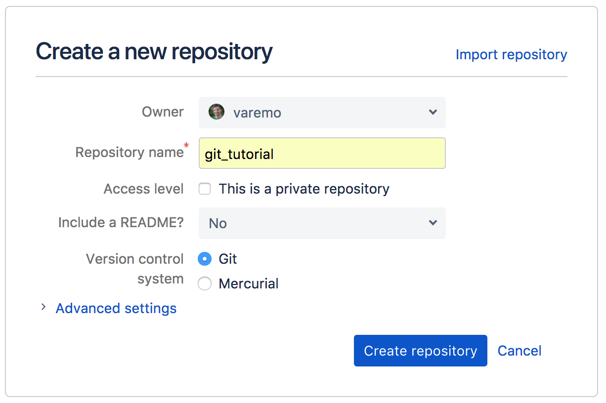

# Introduction to Git

Git is a widely used system (both in academia and industry) for version controlling files and
collaborating on code. It is used to track changes in (text) files, thereby establishing a history of all edits made to each file, together with short messages about each change and information about who made it. Git is mainly run from the command line, but there are several tools that have implemented a graphical user interface to run git commands.

Using version control for tracking your files, and edits to those, is an essential step in making your computational research reproducible. A typical git workflow consists of:

* making distinct and related edits to one or several files
* committing those changes (i.e. telling git to add those edits to the history, together with a message about what those changes involve)
* and pushing the commit to a remote repository (i.e. syncing your local project directory with one in the cloud)

There are many benefits of using git in your research project:

* You are automatically forced into a more organized way of working, which is usually a first step towards reproducibility.
* If you have made some changes to a file and realize that those were probably not a good idea after all, it is simple to view exactly what the changes were and revert them.
* If there is more than one person involved in the project, git makes it easy to collaborate by tracking all edits made by each person. It will also handle any potential conflicting edits.
* Using a cloud-based repository hosting service (the one you push your commits to), like e.g. [Github](https://github.com/) or [Bitbucket](https://bitbucket.org/), adds additional features, such as being able to discuss the project, comment on edits, or report issues.
* At some point your project will be published. Github or Bitbucket (or similar) are excellent places to publicly distribute your code. Other researchers can then use git to access the code needed for reproducing your results, in exactly the state it was when used for the publication.
* If needed, you can host private repositories on Github and Bitbucket as well. This may be convenient during an ongoing research project, before it is publicly published.

The best way to get an idea about git is simply to start using it. The tutorial below will guide you through the essential steps, with a focus on what is needed for making a project reproducible. There are many additional features of both git and the web-based repository hosting services (like Github and Bitbucket) that are not included here. If you are interested in learning more, the web is filled with information (see some examples below)!

## Tell me more

* For a more complete introduction to git, check e.g. [Wikipedia](https://en.wikipedia.org/wiki/Git)
* [A simple git guide](http://rogerdudler.github.io/git-guide/)
* ["Got 15 minutes and want to learn Git?"](https://try.github.io/levels/1/challenges/1)
* [Git reference manual](https://book.git-scm.com/docs)

# Set up
This tutorial depends on files from the course Bitbucket repo. Take a look at the [intro](tutorial_intro.md) for instructions on how to set it up if you haven't done so already.

## Install git

Chances are that you already have git installed on your computer. You can check by running e.g. `git --version`. If you don't have git, install it following the instructions [here](https://git-scm.com/book/en/v2/Getting-Started-Installing-Git).

## Configure git

If it is the first time you use git on your computer, you may want to configure it so that it is aware of your username. This username should match the username you have registered on Bitbucket. This will make it easier when you want to sync local changes with your remote Bitbucket repository.

```
git config --global user.name "Mona Lisa"
```

!!! tip
    If you have several accounts (e.g. both a Github and Bitbucket account), and thereby several different usernames, you can configure git on a per-repository level. Change directory into the relevant local git repository and run:

    ```
    git config user.name "Mona Lisa"
    ```

    This will set the default username for that repository only.


## Create an account at Bitbucket

If you have not done so already, go to [bitbucket.org](https://bitbucket.org/account/signup/) and create an account.

# Practical exercise

## Create a new git repository

* Login to [Bitbucket](https://bitbucket.org/) and press the plus button to the left and select *Create a new repository*:
    * Make sure you are listed as the owner
    * Add a repository name, e.g. *git_tutorial*
    * You can keep the repo private or make it public, as you wish
    * Skip including a README
    * Make sure Git is selected for version control  




You will now be redirected to the repository page. It is an empty repository, so there is not much to see yet. We want to add some contents (files) to the repository. To do that we will first *clone* the repository locally:

* Open a terminal and `cd` to a directory where you want to clone your newly created git repository (perhaps make a new directory for this course if you haven't done so already).

!!! attention
    **Important:** the directory should *not* be within the `reproducible_research_course` directory.

* Once you are in your directory of choice, run the following command (just make sure to change `user` to your Bitbucket username and `git_tutorial` to your repository name, in case you chose something different):
```bash
git clone https://user@bitbucket.org/user/git_tutorial.git
```

What will happen now is that the git repository will be cloned (i.e. downloaded) to your computer. You might get a warning that the repository is empty (which in fact is the case).

* A new directory, `git_tutorial` (or a different name if you choose so), has now been created, `cd` into that directory.  
* This is a git version-tracked directory. How can you know? Run `git status`!

It will probably return something like:

```no-highlight
On branch master. Initial commit. nothing to commit (create/copy files and use "git add" to track).
```

!!! tip
    If you try to run `git status` in a non-git directory, it will say that it is *not a git repository*. The way this works is that git adds a hidden directory `.git/` in the root of a git tracked directory (run `ls -a` to see it). This hidden directory contains all information and settings git needs in order to run and version track your files. This also means that your git-tracked directory is self-contained, i.e. you can simply delete it and everything that has to do with git in connection to that directory will be gone.

* Remember that git told you "*nothing to commit (create/copy files and use "git add" to track*"? Lets do that!  
* Copy the following files and directories from the `reproducible_research_course/git` directory, into your `git_tutorial` directory:
    * `Dockerfile`
    * `Snakefile`
    * `config.yml`
    * `environment.yml`
    * `code/`  
* Once you have done that, run `git status` again. It will tell you that there are files in the directory that are not version tracked by git.

!!! note
    For the purpose of this tutorial, the exact contents of the files you just copied are not important. But you will probably recognize many of them, as they are all files used in the [MRSA case study](tutorial_intro.md). The `environment.yml` file contains the conda environment with all the software used in the analysis (see the [conda tutorial](conda.md)). The `Snakefile` and `config.yml` are both used to define the Snakemake workflow, that you should recognize from the [Snakemake tutorial](snakemake.md). The `Dockerfile` contains the recipe for making a Docker container for the analysis, this will be convered in detail in the [Docker tutorial](docker.md). The `code/` directory contains an R Markdown report that is used in the final step of the analysis (more on this in the [R Markdown tutorial](rmarkdown.md)).

!!! note "Quick recap"
    We have used two `git` commands this far:

    * `git clone` - to clone a remote repository locally (e.g. from Bitbucket). This is only done the first time you want to download the repository locally.
    * `git status` - this is a command you should use *a lot*. It will tell you, amongst other things, the status of your git clone in relation to the online remote repository.

## Committing

* We will now commit the untracked files. A commit is essentially a set of changes to a set of files. Preferably, the changes making out a commit should be related to something, e.g. a specific bug fix or a new feature. Our first commit will be to add the copied files to the repository. Run (as suggested by `git status`):

```bash
git add Dockerfile Snakefile
```

* Run `git status` again! See that we have added Dockerfile and Snakefile to our upcoming commit (listed under "*Changes to be committed*"). This is called the staging area, and the files there are staged to be committed.
* We might as well commit all files in one go! Use `git add` on the remaining files as well:

```bash
git add config.yml environment.yml code/
```

* Run `git status` and see that all files are in the staging area, and that no files are listed as untracked.
* We are now ready to commit! Run:

```bash
git commit -m "add initial files"
```

The `-m` option adds a commit message. This should be a short description of what the commit contains. If you forget to add `-m` and just run `git commit`, a terminal editor will open and prompt you to write a commit message. This can be confusing if you are not used to using a terminal editor, so try to remember the `-m` flag.

* Run `git status` (yep, again!). It should tell you "*nothing to commit, working directory clean*".
* Now, let's edit a file. Open up `environment.yml` in your favorite editor, and change the version of bowtie2 to a different value, e.g. `bowtie2=2.1`.
* Run `git status`. It will tell you that there are modifications in one file (`environment.yml`) compared to the previous commit. This is nice! We don't have to keep track of what files we have edited, git will do that for us.
* Run `git diff environment.yml`. This will show you the changes made to the file. A `-` means a deleted line, a `+` means an added line. There are also shown a few lines before and after the changes, to put them in context.
* Let's edit another file! Open `config.yml`and change the line `genome_id: NCTC8325` to `genome_id: ST398`. Run `git status`. Run `git diff`. If we don't specify a file, it will show all changes made in any file, compared to the previous commit. Do you see your changes?
* Ok, we made our changes. Let's commit them! Run:

```bash
git add config.yml environment.yml
```

This will add both our files to the staging area at the same time. Run `git status` and see that the changes in both `config.yml` and `environment.yml` are ready to be committed.

But wait a minute! Shouldn't each commit optimally be a specified set of changes? Yes! So we want to make two commits, one for each change.

* Let's remove `environment.yml` from the staging area. `git status` tells us how to do this: "*(use "git reset HEAD <file>..." to unstage)*". So run:

```bash
git reset HEAD environment.yml
```

* Run `git status` again. See that now only `config.yml` is staged for being committed, whereas the changes in `environment.yml` are tracked by git, but not ready to be commited.
* Commit the changes in `config.yml`:

```bash
git commit -m "change genome to align to"
```

* Add and commit the changes in `environment.yml`:

```bash
git status
git add environment.yml
git status
git commit -m "change bowtie2 version"
git status
```

You don't have to run `git status` between each command, but it can be useful in the beginning while learning what each command does.

* To see a history of our changes so far, run:

```bash
git log
```

As you can see, each commit is a point in history. The more often you commit, and the more specific you keep your commits, the better (more fine-grained) history and version tracking you will have of your files.

* We can also try to delete a file:

```bash
rm Dockerfile
```

* Run `git status`. As you can see, git tells us that the file is deleted, but that the deletion is not committed. In the same way as we commit edits to files, we need to commit a deletion of a file:

```bash
git add Dockerfile
git status
git commit -m "remove Dockerfile"
git status
git log
```

Here we used `rm Dockerfile` to delete the file and `git add Dockerfile` to stage the deletion. You can also use `git rm Dockerfile` to do both these operations in one step.

!!! note "Quick recap"
    We now added four important git commands to our repertoire:

    * `git add` - adds a file so that changes in that file can be committed.
    * `git rm` - the opposite of `git add`, i.e. sets a file to be deleted in the next commit.
    * `git commit` - commits the changes we have staged (by using `git add` or `git rm`).
    * `git log` - shows us the commit history.

## Pushing

So far we have just worked locally. The strength with git is that we can add a remote location to push our commits to. In fact, we already have setup such a remote, since we created the repository at Bitbucket and cloned it locally. The idea is that you work and edit your files locally, and commit changes as you go along. At some points, preferably as often as possible, you push your changes to the remote. Your local copy and the remote copy are then in sync. In principle, you can now safely delete your local copy since everything is backed up in the cloud, including the full commit history. This also enables collaboration. Several users can work on their local clones of a given repository and push changes to a common remote location. Let's try this out in practice!

* Run `git remote -v`. This will show you what remote location is connected to your local git clone. The short name of the default remote is usually "*origin*".
* Run `git branch`. This will show you the name of the current branch. By default this will be "*master*".

!!! attention
    We have not mentioned branches, and will not go into details about branches here, but they are a major feature of git. They allow you to have different "versions" of a repository. As an example, during software development it is common to have a release branch containing code that is working correctly, and a development branch containing code with new features and fixes but also potential bugs that have not been fixed yet. Once the development branch is fixed and working, it can be merged into the release branch. End-users will typically use the code in the release branch only.

* Now we will push the latest commits to the master branch to our remote origin:

```bash
git push -u origin master
```

* Run `git status`. This should tell you that "*Your branch is up-to-date with 'origin/master'.*".
* Go to your Bitbucket repository in your browser again and click on Source to the left. You should now see that the files you have locally appear here as well!
* Click on `config.yml`. You will see the contents of the file. Notice that it is the latest version, where we changed "genome_id".
* Click on Diff, in the upper right corner. You will see the changes made to this file compared to the previous commit.
* Click History. You will see an overview of the commits involving changes made to this file.
* Click Commits, to the left in the main menu. You will see an overview of all commits made. Click on a specific commit to see the changes introduced by that commit.
* Click on the commit that was the initial commit, where we added all the files. You can now click on View source in the top right corner. You will now see the files as they were when we first added them. Specifically you can see that the `Dockerfile` is back, even though we deleted it! Click on Source to the left again to return to the latest version.

!!! note "Quick recap"
    We now learned yet another important git command:

    * `git push` -  to push local commits to the remote repository

## Conflicts

We will now learn how to manage conflicts. This is important to know, since it will probably happen sooner or later. It can get a bit tricky, but the important thing is not to panic! :)

* On the Bitbucket web page, click on `environment.yml` and click Edit. We can now edit this file directly on the web. This is generally not recommended, but we will do it here to demonstrate a point.
* Let's pretend that using multiqc version 1.3 did not work. Change the multiqc version to 1.4:  

```yaml
multiqc=1.4
```

* Click Commit. Add the commit message: "update multiqc version to 1.4". Click Commit.
* Click Commits to the left to see the commit history, and your latest change at the top.

Now we have a change in the remote repository that is not yet in our local clone. This could happen for instance if a collaborator of yours committed a change and pushed it to Bitbucket.

* Go back to your local terminal. Run `git status`. Notice that git says: "*Your branch is up-to-date with 'origin/master'.*". This is of course not true, but our local git clone is not yet aware of the remote changes. We will get those changes soon.
* But first, we will edit `environment.yml` locally as well! (It may be the case that your collaborator thought it was good to use multiqc version 1.4, whereas you thought it would be better to use multiqc version 1.2, but neither of you communicated that to the other.) Use a text editor and change the multiqc line to:

```yaml
multiqc=1.2
```

* Commit your change (use `git status` along the way if you want to check what is happening in the different steps):

```bash
git status
git add environment.yml
git status
git commit -m "downgraded multiqc to v1.2"
git status
```

* Now let's try to push this commit!

```bash
git push
```

!!! tip
    Note that after the initial push you probably don't have to specify `-u origin master`, git will figure that out by itself.

* Read the error message. It should be fairly informative of what is going on. In essence it will not allow you to push since there are conflicting changes made to the remote repository.

* We will now download the changes made to the remote:

```bash
git fetch
```

* Now run `git status`. Unlike before, our local git clone now is aware of the latest changes pushed to the remote. It will tell you something along the lines: "*Your branch and 'origin/master' have diverged,
and have 1 and 1 different commit each, respectively.*".
* Now, since we ran `git fetch` our local git has up-to-date information about the status of the remote repository. We can therefore run the following to see what the difference is between the current state of our local clone and the master branch on the remote origin:

```bash
git diff origin/master
```

* Now let's try to integrate the remote changes with our local changes and get up to sync with the remote:

```bash
git pull
```

!!! tip
    Note that you can skip the `git fetch`command if you want to and run `git pull` directly. The difference is that `fetch` will just update git with the latest information of the remote status, whereas `pull` will try to integrate and sync those changes to your local clone directly.

* As you have probably noticed, the `git pull` command resulted in a conflict. Git tells us about this and suggests that we should fix the conflicts and commit that.
As always, run `git status` to get an overview! You will see that you have, so called, unmerged paths and that the conflicting file is `environment.yml`, since both modified this file. To fix a conflict, open the affected file in a text editor. You will see that it now looks like this:

```
  channels:
  - conda-forge
  - bioconda
  dependencies:
  - fastqc=0.11.6
  - sra-tools=2.8
  - bowtie2=2.1
  <<<<<<< HEAD
  - multiqc=1.2
  =======
  - multiqc=1.4
  >>>>>>> d9b35ef61d2fde56fcbd64aacb10a96098c67cbf
  - snakemake=4.4.0
  - samtools=1.6
  - htseq=0.9
  - graphviz=2.38.0
  - xorg-libxrender
  - xorg-libxpm
  - wget
```

The part between `<<<<<<< HEAD` and `=======` is your local version, and the part between `=======` and `>>>>>>> d9b35ef61d2fde56fcbd64aacb10a96098c67cbf` is the one added to the remote and which caused the conflict when you tried to pull those changes to your local repository. The long sequence of numbers is the commit id (the first 7 are e.g. displayed on Bitbucket under Commits).

* It is now up to you to decide which version to keep, or to change it to a third alternative. Let's say that you are confident that it is better to run multiqc v1.2 rather than v1.4. Edit the file so that it looks like you want it to, i.e. remove the lines added by git and delete the line with `multiqc=1.4`. The final file should look like this:

```yaml
  channels:
  - conda-forge
  - bioconda
  dependencies:
  - fastqc=0.11.6
  - sra-tools=2.8
  - bowtie2=2.1
  - multiqc=1.2
  - snakemake=4.4.0
  - samtools=1.6
  - htseq=0.9
  - graphviz=2.38.0
  - xorg-libxrender
  - xorg-libxpm
  - wget
```

* Run `git status`, notice that it says *use "git add <file>..." to mark resolution*? Let's do that!

```bash
git add environment.yml
```

* Run `git status` again! It will now tell us: "*All conflicts fixed but you are still merging. (use "git commit" to conclude merge)*.". So, you probably guessed it, run:

```bash
git commit -m "merge and set multiqc to v1.2"
```

* Finally, push these changes to Bitbucket:

```bash
git push
```

* Go to Bitbucket in the browser and click Commits. You should be able to see a graph showing that the paths diverged (where one commit set the version to 1.4 and the other to 1.2) and that they are later merged, and the conflict fixed!

!!! note "Quick recap"
    We now learned how to sync our local clone with the remote one on Bitbucket, and how to fix potential conflicting commits. We added these commands to our repertoire:

    * `git fetch` - downloads information from the remote repository.
    * `git pull` - both fetches and integrates changes from the remote repository.

## Ignoring files

Git is aware of all files within the repository. However, it is not uncommon to have files that we don't want git to track. For instance, our analysis might produce several intermediate files and results. We typically don't track such files. Rather, we want to track the actual code and other related files (e.g. configuration files) that produce the intermediate and result files, given the raw input data.

* Let's make some intermediate and result files:

```bash
mkdir intermediate
mkdir results
touch intermediate/multiqc_general_stats.txt
touch results/supplementary_material.pdf
touch log.tmp
```

* Run `git status`. You will see that git tells you that you have untracked files. However, we don't want git to track these files anyway. To tell git what files to ignore we use a file called `.gitignore`. Let's create it:

```bash
touch .gitignore
```

* Open the `.gitignore` file in an editor and add the following lines to it:

```
# Ignore these directories:
results/
intermediate/

# Ignore temporary files:
*.tmp
```

* Run `git status` again. Now there is no mention of the `results` and `intermediate` directories or the `log.tmp` file. Notice that we can use wildcards (\*) to ignore files with a given pattern, e.g. a specific extension.

* Go ahead and add, commit, and push the `.gitignore` file.

!!! note "Quick recap"
    We now learned how to use a `.gitignore` file to control what directories and files git should ignore.


## Tagging

The last topic we will cover in this tutorial is tagging. Git allows us to tag commits. This is of particular importance when it comes to reproducible research. We can tag commits that represent important points in the history of our project. This can be, for example, the version of the repository that was used for the manuscript submission, the version used during resubmission, and, most importantly, the version used for the final publication. The first two examples are mainly useful internally, but the latter is essential for other researchers to be able to rerun your published analysis. Let's try this out!

* Let's assume that the status of the repository as it is now is ready for a submission to a journal. It may for example contain the scripts that were used to generate the manuscript figures. Let's add a tag:

```bash
git tag "submission1"
```

* To push this tag to Bitbucket we use:

```bash
git push --tags
```

* Go to Bitbucket and check Commits. Can you see that the tag has been added?
* Let's assume we now got comments from the reviewers, and by fixing those we had to update our code. Open `config.yml` and change the line `max_reads: 25000` to `max_reads: 50000`. Commit and push that change:

```bash
git add config.yml
git commit -m "increased number of reads"
git push
```

* Now let's say that the reviewers were happy and the manuscript was accepted for publication. Let's immediately add a tag:

```bash
git tag "publication"
git push --tags
```

* After the study was published you realized that you get nicer QC information if you upgrade multiqc. Open `environment.yml` and change `multiqc=1.2` to `multiqc=2.0`. Add, commit, and push this change:

```bash
git add environment.yml
git commit -m "upgrade to newer multiqc version"
git push
```

* Go to Bitbucket and click Downloads, and then Tags. Here users can download a compressed file containing the repository at the versions specified by the tags.
Alternatively, git users who want to reproduce your analysis with the code used for the publication can clone the Bitbucket repository and then run `git checkout publication`.

* You can try this in your local clone, run:

```bash
git checkout publication
```

* Open `environment.yml` and note that the multiqc version now is back to 1.2! To go back to the latest version, run:

```bash
git checkout master
```

* Again, open `environment.yml` and see that it now has version 2.0!

!!! note "Quick recap"
    We now learned how to tag important commits:

    * `git tag` - add a tag to a commit
    * `git checkout` - update files to match the versions in the given branch or tag name
