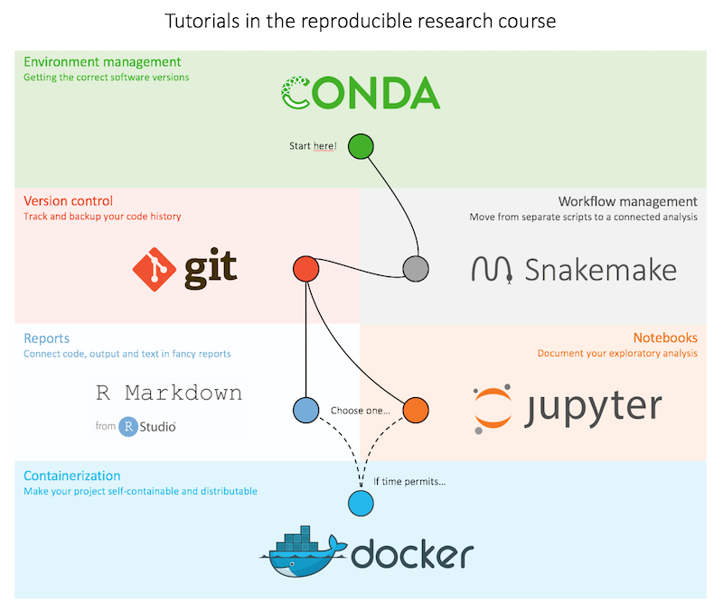
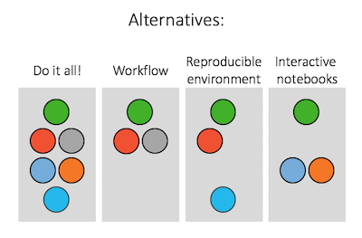

# Making bioinformatics research reproducible 
## - from raw data to publication

Welcome to the tutorials!

## The biological problem
For many examples in the tutorials we will use a real bioinformatics research project.

## Setup

### For Mac / Linux users

Clone the git/bitbucket repository containing all files you will need for completing the tutorials. First, `cd` into a directory on your computer (or create one) where it makes sense to download the course directory.
```bash
cd /path/to/your/directory/
git clone https://bitbucket.org/scilifelab-lts/reproducible_research_course.git
cd reproducible_research_course
```


### For Windows users
Install Docker from [here](https://docs.docker.com/docker-for-windows/install/). Note that for older versions of Windows you should use Docker Toolbox. Then run:
```bash
docker run --rm -it -v c:/my_dir:/home/ scilifelablts/reproducible_research_course_slim
```

This will start an isolated container running Linux, where the directory c:/my_dir is mounted (i.e. you can access the files in this Windows directory within the Linux container, and files edited or created within the Linux container will appear in this Windows directory).
Note that the idea is that you should edit files in the mounted c:/my_dir using an editor in your normal OS, say notepad in windows. The terminal in the container is for running stuff, not editing.

Clone the git/bitbucket repository containing all files you will need for completing the tutorials.
```bash
git clone https://bitbucket.org/scilifelab-lts/reproducible_research_course.git
cd reproducible_research_course
```

## The exercises

* [Conda](tutorials/conda)
* [Git](tutorials/git)
* [Snakemake](tutorials/snakemake)
* [RMarkdown](tutorials/rmarkdown)
* [Jupyter](tutorials/jupyter)
* [Docker](tutorials/docker)




## Take down
How to remove stuff

* ~/.ncbi/ # contains settings file, exists only if vdb-config is run
* ~/ncbi/ # created if caching is not disabled by vdb-config
* ~/.bash_profile # conda line
* ~/.conda/
* ~/.condarc
* ~/.continuum/ ?
* ~/.docker/
