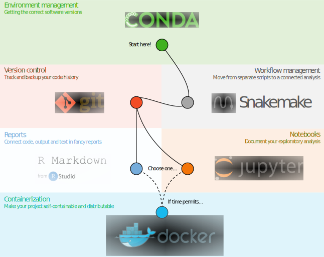
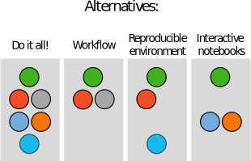

# Making bioinformatics research reproducible - from raw data to publication
Welcome to the tutorials!

## The biological problem
For many examples in the tutorials we will use a real bioinformatics research project.

# Setup
## For Mac / Linux users

Clone the git/bitbucket repository containing all files you will need for completing the tutorials. First, `cd` into a directory on your computer (or create one) where it makes sense to download the course directory.
```bash
cd /path/to/your/directory/
git clone https://bitbucket.org/scilifelab-lts/reproducible_research_course.git
cd reproducible_research_course
```

## For Windows users
Install Docker from [here](https://docs.docker.com/docker-for-windows/install/). Note that for older versions of Windows you should use Docker Toolbox. Then run:
```bash
docker run -it -v c:/my_dir:/home/ scilifelablts/reproducible_research_course_slim
```

This will start an isolated container running Linux, where the directory c:/my_dir is mounted (i.e. you can access the files in this Windows directory within the Linux container, and files edited or created within the Linux container will appear in this Windows directory).
Note that the idea is that you should edit files in the mounted c:/my_dir using an editor in your normal OS, say notepad in windows. The terminal in the container is for running stuff, not editing.

Clone the git/bitbucket repository containing all files you will need for completing the tutorials.
```bash
git clone https://bitbucket.org/scilifelab-lts/reproducible_research_course.git
cd reproducible_research_course
```

# The tutorials



* [Conda](conda)
* [Snakemake](snakemake)
* [Git](git)
* [R Markdown](rmarkdown)
* [Jupyter](jupyter)
* [Docker](docker)

# Take down
Depending on which of the tutorials you have taken, there might be quite a lot of files stored on your computer. Here are instructions for how to remove them.

## All tutorials
All the tutorials depend on you cloning the `reproducible_research_course` Bitbucket repo. This can be removed like any other directory; via Finder, Explorer or `rm -rf reproducible_research_course`. Note that this will also delete the hidden directories `.git`, which contains the history of the repo, and `.snakemake`, which contains the history of any Snakemake runs.

## Conda
Several of the tutorials use Conda for installing packages. This amounts to about 2.6 gb if you've done all the tutorials. If you plan on using Conda in the future you can remove just the packages, or you can remove everything including Conda itself. Note that this is not needed if you've done the tutorials on Windows using Docker (see the section on Docker below instead).

### Uninstall all of these packages but keep Conda itself for future use
First list all Conda environments
```bash
conda env list
```

For each of the environments except "root" run
```bash
conda remove -n envname --all
```

And lastly:
```bash
conda clean --all
```

### Remove every trace of Conda
First check where Conda is installed:

```bash
which conda
```

This should say something like `/Users/myuser/miniconda3/bin/conda`. Then remove the entire Conda directory:

```
rm -rf /Users/myuser/miniconda3
```

## Snakemake
Snakemake is installed via Conda and will be removed if you follow the instructions in the Conda section above. Note that Snakemake also generates a hidden `.snakemake` directory in the directory where it's run. You can remove this with

```bash
rm -rf reproducible_research_course/snakemake/.snakemake
```

## Docker
If you've done the Docker tutorial **or if you've been running Docker for Windows** you have some cleaning up to do. Docker is infamous for quickly taking up huge amounts of space, and some maintenance is necessary every now and then. Here is how to uninstall Docker completely. For instructions for how to remove individual images or containers, see the [docker tutorial](docker)

### macOS
Click the Docker icon in the menu bar (upper right part of the screen) and select "Preferences". This will open up the window below. First select "Reset" and fill in your password. Then select "Uninstall". Once it's done uninstalling, drag the Docker app from Applications to Trash.


### Linux

### Windows
Uninstall Docker for Windows (on Windows 10) or Docker Toolbox (on Windows 7) via Control Panel > Programs > Programs and Features. Docker Toolbox will also have installed Oracle VM VirtualBox, so uninstall that as well if you're not using it for other purposes.

How to remove stuff

* ~/.ncbi/ # contains settings file, exists only if vdb-config is run
* ~/ncbi/ # created if caching is not disabled by vdb-config
* ~/.bash_profile # conda line
* ~/.conda/
* ~/.condarc
* ~/.continuum/ ?
* ~/.docker/
