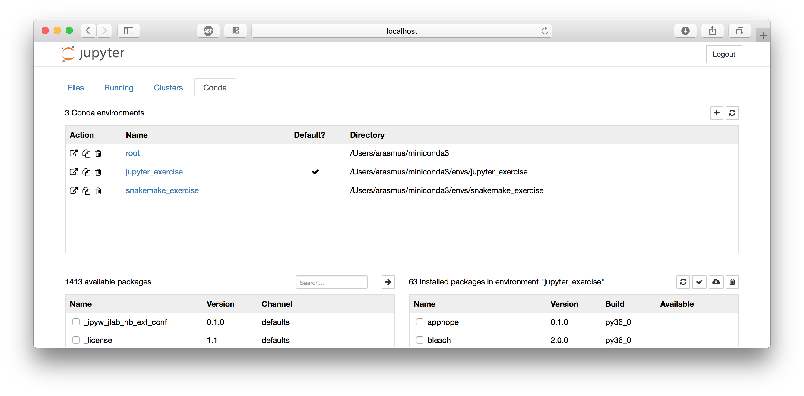

# Introduction

The Jupyter Notebook is an open-source web application that allows you to
create and share documents that contain code, equations, visualizations and
text. The functionality is partly overlapping with R Markdown (see the
[tutorial](rmarkdown.md)), in that they both use markdown and code chunks to
generate reports that integrate results of computations with the code that
generated them. Jupyter Notebook comes from the Python community while
R Markdown was developed by RStudio, but you could use most common programming
languages in either alternative. In practice though, it's quite common that
R developers use Jupyter but probably not very common that Python developers
use RStudio. Some reasons to use Jupyter include:

* Python is lacking a really good IDE for doing exploratory scientific data
  analysis, like RStudio or Matlab. Some people use Jupyter simply as an
  alternative for that.
* The community around Jupyter notebooks is large and dynamic, and there are
  lots of tools for sharing, displaying or interacting with notebooks.
* An early ambition with Jupyter notebooks (and its predecessor IPython
  notebooks) was to be analogous to the lab notebook used in a wet lab. It
  would allow the data scientist to document his or her day-to-day work and
  interweave results, ideas, and hypotheses with the code. From
  a reproducibility perspective, this is one of the main advantages.
* Jupyter notebooks can be used, just like R Markdown, to provide a tighter
  connection between your data and your results by integrating results of
  computations with the code that generated them. They can also do this in an
  interactive way that makes them very appealing for sharing with others.

As always, the best way is to try it out yourself and decide what to use it
for! Here are some useful resources if you want to read more:

* The [Jupyter project site](http://jupyter.org) contains a lot of information
  and inspiration.
* The [Jupyter Notebook documentation](
  https://jupyter-notebook.readthedocs.io/en/stable/).
* A [guide](http://ipywidgets.readthedocs.io/en/stable/index.html) to using
  widgets for creating interactive notebooks.

## Setup 

This tutorial depends on files from the course GitHub repo. Take a look at the
[intro](tutorial_intro.md) for instructions on how to set it up if you haven't
done so already. Then open up a terminal and go to
`workshop-reproducible-research/jupyter`.

If you have done the [Conda tutorial](conda.md) you should know how to define
an environment and install packages using Conda. Create an environment
containing the following packages from the `conda-forge` channel. Don't
forget to activate the environment.

* `jupyter`: for running everything
* `nb_conda`: for integrating Conda with Jupyter Notebook
* `matplotlib` and `ipywidgets` and `seaborn`: for generating plots
* `pandas`: for working with data frames and generating tables

!!! note "A note on nomenclature"
    * Jupyter: a project to develop open-source software, open-standards, and
      services for interactive computing across dozens of programming
      languages. Lives at [jupyter.org](jupyter.org).
    * Jupyter Notebook: A web application that you use for creating and
      managing notebooks. One of the outputs of the Jupyter project.
    * Jupyter notebook: The actual `.ipynb` file that constitutes your
      notebook.

!!! attention "Windows users"
    If you are doing these exercises through a Docker container you also need
    the run the following:
    
    ```bash
    mkdir -p -m 700 /root/.jupyter/ && \
    echo "c.NotebookApp.ip = '0.0.0.0'" >> \
        /root/.jupyter/jupyter_notebook_config.py
    ```

## Getting started

One thing that sets Jupyter Notebook apart from what you might be used to is
that it's a web application, *i.e.* you edit and run your code from your
browser. But first you have to start the Jupyter Notebook server.

```no-highlight
$ jupyter notebook --allow-root
[I 18:02:26.722 NotebookApp] Serving notebooks from local directory: /Users/john/Documents/projects/workshop-reproducible-research/jupyter
[I 18:02:26.723 NotebookApp] 0 active kernels
[I 18:02:26.723 NotebookApp] The Jupyter Notebook is running at:
[I 18:02:26.723 NotebookApp] http://localhost:8888/?token=e03f10ccb40efc3c6154358593c410a139b76acf2cae785c
[I 18:02:26.723 NotebookApp] Use Control-C to stop this server and shut down all kernels (twice to skip confirmation).
[C 18:02:26.724 NotebookApp]

    Copy/paste this URL into your browser when you connect for the first time,
    to login with a token:
        http://localhost:8888/?token=e03f10ccb40efc3c6154358593c410a139b76acf2cae785c
[I 18:02:27.209 NotebookApp] Accepting one-time-token-authenticated connection from ::1
```

Jupyter Notebook probably opened up a web browser for you automatically,
otherwise go to the address specified in the message in the terminal. Note that
the server is running locally (as `http://localhost:8888`) so this does not
require that you have an active internet connection. Also note that it says:

```no-highlight
Serving notebooks from local directory: </some/local/path/workshop-reproducible-research/jupyter>
```

Everything you do in your Notebook session will be stored in this directory, so
you won't lose any work if you shut down the server.


What you're looking at is the Notebook dashboard. This is where you manage your
files, notebooks, and kernels. The Files tab shows the files in your directory.
If you've done the other tutorials the file names should look familiar; they
are the files needed for running the RNA-seq workflow in Snakemake. The Running
tab keeps track of all your processes. The third tab, Clusters, is used for
parallel computing and won't be discussed further in this tutorial. The Conda
tab lets us control our Conda environments. Let's take a quick look at that.
You can see that I'm currently in the `jupyter_exercise` environment which is 
the name I chose when I created the environment (you may have used another name).



Let's start by creating an empty notebook by selecting the Files tab and
clicking New > Notebook > Python 3. This will open up a new tab or window 
looking like this:


!!! tip
    If you want to start Jupyter Notebooks on a cluster that you SSH to you
    have to do some port forwarding:
    
    ```bash
    ssh me@rackham.uppmax.uu.se -L8888:localhost:8888
    jupyter notebook --ip 0.0.0.0 --no-browser
    ```
## The basics

Jupyter notebooks are made up out of cells, and you are currently standing in
the first cell in your notebook. The fact that it has a green border indicates
that it's in "Edit mode", so you can write stuff in it. A blue border indicates
"Command mode" (see below). Cells in Jupyter notebooks can be of two types:
*markdown* or *code*.

* **Markdown:** These cells contain static material such as captions, text,
  lists, images and so on. You express this using Markdown, which is
  a lightweight markup language. Markdown documents can then be converted to
  other formats for viewing (the document you're reading now is written in
  Markdown and then converted to HTML). The format is discussed a little more in
  detail in the [R Markdown tutorial](rmarkdown.md). Jupyter Notebook uses
  a dialect of Markdown called Github Flavored Markdown, which is described
  [here](https://guides.github.com/features/mastering-markdown/).
* **Code:** These are the cells that actually do something, just as code chunks
  do in R Markdown. You can write code in dozens of languages and all do all
  kinds of clever tricks. You then run the code cell and any output the code
  generates, such as text or figures, will be displayed beneath the cell. We
  will get back to this in much more detail, but for now it's enough to
  understand that code cells are for executing code that is interpreted by
  a kernel (in this case the Python version in your Conda environment).

Before we continue, here are some shortcuts that can be useful. Note that they
are only applicable when in command mode (blue frames). Most of them are also
available from the menus. These shortcuts are also available from the **Help**
menu in your notebook (there's even an option there to edit shortcuts).

| Shortcut        | Effect                                   |
|-----------------|------------------------------------------|
| ++enter++       | enter Edit mode                          |
| ++escape++      | enter Command mode                       |
| ++ctrl+enter++  | run the cell                             |
| ++shift+enter++ | run the cell and select the cell below   |
| ++alt+enter++   | run the cell and insert a new cell below |
| ++ctrl+s++      | save the notebook                        |
| ++tab++         | for code completion or indentation       |
| ++m++/++y++     | toggle between Markdown and Code cells   |
| ++d-d++         | delete a cell                            |
| ++a/b++         | insert cells above/below current cell    |
| ++x/c/v++       | cut/copy/paste cells                     |
| ++o++           | toggle output of current cell            |

### Writing markdown

Let's use our first cell to create a header. Change the format from 
Code to Markdown in the drop-down list above the cell. Double click on 
the cell to enter editing mode (green frame) and input "# My notebook" 
("#" is used in Markdown for header 1). Run the cell with Shift-Enter. 
Tada!

Markdown is a simple way to structure your notebook into sections with
descriptive notes, lists, links, images etc.

Below are some examples of what you can do in markdown. Paste all or parts
of it into one or more cells in your notebook to see how it renders. Make 
sure you set the cell type to Markdown.

```
## Introduction
In this notebook I will try out some of the **fantastic** concepts of Jupyter
Notebooks.

## Markdown basics
Examples of text attributes are:

* *italics*
* **bold**
* `monospace`

Sections can be separated by horizontal lines.

---

Blockquotes can be added, for instance to insert a Monty Python quote:

    Spam! 
    Spam! 
    Spam! 
    Spam!

See [here](https://jupyter-notebook.readthedocs.io/en/stable/examples/Notebook/Working%20With%20Markdown%20Cells.html) for more information.    
```

### Writing code

Now let's write some code! Since we chose a Python kernel, Python would be the
native language to run in a cell. Enter this code in the second cell and run
it:

```python
print("Hello world!")
```

Note how the output is displayed below the cell. This interactive way of working
is one of the things that sets Jupyter Notebook apart from RStudio and
R Markdown. R Markdown is typically rendered top-to-bottom in one run, while you
work *in* a Jupyter notebook in a different way. This has partly changed with
newer versions of RStudio, but it's probably still how most people use the two
tools. Another indication of this is that there is no (good) way to hide the
code cells if you want to render your Jupyter notebook to a cleaner looking
report (for a publication for example).

What **is** a Jupyter notebook? Let's look a little at the notebook we're
currently working in. Jupyter Notebook saves it every minute or so, so you will
already have it available. We can be a little meta and do this from within the
notebook itself. We do it by running some shell commands in the third code cell
instead of Python code. This very handy functionality is possible by prepending
the command with `!`. Try `!ls` to list the files in the current directory.

Aha, we have a new file called `Untitled.ipynb`! This is our notebook. Look at
the first ten lines of the file by using `!head Untitled.ipynb`. Seems like it's
just a plain old JSON file. Since it's a text file it's suitable for version
control with for example Git. It turns out that Github and Jupyter notebooks are
the best of friends, as we will see more of later. This switching between
languages and whatever-works mentality is very prominent within the Jupyter
notebook community.

Variables defined in cells become variables in the global namespace. You can
therefore share information between cells. Try to define a function or variable
in one cell and use it in the next. For example:

```python
def print_me(str):
  print(str)
```

and

```python
print_me("Hi!")
```

Your notebook should now look something like this.


The focus here is not on how to write Markdown or Python; you can make really
pretty notebooks with Markdown and you can code whatever you want with Python.
Rather, we will focus on the Jupyter Notebook features that allow you to do
a little more than that.

!!! note "Quick recap"
    In this section we've learned:

    * That a Jupyter notebook consists of a series of cells, and that they can
      be either markdown or code cells.
    * That we execute the code in a code cell with the kernel that we chose
      when opening the notebook.
    * We can run shell commands by prepending them with `!`.
    * A Jupyter notebook is simply a text file in JSON format.

## Magics

Magics constitute a simple command language that significantly extends the
power of Jupyter notebooks. There are two types of magics:

* **Line magics**: Commands that are prepended by "%", and whose arguments only
  extend to the end of the line.
* **Cell magics**: Commands that start with `%%` and then applies to the whole
  cell. Must be written on the first line of a cell.

Now list all available magics with `%lsmagic` (which itself is a magic). You
add a question mark to a magic to show the help (*e.g.* `%lsmagic?`). Some of
them act as shortcuts for commonly used shell commands (`%ls`, `%cp`, `%cat`,
..). Others are useful for debugging and optimizing your code (`%timeit`,
`%debug`, `%prun`, ..).

A very useful magic, in particular when using shell commands a lot in your
work, is `%%capture`. This will capture the stdout/stderr of any code cell and
store them in a Python object. Run `%%capture?` to display the help and try to
understand how it works. Try it out with either some Python code, other magics
or shell commands.

??? note "Click to see an example"

    ```no-highlight
    %%capture output
    %%bash
    echo "Print to stdout"
    echo "Print to stderr" >&2
    ```

    and in another cell

    ```python
    print("stdout:" + output.stdout)
    print("stderr:" + output.stderr)
    ```

The `%%script` magic is used for specifying a program (bash, perl, ruby, ..)
with which to run the code (similar to a shebang). For some languages it's
possible to use these shortcuts:

* `%%ruby`
* `%%perl`
* `%%bash`
* `%%html`
* `%%latex`
* `%%R` (here you have to first install the rpy2 extension, for example with
  Conda, and then load with `%load_ext rpy2.ipython`)

Try this out if you know any of the languages above. Otherwise you can always
try to print the quadratic formula with LaTeX!

```no-highlight
\begin{array}{*{20}c} {x = \frac{{ - b \pm \sqrt {b^2 - 4ac} }}{{2a}}} & {{\rm{when}}} & {ax^2 + bx + c = 0} \\ \end{array}
```

Python's favorite library for plotting, matplotlib, has its own magic as well:
`%matplotlib`. Try out the code below, and you should hopefully get a pretty
sine wave.

```python
%matplotlib inline
import numpy as np
import matplotlib.pyplot as plt
x = np.linspace(0,3*np.pi,100)
y = np.sin(x)
fig = plt.figure()
ax = fig.add_subplot(111)
line, = plt.plot(x, y, 'r-')
fig.canvas.draw()
```

By default rendering is done as rasterized images which can make the quality
poor. To render in scalable vector graphics format add the following line magic

```python
%config InlineBackend.figure_format = 'svg'
``` 

Try it by adding it to the cell with the lineplot and run it again. 

!!! tip
    The `%matplotlib inline` and `%config InlineBackend.figure_format = 'svg'`
    line magics are only required once per notebook. You could for instance 
    add them to the first cell where you import matplotlib for plotting.

!!! tip
    You can capture the output of some magics directly like this:

    ```python
    my_dir = %pwd
    print(my_dir)
    ```

## Widgets and plotting

Since we're typically running our notebooks in a web browser, they are quite
well suited for also including more interactive elements. A typical use case
could be that you want to communicate some results to a collaborator or to
a wider audience, and that you would like them to be able to affect how the
results are displayed. It could, for example, be to select which gene to plot
for, or to see how some parameter value affects a clustering. Jupyter notebooks
has great support for this in the form of *widgets*.

Widgets are eventful Python objects that have a representation in the browser,
often as a control like a slider, textbox, etc. These are implemented in the 
`ipywidgets` package.

The easiest way to get started with using widgets are via the `interact` and
`interactive` functions. These functions autogenerate widgets from functions
that you define, and then call those functions when you manipulate the widgets.
Too abstract? Let's put it into practice! 

Let's try to add sliders that allow us to change the frequency, amplitude and
phase of the sine curve we plotted previously.

```python
# Import the interact and interactive functions from ipywidgets
from ipywidgets import interact, interactive
# Also import numpy (for calculating the sine curve) 
# and pyplot from matplotlib for plotting
import numpy as np
import matplotlib.pyplot as plt

# Define the function for plotting the sine curve
def sine_curve(A, f, p):
    # Set up the plot
    plt.figure(1, figsize=(4,4))
    # Create a range of 100 evenly spaced numbers between 0 and 100
    x = np.linspace(0,10,100)
    # Calculate the y values using the supplied parameters
    y = A*np.sin(x*f+p)
    # Plot the x and y values ('r-' specifies color and line style)
    plt.plot(x, y, 'r-')
    plt.show()

# Here we supply the sine_curve function to interactive, 
# and set some limits on the input parameters
interactive_plot = interactive(sine_curve, 
            A=(1, 5, 1), 
            f=(0, 5, 1), 
            p=(1, 5, 0.5))

# Display the widgets and the plot
interactive_plot
```

The code above defines a function called `sine_curve` which takes three 
arguments: 

- `A` = the amplitude of the curve
- `f` = the frequency of the curve
- `p` = the phase of the curve

The function creates a plot area, generates x-values and calculates y-values
using the `np.sin` function and the supplied parameters. Finally, the x and y
values are plotted.

Below the function definition we use `interactive` with the `sine_curve` 
function as the first parameter. This means that the widgets will be tied to 
the `sine_curve` function. As you can see we also supply the `A`, `f` and `p` 
keyword arguments. Importantly, all parameters defined in the `sine_curve` 
function must be given in the `interactive` call and a widget is created for
each one. 

Depending on the `type` of the passed argument different types of
widgets will be created by `interactive`. For instance: 

- `int` or `float` arguments will generate a slider
- `bool` arguments (True/False) will generate checkbox widgets
- `list` arguments will generate a dropdown
- `str` arguments will generate a text-box 

By supplying the arguments in the form of 
[tuples](https://docs.python.org/3/library/stdtypes.html#typesseq) we can
adjust the properties of the sliders. `f=(1, 5, 1)` creates a widget with 
minimum value of `1`, maximum value of `5` and a step size of `1`. Try adjusting
these numbers in the `interactive` call to see how the sliders change (you have
to re-execute the cell).

The final line of the cell (`interactive_plot`) is where the actual widgets and 
plot are displayed. This code can be put in a separate cell, so that you can
define functions and widgets in one part of your notebook, and reuse them
somewhere else.

This is how it should look if everything works. You can now set the frequency
amplitude and phase of the sine curve by moving the sliders. 


There are lots of widgets, _e.g._:

- Dropdown menus
- Toggle buttons
- Range sliders
- File uploader

... and much, much more. Here is a [list of all available widgets](
https://ipywidgets.readthedocs.io/en/latest/examples/Widget%20List.html)
together with documentation and examples. Some of these widgets cannot be 
autogenerated by `interactive`, but fear not! Instead of relying on 
autogeneration we can define the widget and supply it directly to `interactive`.

To see this in practice, change out the `A` argument to a pre-defined
`IntSlider` widget. First define the slider:

```python
from ipywidgets import widgets
A = widgets.IntSlider(value=2, min=1, max=5, step=1)
```

Then replace the call to `interactive` so that it looks like this:

```python
interactive_plot = interactive(sine_curve, A=A, f=5, p=5)
```

### Extra challenge

If you can't get enough of widgets you might want to try this out: see if you
can figure out how to add a widget that lets you pick the color for the sine
curve line. Search for the appropriate widget in the [Widget list](
https://ipywidgets.readthedocs.io/en/latest/examples/Widget%20List.html).
You'll need to update the `sine_curve` function and pass the new widget as
an argument in the call to `interactive`. If you need help, click below. 

??? note "Click to see how to add a color picker"
    
    ```python
    # Import the interact and interactive functions from ipywidgets
    from ipywidgets import interact, interactive
    # Also import numpy (for calculating the sine curve) 
    # and pyplot from matplotlib for plotting
    import numpy as np
    from ipywidgets import widgets ## <- import widgets
    import matplotlib.pyplot as plt
    
    # Define the function for plotting the sine curve
    def sine_curve(A, f, p, color): ## <- add parameter here
        # Set up the plot
        plt.figure(1, figsize=(4,4))
        # Create a range of 100 evenly spaced numbers between 0 and 100
        x = np.linspace(0,10,100)
        # Calculate the y values using the supplied parameters
        y = A*np.sin(x*f+p)
        # Plot the x and y values 
        plt.plot(x, y, color=color) ## <- Use color from widget here
        plt.show()
    
    # Here we supply the sine_curve function to interactive, 
    # and set some limits on the input parameters
    # Define the colorpicker widget
    colorpicker = widgets.ColorPicker(description='color',value="red")
    interactive_plot = interactive(sine_curve, 
                A=(1, 5, 1), 
                f=(0, 5, 1), 
                p=(1, 5, 0.5),
                color=colorpicker) ## <- Supply the colorpicker to the function
    
    # Display the widgets and the plot
    interactive_plot
    ```

### Other interactive plots

Jupyter widgets, like we used here, is the most vanilla way of getting
interactive graphs in Jupyter notebooks. Some other alternatives are:

* [Plotly](https://plot.ly/python/ipython-notebook-tutorial) - is actually an
  API to a web service that renders your graph and returns it for display in
  your Jupyter notebook. Generates very visually appealing graphs, but from
  a reproducibility perspective it's maybe not a good idea to be so reliant on
  a third party.
* [Bokeh](https://bokeh.pydata.org/en/latest/docs/user_guide/notebook.html#userguide-notebook)
  - is another popular tool for interactive graphs. Most plotting packages for
    Python are built on top of matplotlib, but Bokeh has its own library. This
  can give a steeper learning curve if you're used to the standard packages.
* [mpld3](http://mpld3.github.io) - tries to integrate matplotlib with
  Javascript and the D3js package. It doesn't scale well for very large
  datasets, but it's easy to use and works quite seamlessly.

!!! note "Quick recap"
    In the two previous sections we've learned:

    * How magics can be used to extend the power of Jupyter notebooks, and the
      difference between line magics and cell magics.
    * How to switch between different languages by using magics.
    * How to use widgets and the mpld3 library for interactive plotting.

## Using the command line

### Converting notebooks

Notebooks can be converted to various output formats such as HTML, PDF, LaTeX
*etc.* directly from the **File** -> **Download as** menu. 

Conversion can also be performed on the command line using the `jupyter
nbconvert` command. `nbconvert` is installed together with the `jupyter` Conda
package and is executed on the command line by running `jupyter nbconvert`. 
 
The syntax for converting a Jupyter notebook is:

```bash
jupyter nbconvert --to <FORMAT> notebook.ipynb
``` 

Here `<FORMAT>` can be any of `asciidoc`, `custom`, `html`, `latex`, `markdown`,
`notebook`, `pdf`, `python`, `rst`, `script`, `slides`. Converting to some 
output formats (*e.g.* PDF) may require you to install separate software such
as [Pandoc](pandoc.org) or a **TeX** environment.

Try converting the `Untitled.ipynb` notebook that you have been working on so
far to HTML using `jupyter nbconvert`.

### Executing notebooks

`nbconvert` can also be used to run a Jupyter notebook from the commandline. By
running:
 
```bash
jupyter nbconvert --execute --to <FORMAT> notebook.ipynb 
```

`nbconvert` executes the cells in a notebook, captures the output and saves the
results in a new file. Try running it on the `Untitled.ipynb` notebook.

You can also specify a different output file with `--output <filename>`.

So in order to execute your `Untitled.ipynb` notebook and save it to a file 
named `report.html` you could run:

```bash
jupyter nbconvert --to html --output report.html --execute Untitled.ipynb
```

## Jupyter and the case study

As you might remember from the [intro](tutorial_intro.md), we are attempting to
understand how lytic bacteriophages can be used as a future therapy for the
multiresistant bacteria MRSA (methicillin-resistant _Staphylococcus aureus_). We
have already seen how to define the project environment in the [Conda
tutorial](conda.md) and how to set up the workflow in the [Snakemake
tutorial](snakemake.md). Here we explore the results from a the snakemake
workflow in a Jupyter notebook as an example of how you can document your
day-to-day work as a dry lab scientist.

We will create a report similar to the one in the [R Markdown tutorial](
rmarkdown.md) and generate and visualize read coverage across samples for the
_S. aureus_ genome.

### Install a new Conda environment

For the purposes of this part of the tutorial we will install a new Conda
environment and run a slightly slimmed down version of the MRSA Snakemake
workflow to generate some output to work with.

In the `jupyter/` directory you'll find a `Snakefile` containing the workflow
as well as a Conda `environment.yml` file which contains all packages
required for both the execution of the workflow as well as the downstream 
analyses we will perform in the Jupyter notebook.
  
Install *a new* Conda environment using the `environment.yml` file and then
activate it. You can choose the name of the environment yourself. 
Here's an example using the name `jupyter-snakemake`:
 
```bash
conda env create -f environment.yml -n jupyter-snakemake
# Activate the environment 
conda activate jupyter-snakemake
```

!!! attention
    If you are doing these exercises through a Docker container you should
    instead update the current conda base environment by running `conda env
    update -f environment.yml -n base`.

### Open the MRSA notebook

In the `jupyter/` directory you will also see a notebook called `mrsa_notebook
.ipynb`. With the newly created conda environment active, open this notebook
 directly by running:
 
```bash
jupyter notebook mrsa_notebook.ipynb
```

!!! tip
    Using what you've learned about markdown in notebooks, add headers 
    and descriptive text to subdivide sections as you add them. This will
    help you train how to structure and keep note of your work with a 
    notebook.

You will see that the notebook contains only two cells: one with some 
import statements and one with two function definitions. We'll come back 
to those later. Now, run the cells and add a new empty cell to the notebook. 
Typically the Snakemake workflow would be executed from a terminal but let's 
try to actually run the workflow directly from within the Jupyter notebook. 

In the current directory you'll find the necessary `Snakefile` and `config.yml`
to run the workflow. In an empty cell in your notebook, add code to run the
workflow. Then run the cell.     

??? note "Click to see how to run the workflow from a cell"

    ```
    !snakemake
    ```

Once the workflow is finished we can start to explore the results. 

### Plot QC status
First let's take a look at the FastQC summary for the samples. Add the
following code to a cell then run the cell. This will extract and concatenate
summary files for all samples using FastQC output in the `intermediate/`
directory. 

```python
import glob
import os

with open('summary.txt', 'w') as fhout:
    # Find all zip files from fastqc
    for f in glob.glob('intermediate/*_fastqc.zip'):
        # Extract the archive name
        arc_name = os.path.splitext(os.path.basename(f))[0]
        # Open up the 'summary.txt' in the zip archive
        # and output the contents to 'summary.txt'
        with ZipFile(f) as myzip:
            with myzip.open('{arc_name}/summary.txt'.format(arc_name=arc_name), 'r') as fhin:
                fhout.write(fhin.read().decode())
```

Read the summary results into a data frame using the pandas package:

```python
# Read the concatenated summary.txt
qc = pd.read_csv("summary.txt", sep="\t", header=None,
    names=["Status","Statistic","Sample"], index_col=0)
# Rename strings in the Sample column
qc["Sample"] = [x.rstrip(".fastq.gz") for x in qc["Sample"]]
# Map the status strings to numeric values for plotting
qc.rename(index={"PASS": 1, "WARN": 0, "FAIL": -1}, inplace=True)
# Convert from long to wide format
qc = pd.pivot_table(qc.reset_index(), columns="Sample", index="Statistic")
```

Take a look at the `qc` DataFrame by adding the variable to an empty cell
and running the cell.

Now let's plot the heatmap using the `heatmap` function from the `seaborn` 
package.

```python
# Plot the heatmap
ax = sns.heatmap(qc["Status"], cmap=["Red","Yellow","Green"], linewidth=.5,
    cbar=None)
ax.set_ylim(11,0); # Only necessary in cases where matplotlib cuts the y-axis
``` 

To save the plot to a file add the following to the cell:
```python
plt.savefig("qc_heatmap.png", dpi=300, bbox_inches="tight")
```

### Genome coverage
In the workflow reads were aligned to the _S. aureus_ reference genome 
using `bowtie2`. Let's take a look at genome coverage for the samples. To 
do this we will first generate coverage files with `bedtools`.

Add the following to a new cell:

```
%%bash
for f in $(ls intermediate/*.sorted.bam);
do
    bedtools genomecov -ibam $f -d | gzip -c > $f.cov.gz
done
```
This will run `bedtools genomecov` on all bam-files in the `intermediate/` 
directory and generate coverage files. 

Next, read coverage files and generate a table of genome positions and 
aligned reads in each sample. For this we make use of the `read_cov_files` 
function defined in the beginning of the notebook.

```python
files = glob.glob("intermediate/*.sorted.bam.cov.gz")
coverage_table = read_cov_tables(files)
```
Take a look at the `coverage_table` DataFrame. Because this is a relatively 
large table you can use:
```python
coverage_table.head()
```
 to only view the first 5 rows. With

```python
coverage_table.sample(5)
``` 
you will see 5 randomly sampled rows.

Next let's calculate reads aligned to the genome using a sliding window. 
For this we'll use the `sliding_window` function defined at the start of the
notebook. You can try different sizes of the sliding window, in the example
below we're using 10 kbp.

```python
coverage_window = sliding_window(coverage_table, window=10000)
```

Now we'll plot the read coverage for all samples:

```python
# Set the figure size
fig = plt.figure(figsize=(6,4))
# Set colors
colors = sns.color_palette("Dark2", n_colors=3)
# Set legend handles
handles = []
# Iterate samples and plot coverage
for i, sample in enumerate(coverage_window.columns):
    ax = sns.lineplot(x=coverage_window.index, y=coverage_window[sample],
        linewidth=.75, color=colors[i])
    # Update legend handles
    handles.append(mpatches.Patch(color=colors[i], label=sample))
# Set y and x labels
ax.set_ylabel("Reads aligned");
ax.set_xlabel("Genome position");
# Plot legend
plt.legend(handles=handles);
```

Not too bad, but it's a bit difficult to see individual samples in one plot.

Let's also make three subplots and plot each sample separately. First we 
define the subplots grid using `plt.subplots`, then each sample is plotted
in a separate subplot using the `ax=` keyword argument in `sns.lineplot`:

```python
# Define the subplots
fig, axes = plt.subplots(ncols=1, nrows=3, sharey=True, sharex=True,
    figsize=(6,6))
# Iterate samples and plot in separate subplot
for i, sample in enumerate(coverage_window.columns):
    ax = sns.lineplot(x=coverage_window.index, y=coverage_window[sample],
        ax=axes[i], linewidth=.75)
    ax.set_title(sample)
    ax.set_ylabel("Reads aligned");
# Adjust space between subplots
plt.subplots_adjust(hspace=.3)
```

We can also visualize how the coverage correlates between the samples using
the `scatterplot` function in `seaborn`:

```python
sns.scatterplot(x=coverage_window["SRR935090"],y=coverage_window["SRR935091"])
```

Let's see if you can figure out how to visualize coverage correlation as 
above for all sample combinations in a subplot figure. Try to combine what we
used in the previous two cells. Then take a look at the answer below.

??? note "Click to see how to plot correlations in subplots"
    ```
    fig, axes = plt.subplots(ncols=3, nrows=1, figsize=(12,3), sharex=False,
        sharey=False)
    ax1 = sns.scatterplot(x=coverage_window["SRR935090"],
        y=coverage_window["SRR935091"], ax=axes[0])
    ax2 = sns.scatterplot(x=coverage_window["SRR935090"],
        y=coverage_window["SRR935092"], ax=axes[1])
    ax3 = sns.scatterplot(x=coverage_window["SRR935092"],
        y=coverage_window["SRR935091"], ax=axes[2])
    plt.subplots_adjust(wspace=.4)
    ```

!!! tip
    Seaborn actually has a function that essentially let's us generate the plot
    above with one function call. Take a look at the `pairplot` function by
    running `?sns.pairplot` in a new cell. Can you figure out how to use it
    with our data?

### Integrating the notebook into the workflow

So now we have a Jupyter notebook that uses output from a Snakemake workflow
and produces some summary results and plots. Wouldn't it be nice if this was
actually part of the workflow itself? We've already seen how we can [execute
notebooks from the commandline](#executing-notebooks) using `nbconvert`. If 
you've done the [Snakemake](snakemake.md) tutorial you should have an 
understanding of how to add/modify rules in the `Snakefile` that's available
in the current `jupyter/` folder. 

Make sure you save the `mrsa_notebook.ipynb` notebook. Then open the `Snakefile`
in a text editor and try to add a rule called`generate_report` that uses 
the `mrsa_notebook.ipynb` you've been working on and produces a report file
called `report.html` in the `results/` directory. **Hint**: because the notebook
uses output from the current Snakemake workflow the input to `generate_report` 
should come from rules that are run towards the end of the workflow. 

Try to add the rule on your own first. If you get stuck, take a look at the 
example below.

??? note "Click to see an example on how to implement `generate_report`"

    ```
    rule generate_report:
    """
    Generate a report from a Jupyter notebook with nbconvert
    """
    input:
        "results/tables/counts.tsv",
        "results/multiqc.html"
    output:
        "results/report.html"
    shell:
        """
        jupyter \
            nbconvert \
            --to html \
            --execute mrsa_notebook.ipynb \
            --output {output}
        """
    ```

To get snakemake to run the new rule as part of the rest of the workflow 
(*i.e.* when only running `snakemake`) add `results/report.html` to the input
of the `all` rule. Now that the notebook is integrated into the workflow you
can remove the cell where we executed snakemake (*e.g.* using `!snakemake`).

Finally, try to re-run the updated workflow either by deleting the `data/`, 
`intermediate/` and `results/` directories and executing `snakemake` again, or
by running `snakemake --forceall`.

## Sharing your work

The files you're working with come from a GitHub repo. Both GitHub and Bitbucket
can render Jupyter notebooks as well as other types of Markdown documents. Now
go to our GitHub repo at
[https://github.com/NBISweden/workshop-reproducible-research](https://github.com/NBISweden/workshop-reproducible-research)
and navigate to `jupyter/mrsa_notebook.ipynb`.


As you can imagine, having this very effortless way of sharing results
can greatly increase the visibility of your work. You work as normal on
your project, and push regularly to the repository as you would anyways,
and the output is automatically available for anyone to see. Or for a
select few if you're not ready to share your findings with the world
quite yet.

Say your notebook isn't on Github/Bitbucket. All hope isn't lost there.
Jupyter.org provides a neat functionality called *nbviewer*, where you can
past an URL to any notebook and they will render it for you. Go to
[https://nbviewer.jupyter.org](https://nbviewer.jupyter.org) and try
this out with our notebook.

```no-highlight
https://raw.githubusercontent.com/NBISweden/workshop-reproducible-research/main/jupyter/mrsa_notebook.ipynb
```

### Shared interactive notebooks
So far we've only shared static representations of notebooks. A strong
trend at the moment is to run your notebooks in the cloud, so that the
person you want to share with could actually execute and modify your
code. This is a great way of increasing visibility and letting
collaborators or readers get more hands-on with your data and analyses.
From a reproducibility perspective, there are both advantages and
drawbacks. On the plus side is that running your work remotely forces
you to be strict when it comes to defining the environment it uses
(probably in the form of a Conda environment or Docker image). On the
negative side is that you become reliant on a third-party service that
might change input formats, go out of business, or change payment model.

Here we will try out a service called Binder, which lets you run and
share Jupyter Notebooks in Git repositories for free. There are a number
of [example repositories](https://github.com/binder-examples/) that are
setup to be used with Binder. Navigate to
[https://github.com/binder-examples/conda/](https://github.com/binder-examples/conda/) 
to see one such example. As you can see the repository contains a LICENSE 
file, a README, an environment file and a notebook. To use a repository 
with Binder the environment file should contain all the packages needed 
to run notebooks in the repo. So let's try to run the `index.ipynb` file 
using Binder:

Just go to [https://mybinder.org](https://mybinder.org) and paste the link 
to the GitHub repo. Note the link that you can use to share your notebook. 
Then press "launch".


What will happen now it that:

* Binder detects the `environment.yml` file in the root of the repo.
  Binder then builds a _Docker image_ based on the file. This might take
  a minute or two. You can follow the progress in the build log.
* Binder then launches the Jupyter Notebook server in the Docker
  container..
* ..and opens a browser tab with it for you.

Once the process is finished you will be presented with a Jupyter server
overview of the contents in the repository. Click on the `index.ipynb`
notebook to open it. Tada! You are now able to interact with (and
modify) someone else's notebook online.

Applied to your own projects you now have a way to run analyses in the
cloud and in an environment that you define yourself. All that's needed
for someone to replicate your analyses is that you share a link with
them. Note that notebooks on Binder are read-only; its purpose is for
trying out and showing existing notebooks rather than making new ones.

!!! tip "Binder configuration files" 

    By default Binder looks for configuration files such as environment.yml
     in the root of the repository being built. But you may also put 
     such files outside the root by making a `binder/` folder in the root
     and placing the file there.  

!!! note "A note on transparency" 
    
    Resources like Github/Bitbucket and Jupyter Notebooks have changed 
    the way we do scientific research by encouraging visibility, social 
    interaction and transparency. 
    It was not long ago that the analysis scripts and workflows in a lab were
    well-guarded secrets that we only most reluctantly shared with others.
    Assuming that it was even possible. In most cases, the only postdoc who
    knew how to get it to work had left for a new position in industry, or
    no one could remember the password to the file server. If you're a PhD
    student, we encourage you to embrace this new development
    wholeheartedly, for it will make your research better and make you into
    a better scientist. And you will have more fun.
