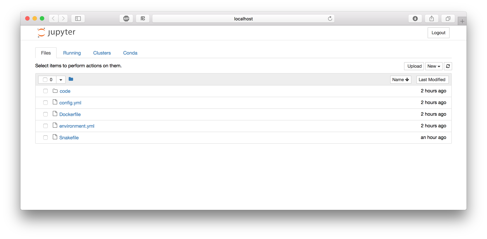
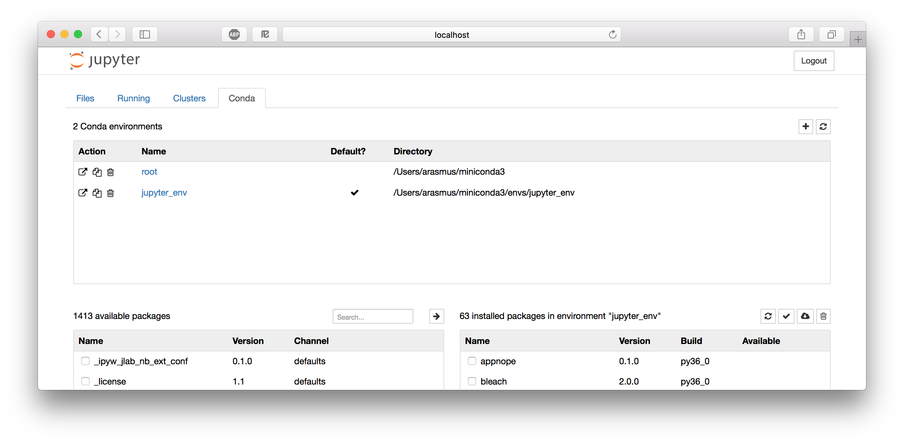

# Introduction to Jupyter Notebook
The Jupyter Notebook is an open-source web application that allows you to create and share documents that contain code, equations, visualizations and text. The functionality is partly overlapping with R Markdown (see the [tutorial](rmarkdown)), in that they both use markdown and code chunks to generate reports that integrate results of computations with the code that generated them. Jupyter Notebook comes from the Python community while R Markdown was developed by RStudio, but you could use most common programming languages in either alternative. In practice though, it's quite common that R developers use Jupyter but probably not very common that Python developers use RStudio.

TODO: Some more text here. Sharing and server and git and gist and nbviever.

As always, the best way to understand how something works is to try it out.

## Tell me more
* The [Jupyter project site](http://jupyter.org) contains a lot of information and inspiration.
* The [Jupyter Notebook documentation](https://jupyter-notebook.readthedocs.io/en/stable/).

# Set up
This tutorial depends on files from the course BitBucket repo. Take a look at the [intro](index.md) for instructions on how to set it up if you haven't done so already. Then open up a terminal and go to `reproducible_research_course/jupyter`.

## Install Jupyter Notebook
If you have done the [Conda tutorial](conda.md) you should know how to define an environment and install packages using Conda. Create an environment containing the packages `jupyter` and `nb_conda` (for managing Conda environments from Jupyter) from the `conda-forge` channel. Don't forget to activate the environment.

(If you don't want to use Conda for some reason you can also install Jupyter with `pip3 install jupyter`.)

# Practical exercise
## The Jupyter Notebook dashboard
One thing that sets Jupyter Notebook apart from what you might be used to is that it's a web application, i.e. you edit and run your code from your browser. Ok, not quite everything, you first have to start the Jupyter Notebook server.

```no-highlight
$ jupyter notebook
[I 18:02:26.722 NotebookApp] Serving notebooks from local directory: /Users/arasmus/Documents/projects/reproducible_research_course/jupyter
[I 18:02:26.723 NotebookApp] 0 active kernels
[I 18:02:26.723 NotebookApp] The Jupyter Notebook is running at:
[I 18:02:26.723 NotebookApp] http://localhost:8888/?token=e03f10ccb40efc3c6154358593c410a139b76acf2cae785c
[I 18:02:26.723 NotebookApp] Use Control-C to stop this server and shut down all kernels (twice to skip confirmation).
[C 18:02:26.724 NotebookApp]

    Copy/paste this URL into your browser when you connect for the first time,
    to login with a token:
        http://localhost:8888/?token=e03f10ccb40efc3c6154358593c410a139b76acf2cae785c
[I 18:02:27.209 NotebookApp] Accepting one-time-token-authenticated connection from ::1
```

Jupyter Notebook probably opened up a web browser for you automatically, otherwise go to the adress specified in the message in the terminal. Note that the server is running locally (as [http://localhost:8888](http://localhost:8888)) so this does not require that you have an active internet connection. Also note that it says "Serving notebooks from local directory: /Users/arasmus/Documents/projects/reproducible_research_course/jupyter". Everything you do using Notebook will be stored in this directory, so you don't lose any work if you shut down the server.



What you're looking at is the Notebook dashboard. This is where you manage your files, notebooks, and kernels. The "Files" tab is where all your files are kept and the "Running" tab keeps track of all your processes. The third tab, "Clusters", is used for parallel computing and won't be discussed further in this tutorial. The "Conda" tab lets us control our Conda environments. Let's take a look at that. You can see that I'm currently in the `jupyter_env` environment.



Let's start by creating
