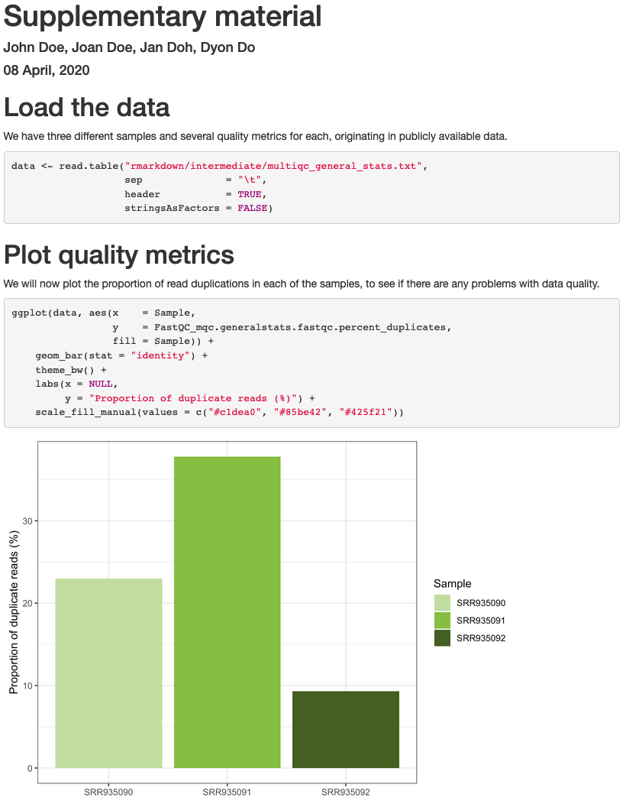
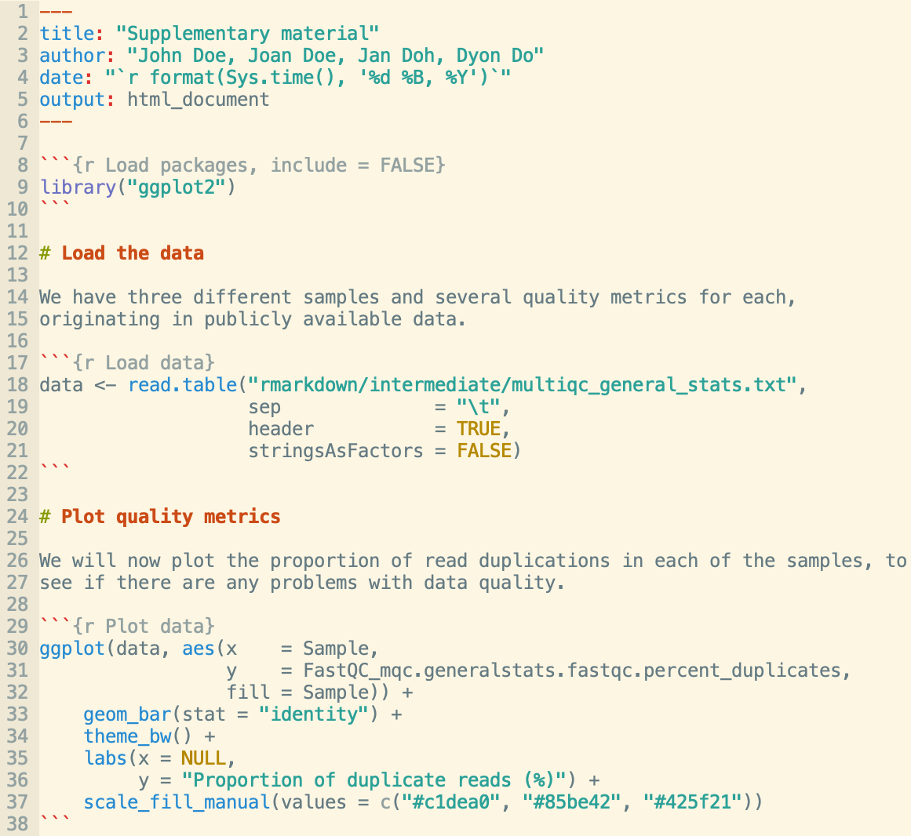

layout: true
<div class="southgreen-logo"></div>
<div class="nbis-logo"></div>

---

class: center, middle

*Making reports with*


---


# R Markdown connects code with results

<br><br><br>
<center>

</center>

---

# R Markdown connects code with results

.pull-left[

]

--

.pull-right[
<br><br>

]

---

# R Markdown connects code with results

.pull-left[

### A .green[header] in YAML-format

* .small[Defines document-wide options]
* .small[Specifies the output format]
* .small[Can include several parameters]
]

.pull-right[
<br><br>

]

---

# R Markdown connects code with results

.pull-left[

### A .green[header] in YAML-format

* .small[Defines document-wide options]
* .small[Specifies the output format]
* .small[Can include several parameters]

### .green[Markdown] text

* .small[Freely add and format text using standard markdown]
]

.pull-right[
<br><br>

]

---

# R Markdown connects code with results

.pull-left[

### A .green[header] in YAML-format

* .small[Defines document-wide options]
* .small[Specifies the output format]
* .small[Can include several parameters]

### .green[Markdown] text

* .small[Freely add and format text using standard markdown]

### Code .green[chunks]

* .small[Evaluate R code and show its output]
* .small[Specify global or local chunk options (*e.g.* figure dimensions)]
* .small[Also works with several other languages (*e.g.* Bash and Python)]
]

.pull-right[
<br><br>

]

---

# Rendering R Markdown documents

* Render from the .green[command line] (or R terminal in RStudio):
  <br>`R -e "rmarkdown::render('Report.Rmd')"`

* Render from the .green[RStudio menu]

---

# Output formats

* .green[Reports] and general documents (HTML, PDF, Microsoft Word)

* .green[Presentations] (Xaringan, reveal.js, PowerPoint, Beamer)

* .green[Interactive documents] and .green[dashboards] (HTML widgets, Shiny)

* .green[Books] and .green[websites] (Bookdown)

---

# Presentations with R Markdown

```{r Plot, dpi = 150, fig.width = 10, fig.height = 4.5, warning = FALSE}
library("ggplot2")
library("palmerpenguins")
data(penguins, package = "palmerpenguins")
ggplot(penguins, aes(x      = bill_length_mm,
                     y      = body_mass_g,
                     colour = species)) +
    geom_point(size = 2) +
    theme_bw() +
    labs(x = "Bill length (mm)",
         y = "Body mass (g)") +
    ggtitle("Penguin weight and bill length") +
    theme(plot.title = element_text(hjust = 0.5)) +
    scale_colour_manual(values = c("#c1dea0", "#85be42", "#425f21"))
```

---

class: center, middle

# Questions?
