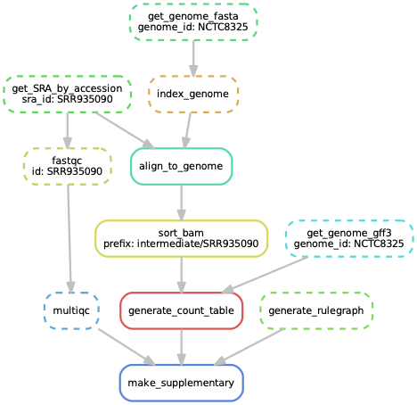

layout: true
<div class="southgreen-logo"></div>
<div class="nbis-logo"></div>

---

class: center, middle

*Making reproducible workflows with*


---

# Why do we need workflow managers?
--
<br>
.pull-left[

]
.pull-right[
*As projects grow or age, it becomes increasingly difficult to keep track of all the parts and how they fit together.*
]

---

# Workflow managers

.pull-left[.center[

<br>
<br>
<br>

]]

.pull-right[.center[

<br>
GNU Make

<br>

]]

---

# Snakemake workflows

--

- automatically track input/output file dependencies

--

- are built from .green[rules]

--

- are generalized with .green[wildcards]

--

- use a .green[Python-based] definition language

--

- easily scale from laptops to HPC clusters

---

# Reproducible...

.center[]

---

# ...and scalable workflows

.center[]

---

# Example: sequence trimming

Using a bash-script:

```bash
for sample in *.fastq
do  
   id=$(echo ${sample} | sed 's/.fastq//')  
   
   # 1. Trim fastq file
   seqtk trimfq -b 5 -e 10 $sample > ${id}.trimmed.fastq

   # 2. Compress fastq file
   gzip -c ${id}.trimmed.fastq > ${id}.trimmed.fastq.gz

   # 3. Remove intermediate files  
   rm ${id}.trimmed.fastq
done
```

---

# Example: sequence trimming

Using snakemake rules:

```python
rule trim_fastq:
    output: temp("{prefix}.trimmed.fastq")
    input: "{prefix}.fastq"
    shell:
        "seqtk trimfq -b 5 -e 10 {input} > {output}"

rule gzip:
    output: "{prefix}.trimmed.fastq.gz"
    input: "{prefix}.trimmed.fastq"
    shell:
        "gzip -c {input} > {output}"
```

---

# Example: sequence trimming

Using snakemake rules:
.small[
``` bash
$ snakemake -c 1 {a,b}.trimmed.fastq.gz
```
]
---

# Example: sequence trimming

Using snakemake rules:
.small[
``` bash
$ snakemake -c 1 {a,b}.trimmed.fastq.gz
Provided cores: 1
Rules claiming more threads will be scaled down.
Job counts:
count   jobs
2       gzip
2       trim_fastq
4        

rule trim_fastq:
    input: a.fastq
    output: a.trimmed.fastq
    wildcards: prefix=a
    1 of 4 steps (25%) done

rule gzip:
    input: a.trimmed.fastq
    output: a.trimmed.fastq.gz
    wildcards: prefix=a
Removing temporary output file a.trimmed.fastq.
2 of 4 steps (50%) done
```
]
---

# Example: sequence trimming

Using snakemake rules:
.small[
``` bash
$ snakemake -c 1 {a,b}.trimmed.fastq.gz
```
...
``` bash
rule trim_fastq:
    input: b.fastq
    output: b.trimmed.fastq
    wildcards: prefix=b
3 of 4 steps (75%) done

rule gzip:
    input: b.trimmed.fastq
    output: b.trimmed.fastq.gz
    wildcards: prefix=b
Removing temporary output file b.trimmed.fastq.
4 of 4 steps (100%) done
```
]
---

# Piecing the rules together

.pull-left[
Snakemake figures out how rules can be pieced together to generate some requested output.

Here we ask for .green[supplementary.pdf], which is an R Markdown report generated by the rule `make_supplementary`.

]

.pull-right[


`$ snakemake supplementary.pdf`

]

---

# Re-running the workflow

.pull-left[
Here Snakemake detects that a file used in `align_to_genome` is newer 
than downstream files, so it reruns the necessary rules.
]

.pull-right[

.small[
```bash
$ touch intermediate/NCTC8325.1.bt2
$ snakemake supplementary.pdf
```
]
]

---

# Anatomy of a Snakemake rule
.small[
``` python
rule trim_fastq:
    output: temp("{prefix}.trimmed.fastq")
    input: "{prefix}.fastq"
    log: "logs/{prefix}.trim_fastq.log"
```
]
---

# Anatomy of a Snakemake rule
.small[
``` python
rule trim_fastq:
    output: temp("{prefix}.trimmed.fastq")
    input: "{prefix}.fastq"
    log: "logs/{prefix}.trim_fastq.log"

    shell:
        """
        seqtk trimfq -t 8 –b 5 -e 10 {input} > {output} \
                    2> {log}
        """
```
]
---

# Anatomy of a Snakemake rule
.small[
``` python
rule trim_fastq:
    output: temp("{prefix}.trimmed.fastq")
    input: "{prefix}.fastq"
    log: "logs/{prefix}.trim_fastq.log"

    # rule settings
    params:
        leftTrim=5,
        rightTrim=10

    shell:
      """
      seqtk trimfq -t 8 –b {params.leftTrim} \
                   -e {params.rightTrim} {input} > {output} \
                   2> {log}
      """
```
]
---

# Anatomy of a Snakemake rule
.small[
``` python
rule trim_fastq:
    output: temp("{prefix}.trimmed.fastq")
    input: "{prefix}.fastq"
    log: "logs/{prefix}.trim_fastq.log"

    # rule settings
    params:
        leftTrim=5,
        rightTrim=10

    # resources
    threads: 8
    resources: mem=64

    shell:
      """
      seqtk trimfq -t {threads} –b {params.leftTrim} \
                   -e {params.rightTrim} {input} > {output} \
                   2> {log}
      """
```
]
---

# Anatomy of a Snakemake rule

.small[
``` python
rule trim_fastq:
    output: temp("{prefix}.trimmed.fastq")
    input: "{prefix}.fastq"
    log: "logs/{prefix}.trim_fastq.log"

    # rule settings
    params:
        leftTrim=5,
        rightTrim=10

    # resources
    threads: 8
    resources: mem=64

    # software management
    conda: "envs/seqtk.yaml"
    container: "docker://quay.io/biocontainers/seqtk"

    shell:
      """
      seqtk trimfq -t {threads} –b {params.leftTrim} \
                   -e {params.rightTrim} {input} > {output} \
                   2> {log}
      """
```
]
---

# Snakemake commandline

``` bash
# Generate the output of the first rule in Snakefile 
$ snakemake -s Snakefile
```

--

``` bash
# Run the workflow in dry mode and print shell commands
$ snakemake -n -p
```

--

``` bash
# Execute the workflow with 8 cores
$ snakemake --cores 8
```

--

``` bash
# Specify a configuration file 
$ snakemake --configfile config.yaml
```

--

``` bash
# Run rules with specific conda environments
$ snakemake --use-conda
```

--

``` bash
# Run rules with specific Singularity or Docker containers
$ snakemake --use-singularity
```

---

class: center, middle

# Questions?
