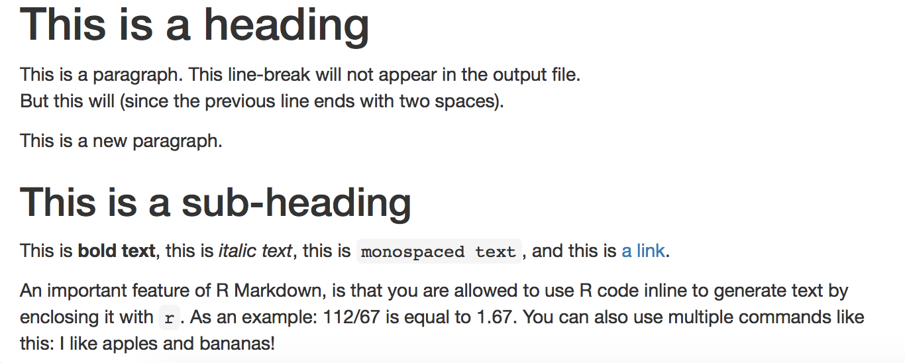

# Introduction to R Markdown

## Markup
A *markup language* is a system for annotating text documents in order to e.g. define formatting. HTML, if you are familiar with that, is an example of a markup language. HTML uses tags, such as:

```html
<h1>Heading</h1>
<h2>Sub-heading</h2>
<a href="www.webpage.com">Link</a>
<ul>
  <li>List-item1</li>
  <li>List-item2</li>
  <li>List-item3</li>
</ul>
```

*Markdown* is a lightweight markup language which uses plain-text syntax in order to be as unobtrusive as possible, so that a human can easily read it. Some examples:

```
# Heading

## Sub-heading

### Another deeper heading

A [link](http://example.com).

Text attributes _italic_, *italic*, **bold**, `monospace`.

Bullet list:

  * apples
  * oranges
  * pears
```

A markdown document can be converted to other formats, such as HTML or PDF, for viewing in a browser or a PDF reader (the page you are reading right now is written in markdown). Markdown is somewhat ill-defined, and as a consequence of that there exists many implementations and extensions (although they share most of the syntax). *R Markdown* is one such implementation/extension.

## R Markdown

R Markdown documents can be used both to save and execute code (with a focus on R) and to generate reports in various formats. This is done by mixing markdown (as in the example above), and so-called code chunks in the same document. The code itself, as well as the output it generates, can be included in the final report. The best way to understand R Markdown is by using it, so head down to the practical exercise below to learn more!

## Tell me more

* A nice "Get Started" section, as a complement to this tutorial, is available at [RStudio.com](http://rmarkdown.rstudio.com/lesson-1.html).
* [R Markdown cheat sheet](https://www.rstudio.com/wp-content/uploads/2016/03/rmarkdown-cheatsheet-2.0.pdf)
* [R Markdown reference guide](https://www.rstudio.com/wp-content/uploads/2015/03/rmarkdown-reference.pdf)

# Set up
This tutorial depends on files from the course Bitbucket repo. Take a look at the [intro](tutorial_intro.md) for instructions on how to set it up if you haven't done so already. Then open up RStudio and set your working directory to `reproducible_research_course/rmarkdown`.

## Install RStudio and R

If you don't already have R or RStudio, you will need to install them:

* Download and install R following the instructions [here](https://cran.rstudio.com/).
* Download and install RStudio Desktop (free) following the instructions [here](https://www.rstudio.com/products/rstudio/download/#download).

!!! attention "Windows users"
    Although most of the tutorials are best to run in a Docker container if you are a Windows user (see information in the [intro](tutorial_intro.md)), both R and RStudio run well directly on Windows. It is therefore suggested that you install Windows versions of these software (if you haven't done so already) when doing this tutorial.

# Practical exercise

## Getting started with R Markdown

* Start RStudio
* Select: File > New File > R Markdown
* You might get prompted to install a few required packages. Do that in such case!
* In the window that opens, select: Document and HTML (should be default), and click Ok.
* This will open a template R Markdown document for you

On the top is a so called YAML header:

```yaml
---
title: "Untitled"
output:
  html_document:
    toc: true
---
```

Here we can specify settings for the document, like the title and the output format.

* Change the title to "My first R Markdown document".
* Now, read through the rest of the template R Markdown document to get a feeling for the format.

As you can see, there are essentially three types of components in an R Markdown document:

1. Text (written in R Markdown)
2. Code chunks (written in R, or another supported language).
3. The YAML header

Let's dig deeper into each of these in the following sections! But first, just to get a flavor for things: press the little Knit-button located at the top of the text editor panel in RStudio. This will prompt you to save the Rmd file (do that), and generate the output file (an HTML file in this case). It will also open up a preview of this file for you.

### Markdown text

Some commonly used formatting written in markdown is shown below:

```
# This is a heading

This is a paragraph.
This line-break will not appear in the output file.  
But this will (since the previous line ends with two spaces).

This is a new paragraph.

## This is a sub-heading

This is **bold text**, this is *italic text*, this is `monospaced text`,
and this is [a link](http://rmarkdown.rstudio.com/lesson-1.html).

An important feature of R Markdown, is that you are allowed to use R code inline
to generate text by enclosing it with `r `.
As an example: 112/67 is equal to `r round(112/67, 2)`.
You can also use multiple commands like this:
I like `r fruits <- c("apples","bananas"); paste(fruits, collapse=" and ")`!
```

The above markdown would generate something like this:

> 

Instead of reiterating information here, take a look on the first page (only the first page!) of this [reference](https://www.rstudio.com/wp-content/uploads/2015/03/rmarkdown-reference.pdf). This will show you how to write more stuff in markdown and how it will be displayed once the markdown document is converted to an output file (e.g. HTML or PDF). An even more complete guide is available [here](http://rmarkdown.rstudio.com/authoring_pandoc_markdown.html).

* Try out some of the markdown described above (and in the links) in your template R Markdown document! Press Knit to see the effect of your edits. Don't worry about the code chunks just yet, we'll come to that in a second.

### Code chunks

Enough about markdown, let's get to the fun part and include some code! Look at the last code chunk in the template R Markdown document that you just created, as an example:

````r
```{r pressure, echo = FALSE}
plot(pressure)
```
````

The R code is surrounded by: ` ```{r}` and ` ``` `. The `r` indicates that the code chunk contains R code (it is possible to add code chunks using other languages, e.g. Python). After that comes an optional chunk name, `pressure` in this case (this can be used to reference the code chunk as well as alleviate debugging). Last comes chunk options, separated by commas (in this case there is only one option: `echo = FALSE`).

!!! note
    Note that the code chunk name `pressure` has nothing to do with the code `plot(pressure)`. In the latter case, `pressure` is a default R dataframe that is used in examples. The chunk name happened to be set to the string `pressure` as well, but could just as well have been called something else, e.g. `plot_pressure_data`.

Below are listed some useful chunk options related to evaluating and displaying code chunks in the final file:

| Chunk option | Effect |
|------|-------|
| `echo = FALSE` | Prevents code, but not the results, from appearing in the finished file. This is a useful way to embed figures. |
| `include = FALSE` | Prevents both code and results from appearing in the finished file. R Markdown still runs the code in the chunk, and the results can be used by other chunks. |
| `eval = FALSE` | The code in the code chunk will not be run (but the code can be displayed in the finished file). Since the code is not evaluated, no results can be shown.|
| `results = "hide"` | Evaluate (and display) the code, but don't show the results. |
| `message = FALSE` | Prevents messages that are generated by code from appearing in the finished file. |
| `warning = FALSE` | Prevents warnings that are generated by code from appearing in the finished file. |

* Go back to your template R Markdown document in RStudio and locate the `cars` code chunk.
* Add the option `echo = FALSE`:

````
```{r cars, echo = FALSE}
summary(cars)
```
````

* Guess how this will affect the final file. Press Knit and look at the generated file. Were you right?
* Remove the `echo = FALSE` option and add `eval = FALSE` instead:

````
```{r cars, eval = FALSE}
summary(cars)
```
````

* Guess how this will affect the final file. Press Knit and look at the generated file. Were you right?
* Remove the `eval = FALSE` option and add `include = FALSE` instead:

````
```{r cars, include = FALSE}
summary(cars)
```
````

There are also some chunk options related to plots:

| Chunk option | Effect |
|------|-------|
| `fig.height = 9, fig.width = 6` | Set plot dimensions to 9x6 inches. (The default is 7x7.) |
| `out.height = "10cm", out.width = "8cm"` | Scale plot to 10x8 cm in the final output file. |
| `fig.cap = "This is a plot."` | Adds a figure caption.

* Go back to your template R Markdown document in RStudio and locate the `pressure` code chunk.
* Add the `fig.width` and `fig.height` options as below:

````
```{r pressure, echo = FALSE, fig.width = 6, fig.height = 4}
plot(pressure)
```
````

* Press Knit and look at the output. Can you notice any difference?
* Now add a whole new code chunk to the end of the document. Give it the name `pressure2` (code chunks have to have unique names, or no name). Add the `fig.width` and `out.width` options like this:

````
```{r pressure2, echo = FALSE, fig.width = 9, out.width = "560px"}
plot(pressure)
```
````

* Press Knit and look at the output. Notice the difference between the two plots? In the second chunk we have first plotted a figure that is a fair bit larger (9 inches wide) than that in the first chunk. Next we have down-sized it in the final output, using the `out.width` option. (Here we need to use a size metric recognized by the output format, in this case "560px" which works for HTML.)

Have you noticed the first chunk?

````
```{r setup, include = FALSE}
knitr::opts_chunk$set(echo = TRUE)
```
````

In this way we can set global chunk options, i.e. defaults for all chunks. In this example, `echo` will always be set to `TRUE`, unless otherwise specified in individual chunks.

!!! tip
    For more chunk options, have a look at page 2-3 of this [reference](https://www.rstudio.com/wp-content/uploads/2015/03/rmarkdown-reference.pdf).

It is also possible to create different types of interactive plots using R Markdown. You can see some examples of this
[here](http://www.htmlwidgets.org/showcase_networkD3.html). If you want to try it out, you can install e.g. the package `networkD3` with `install.packages("networkD3")`. Then add the following code chunk to your document:

````
```{r}
library(networkD3)
data(MisLinks, MisNodes)
forceNetwork(Links = MisLinks, Nodes = MisNodes, Source = "source",
             Target = "target", Value = "value", NodeID = "name",
             Group = "group", opacity = 0.4)
```
````

### YAML header

Last but not least, we have the YAML header. Here is where you configure general settings for the final output file, and a few other things.

The settings are written in [YAML format](https://en.wikipedia.org/wiki/YAML) in the form *key: value*. Nested settings or sub-settings are indented with tabs. In the template R Markdown document you can see that `html_document` is nested under `output`, and in turn, `toc` is nested under `html_document` since it is a setting for the HTML output. The table of contents (TOC) is automatically compiled from the section headers (marked by #).

* Add a subsection header somewhere in your document using three `###`. Knit and look at how the table of contents is structured.
* Now set `toc: false` and knit again. What happened?
* A setting that works for HTML output is `toc_float: true`. Add that to your document (same indentation level as `toc: true`) and knit. What happened?
* In the same way, add the option `number_sections: true`. What happened?
* Think it looks weird with sections numbered with 0, e.g. 0.1? That is because the document does not contain any level-1-header. Add a header using only one `#` at the top of the document, just after the `setup` chunk. Knit and see what happens!

We can also set parameters in the YAML header. These are either character strings, numerical values, or logicals, and they can be used in the R code in the code chunks. Let's try it out:

* Add two parameters, `data` and `color`, to the YAML header. It should now look something like this:

```yaml
---
title: "Untitled"
output:
  html_document:
    toc: true
    toc_float: true
    number_sections: true
params:
  data: cars
  color: blue
---
```

* So now we have two parameters that we can use in the code! Modify the `pressure` code chunk so that it looks like this:

````
```{r pressure, fig.width = 6, fig.height = 4}
plot(get(params$data), col = params$color)
```
````

This will plot the dataset `cars` using the color `blue`.

* Knit and see what happens!

Later, we will learn how to set parameters using an external command.

We have up until now mainly been using `html_document` as an output format. There are however a range of different available formats to choose between. What is important to know, is that not all chunk settings work for all output formats (this mainly regards settings related to rendering plots and figures), and some YAML settings are specific for the given output format chosen.

* Take a look at this [gallery](http://rmarkdown.rstudio.com/gallery.html) of R Markdown documents to see what different kinds of output formats are possible to generate.
* Take a look at the last page of this [reference](https://www.rstudio.com/wp-content/uploads/2015/03/rmarkdown-reference.pdf) for a list of YAML header options, and what output formats they are available for.

### Managing and working with R Markdown documents

Below are a few practical things regarding working with R Markdown documents:

* You can knit/render reports in several different ways:
    - By pressing the Knit button in RStudio (as we have done this far)
    - By running the R command `render`, e.g. to Knit the file `my_file.Rmd` run `render("my_file.Rmd")` in the R console.
    - By running on the terminal command line: `R -e 'rmarkdown::render("my_file.Rmd")'`
* Using the `render` command, we can also set YAML header options and change defaults (i.e. override those specified in the R Markdown document itself). Here are a few useful arguments (see `?rmarkdown::render` for a full list):
    - `output_format` - change output format, e.g. `html_document` or `pdf_document`.
    - `output_file` and `output_dir` - change directory and file name of the generated report file (defaults to the same name and directory as the .Rmd file).
    - `params` - change parameter defaults. Note that only parameters already listed in the YAML header can be set, no new parameters can be defined.

Try to use the `render` command to knit your template R Markdown document and set the two parameters `data` and `color`. Hint: the `params` argument should be a list, so e.g.:

```
rmarkdown::render("my_file.Rmd", params=list(data="cars", color="green"))
```

* You might already have noticed that you can run code chunks directly in RStudio:
    - Place the cursor on an R command and press `CTRL + Enter` (Windows) or `Cmd + Enter` (Mac) to run that line in R.
    - Select several R command lines and use the same keyboard shortcut as above to run those lines.
    - To the right in each chunk there are two buttons, one for running the code in all chunks above the current chunk, or to run the code in the current chunk.
    - Depending on your settings, the output of the chunk code will be displayed inline in the Rmd document, or in RStudios Console and Plot panels. To customize this setting, press the cog-wheel next to the Knit button and select either "Chunk Output Inline" or "Chunk Output in Console".
* You can easily insert an empty chunk in your Rmd document in RStudio by pressing Insert > R.
* In the top right in the editor panel in RStudio there is a button to toggle the document outline. By making that visible you can click and jump between sections (headers and named code chunks) in your R Markdown document.
* Go to File > Help > Cheatsheets > R Markdown Cheat Sheet to open the main R Markdown cheatsheet.
* Go to File > Help > Markdown Quick Reference to open the Markdown Quick Reference in your help pane.

## R Markdown in a reproducible research setting

R Markdown makes your analysis more reproducible by connecting your code, figures and descriptive text. You can use it to make reproducible reports, rather than e.g. copy-pasting figures into a Word document. You can also use it as a notebook, in the same way as lab notebooks are used in a wet lab setting (or as we us a Jupyter notebook in the [tutorial](jupyter.md)).

In this exercise we will use R Markdown to make a reproducible report in form of a Supplementary Material PDF for the MRSA project. The benefits of having a reproducible Supplementary Material includes:

* It is transparent how the text, tables and figures were produced
* If you get reviewer comments you can easily update your code and regenerate the Supplementary Material with the run of a command.

Before you start:

* Make sure that your working directory in R is `rmarkdown`
* Open the file `rmarkdown/code/supplementary_material.Rmd`

* To complete this part you first need to install the following R-packages:
```
source("https://bioconductor.org/biocLite.R")
biocLite("ggplot2")
biocLite("reshape2")
biocLite("pheatmap")
biocLite("rtracklayer")
biocLite("GEOquery")
```

* Let's start by adding a YAML header to the top of the file:

```yaml
---
title: "Supplementary material"
author: John Doe, Joan Dough, Jan Doh, Dyon Do
date: "`r format(Sys.time(), '%d %B, %Y')`"
output: pdf_document
---
```

You can change the author list if you want to. Here, we have added some R code that will print the date to the front page, so that we know what day the report was generated. Also note that the output format is now set to `pdf_document`.

* Add the following parameters, which correspond to the results from the [Snakemake tutorial](snakemake.md):

```yaml
params:
  counts_file: "results/tables/counts.tsv"
  multiqc_file: "intermediate/multiqc_general_stats.txt"
  rulegraph_file: "results/rulegraph.png"
  SRR_IDs: "SRR935090 SRR935091 SRR935092"
  GSM_IDs: "GSM1186459 GSM1186460 GSM1186461"
```

!!! tip
    Make it a practice to keep track of all input files and add them as parameters rather than hard-coding them later in the R code.

* Next, take a look at the `dependencies`, `read_params`, and `read_data` chunks. They load the required packages, reads the parameters and stores them in R objects to be used later in the code, and reads the data in the counts file, the multiqc file, as well as fetches meta data from GEO. These chunks are provided as is, and you do not need to edit them.
* Below these chunks there is some markdown text that contains the Supplementary Methods section. Note the use of section headers using `#` and `##`.
* The `session_info` chunk prints information regarding R version and which packages and versions that are used.
* Finally, there is a Supplementary Tables and Figures section. This contains four code chunks, each for a specific table or figure. Have a quick look at the code and see if you can figure out what it does. Don't worry if you can't understand everything.
* Now that you have had a look at the R Markdown document, it is time to Knit! We will do this from the R terminal (rather than pressing Knit).

```r
rmarkdown::render("code/supplementary_material.Rmd",
                  output_dir = "results")
```

The reason for this is that we can then redirect the output PDF file to be saved in the `results/` directory.

Normally, while rendering, R code in the Rmd file will be executed using the directory of the Rmd file as working directory (`rmarkdown/code` in this case).
However, it is good practice to write all code as if it would be executed from the project root directory (`rmarkdown/` in this case). For instance, you can see that we have specified the files in `params` with relative paths from the project root directory. To set a different directory as working directory for all chunks one modifies the knit options like this:

```
knitr::opts_knit$set(root.dir = normalizePath('../'))
```

Here we set the working directory to the parent directory of the Rmd file (`../`), in other words, the project root. Use this rather than `setwd()` while working with Rmd files.

* Take a look at the output. You should find the PDF file in the `results` directory.

You will probably get a good idea of the contents of the file, but the tables look weird and the figures could be better formatted.
Let's start by adjusting the figures!

* Locate the `setup` chunk. Here, we have already set `echo = FALSE`. Let's add some default figure options: `fig.height = 6, fig.width = 6, fig.align = 'center', fig.pos = "h"`.

This will make the figures slightly smaller than default, center them, and position them in the order and context they appear in the text (otherwise, they may be placed automatically were there is a natural space in the document).

* Knit again, using the same R command as above. Do you notice any difference? Better, but still not perfect!

Let's improve the tables! We have not talked about tables before. There are several options to print tables, here we will use the `kable` function which is part of the `knitr` package.

* Go to the `sample-info` chunk. Replace the last line, `d`, with:

```
knitr::kable(d)
```

* Knit again and look at the result. You should see a formatted table.
* The column names can be improved, and we could use a table legend. Add the following:

```
knitr::kable(d, caption="Sample info",
      col.names=c("SRR", "GEO", "Strain", "Treatment"))
```

* Knit and check the result.
* Try to fix the table in the `qc-stats` chunk in the same manner. The colnames are fine here, so no need to bother changing them, but add a table legend: "QC stats from FastQC". Knit and check your results.

Let's move on to the figures!

* Go to the `counts-barplot` chunk. To add a figure legend we have to use a chunk option (so not in the same way as for tables). Add the chunk option:

```
fig.cap = "Counting statistics per sample, in terms of read counts for genes and reads not counted for various reasons."
```

* Knit and check the outcome!
* Next, add a figure legend to the figure in the `gene-heatmap` chunk. Here we can try out the possibility to add R code to generate the legend:

```
fig.cap = paste("Expression (log-10 counts) of genes with at least ", max_cutoff, " counts in one sample and a CV>", cv_cutoff, ".", sep = "")
```

This will use the `cv_cutoff` and `max_cutoff` variables to ensure that the figure legend gives the same information as was used to generate the plot. Note that figure legends are generated *after* the corresponding code chunk is evaluated. This means we can use objects defined in the code chunk in the legend.

* Knit and admire the results!

The heatmap still looks a bit odd. Let's play with the `fig.height` and `out.height` options, like we did above, to scale the figure in a more appropriate way. Add this to the chunk options: `fig.height=10, out.height="22cm"`. Knit and check the results. Does it look better now?

* Now let's add a third figure! This time we will not plot a figure in R, but use an available image file showing the structure of the Snakemake workflow used to generate the inputs for this report. Add a new chunk at the end containing this code:

```
knitr::include_graphics(normalizePath(rulegraph_file))
```

* Also, add the chunk options:

```
fig.cap = "A rule graph showing the different steps of the bioinformatic analysis that is included in the Snakemake workflow."
```

and:

```
out.height = "11cm"
```

* Knit and check the results.

When knitting to a PDF, the rendering process will make use of LaTeX. In the last part we will see how we can add LaTeX commands directly in the R Markdown document to further customize the look.

* See the section on Reproducibility in the PDF. Notice that the R code output giving information about the R session is a bit big? We can fix this by adding the LaTeX commands `\footnotesize` and `\normalsize` before and after this part, i.e.:

````
\footnotesize
```{r}
sessionInfo()
```
\normalsize
````

This will make the `sessionInfo()` text smaller and then set it back to normal.

* Knit and check the outcome.
* You may also notice that the heading "Supplementary Tables and Figures" would be better place on a new page. To achieve this, insert `\newpage` before the heading (make sure to have a blank line before and after `\newpage`). Knit and see if it worked.
* The last things that we will fix are the figure and table labels. Now they are automatically called e.g. Figure 1 and Table 1, but perhaps we would like to name them Figure S1 and Table S1, being Supplementary. We can customize this using the separate LaTeX file, `code/header.tex`. To include this in the Rmd, update the `output` part of the YAML header so that it looks like this:

```yaml
output:
  pdf_document:
    includes:
      in_header: header.tex
```

* Knit and view the results.

Congrats! You made it to the end and are now an R Markdown expert!
