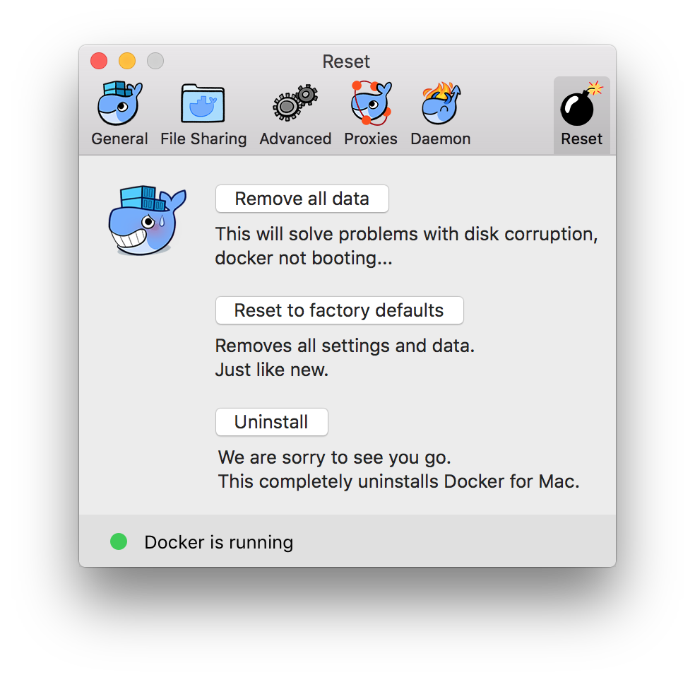

<h1> Take down </h1>
Depending on which of the tutorials you have taken, there might be quite a lot
of files stored on your computer. Here are instructions for how to remove them.

## All tutorials
All the tutorials depend on you cloning the `reproducible_research_course`
GitHub repo. This can be removed like any other directory; via Finder,
Explorer or `rm -rf reproducible_research_course`. Note that this will also
delete the hidden directories `.git`, which contains the history of the repo,
and `.snakemake`, which contains the history of any Snakemake runs.

## Conda
Several of the tutorials use Conda for installing packages. This amounts to
about 2.6 gb if you've done all the tutorials. If you plan on using Conda in
the future you can remove just the packages, or you can remove everything
including Conda itself. Note that this is not needed if you've done the
tutorials on Windows using Docker (see the section on Docker below instead).

### Uninstall all of these packages but keep Conda itself for future use
First list all Conda environments
```bash
conda env list
```

For each of the environments except "base" run
```bash
conda remove -n envname --all
```

And lastly:
```bash
conda clean --all
```

### Remove every trace of Conda
First check where Conda is installed. Look for the row "base environment".

```bash
conda info
```

This should say something like `/Users/<user>/miniconda3`. Then remove the
entire Conda directory:

```
rm -rf /Users/<user>/miniconda3
```

Lastly, open your `~/.bashrc` file (or `~/.bash_profile` if on Mac) in a text
editor and remove the path to Conda from PATH.

## Snakemake
Snakemake is installed via Conda and will be removed if you follow the
instructions in the Conda section above. Note that Snakemake also generates
a hidden `.snakemake` directory in the directory where it's run. You can remove
this with

```bash
rm -rf reproducible_research_course/snakemake/.snakemake
```

## Jupyter
Jupyter is installed via Conda and will be removed if you follow the
instructions in the Conda section above.

## Docker
If you've done the Docker tutorial **or if you've been running Docker for
Windows** you have some cleaning up to do. Docker is infamous for quickly
taking up huge amounts of space, and some maintenance is necessary every now
and then. Here is how to uninstall Docker completely. For instructions for how
to remove individual images or containers, see the [Docker tutorial](docker.md)

### macOS
Click the Docker icon in the menu bar (upper right part of the screen) and
select "Preferences". This will open up the window below. First select "Reset"
and fill in your password. Then select "Uninstall". Once it's done
uninstalling, drag the Docker app from Applications to Trash.



### Linux
If you've installed Docker with `apt-get`, uninstall it like this:

```bash
apt-get purge docker-ce
```

Images, containers, and volumes are not automatically removed. To delete all of
them:

```bash
rm -rf /var/lib/docker
```

### Windows
Uninstall Docker for Windows (on Windows 10) or Docker Toolbox (on Windows 7)
via Control Panel > Programs > Programs and Features. Docker Toolbox will also
have installed Oracle VM VirtualBox, so uninstall that as well if you're not
using it for other purposes.

## Singularity

* Images are files that can simply be deleted
* Singularity creates a hidden directory `.singularity` in your home directory
  that contains cache
