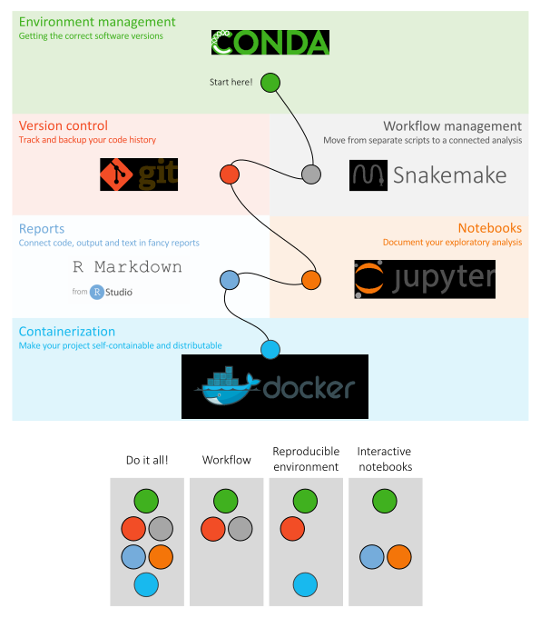

# Introduction to the tutorials

Welcome to the tutorials! Here we will learn how to make a computational 
research project reproducible using the tools:

* Conda
* Snakemake
* Git
* R Markdown
* Jupyter
* Docker
* Singularity

## The case study
We will be running a small bioinformatics project as a case study, and use that 
to exemplify the different steps of setting up a reproducible research project. 
To give you some context, the study background and analysis steps are very 
briefly described below.

### Background

The data is taken from [Osmundson, Dewell, and Darst (2013)](http://journals.plos.org/plosone/article?id=10.1371/journal.pone.0076572), who have studied methicillin-resistant *Staphylococcus aureus* (MRSA).
MRSA is resistant to broad spectrum beta-lactam antibiotics and lead to 
difficult-to-treat infections in humans. Lytic bacteriophages have been 
suggested as potential therapeutic agents, or as the source of novel antibiotic 
proteins or peptides. One such protein, gp67, was identified as a 
transcription-inhibiting transcription factor with an antimicrobial effect. To 
identify *S. aureus* genes repressed by gp67, the authors expressed gp67 in 
*S. aureus* cells.

RNA-seq was then performed on three S. aureus strains:

* RN4220 with pRMC2 with gp67
* RN4220 with empty pRMC2
* NCTC8325-4

### Analysis

The graph below shows the different steps of the analysis that are included in 
this project.

* The input files are:
    * RNA-seq raw data (fastq files) for the three strains
    * *S. aureus* genome sequence (fasta file)
    * *S. aureus* genome annotation (gff file)


* `get_genome_fasta` - Download the genome file.
* `index_genome` - Index the genome, required for the alignment step, using the 
  software Bowtie2.
* `get_SRA_by_accession` - Download the RNA-seq raw data for the three strains 
  from the Sequence Read Archive (SRA).
* `fastqc` - Run quality control on each of the RNA-seq fastq files, using the 
  software FastQC.
* `multiqc` - Summarize the QC.
* `align_to_genome` - Align the RNA-seq data from the three strains to the 
  indexed genome, using the software Bowtie2.
* `sort_bam` - Sort the alignment files by genome coordinate, using the 
  software Samtools.
* `get_genome_gff3` - Download the genome annotation file.
* `generate_count_table` - Calculate gene expression by counting aligned reads 
  per gene, using the software HTSeq-count.
* `generate_rulegraph` - Generate the workflow overview figure shown above.
* `make_supplementary` - Produce the supplementary materials section using data
  from the QC, gene counting and the graph figure.

# Setup
## For Mac / Linux users

Clone the GitHub repository containing all files you will need for completing
the tutorials. First, `cd` into a directory on your computer (or create one) 
where it makes sense to download the course directory.

```bash
cd /path/to/your/directory
git clone https://github.com/NBISweden/workshop-reproducible-research.git
cd workshop-reproducible-research
```

!!! attention
    Check your git version by `git --version`. If you have a very old version 
    of git you might want to update to a later version.

!!! tip
    If you want to revisit the material from an older instance of this course, 
    you can do that using `git checkout tags/<tag-name>`, e.g. `git checkout 
    tags/course_1905`. To list all available tags, use `git tag`. Run this 
    command after you have `cd` into `workshop-reproducible-research` as 
    described above. If you do that, you probably also want to view the same 
    older version of this website. Locate the version box in the bottom right 
    corner of the browser and select the corresponding version.

## For Windows users

There are several different ways to run the course material on a Windows 
computer. Neither is perhaps optimal, and the material itself has not been 
adapted specifically for Windows. Nevertheless, in principle everything 
*should* be possible to run. A few ways you could setup:

- Run as Linux through a virtual machine (and see the Linux setup above)
- Use the Windows 10 PowerShell, install git and clone the course repository 
  (see the Mac/Linux setup above)
- Use the Linux Bash Shell on Windows 10 (see below) *Recommended for the 
  course*
- Run the course in a Docker container (see below)

### Running in the Linux Bash Shell on Windows 10

For the difference between the Linux Bash Shell and the PowerShell on Windows 
10, see e.g. [this article](https://searchitoperations.techtarget.com/tip/On-Windows-PowerShell-vs-Bash-comparison-gets-interesting).

Install Bash on Windows 10, follow the instructions at e.g. one of these 
resources:

- [https://docs.microsoft.com/en-us/windows/wsl/install-win10](https://docs.microsoft.com/en-us/windows/wsl/install-win10)
- [https://www.howtogeek.com/249966/how-to-install-and-use-the-linux-bash-shell-on-windows-10/](https://www.howtogeek.com/249966/how-to-install-and-use-the-linux-bash-shell-on-windows-10/)
- [https://itsfoss.com/install-bash-on-windows/](https://itsfoss.com/install-bash-on-windows/)

Open the Bash Shell Linux terminal and clone the GitHub repository containing
all files you will need for completing the tutorials, as follows. First, `cd` 
into a directory on your computer (or create one) where it makes sense to 
download the course directory.

```bash
cd /path/to/your/directory
git clone https://github.com/NBISweden/workshop-reproducible-research.git
cd workshop-reproducible-research
```
!!! tip
    If you want to revisit the material from an older instance of this course, 
    you can do that using `git checkout tags/<tag-name>`, e.g. `git checkout 
    tags/course_1905`. To list all available tags, use `git tag`. Run this 
    command after you have `cd` into `reproducible_research_course` as 
    described above. If you do that, you probably also want to view the same 
    older version of this website. Locate the version box in the bottom right 
    corner of the browser and select the corresponding version.

### Using Docker to run the course

Alternatively, you could use Docker to run the course in a Docker container. 
First, cd into a directory on your computer (or create one) where it makes 
sense to download the course directory. Install Docker by following the 
instructions in the [Docker tutorial](docker.md#windows). Then run:

```bash
cd c:/my_dir
docker run -it -p 8888:8888 -v /c/my_dir:/course/ nbisweden/workshop-reproducible-research:slim
```

!!! attention
    Note that we use `/c/my_dir` and not `c:/my_dir` as we normally do on 
    Windows. This is required for Docker to parse the command correctly.

This will start an isolated container running Linux, where the directory 
`c:/my_dir` is mounted (i.e. you can access the files in this Windows directory
within the Linux container, and files edited or created within the Linux 
container will appear in this Windows directory).
Note that the idea is that you should edit files in the mounted `c:/my_dir` 
using an editor in your normal OS, say Notepad in Windows. The terminal in the 
container is for running stuff, not editing.

You should now be at a terminal in the Docker container. Now clone the GitHub
repository containing all the files you will need for the tutorials.

```bash
git clone https://github.com/NBISweden/workshop-reproducible-research.git
cd workshop-reproducible-research
```

Don't worry if you feel that this Docker stuff is a little confusing, it will 
become clearer in the [Docker tutorial](docker.md). However, the priority right 
now is just to get it running so that you can start working.

# The tutorials

The figure below gives an overview of the six available tutorials, a very brief 
description of their main purpose, and the suggested order to do them. However, 
each tutorial is made so that it can be completed independently of the other 
tutorials. It is therefore perfectly possible to choose a different order, or a 
subset of tutorials that suits your interests. Under the main figure there is a 
list of a few suggested alternative tutorial orders. You find the tutorials in 
the menu to the left!



Note that running through the tutorials will involve installing several tools, 
which in turn will create quite a lot of files on your computer. In order to
remove any traces of these, after completing the tutorials, please refer to
the [Take down section](take_down.md).
