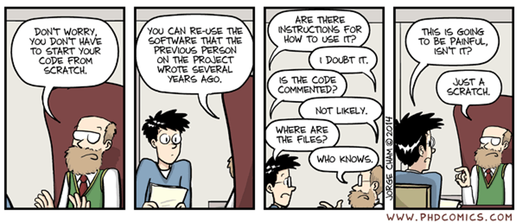
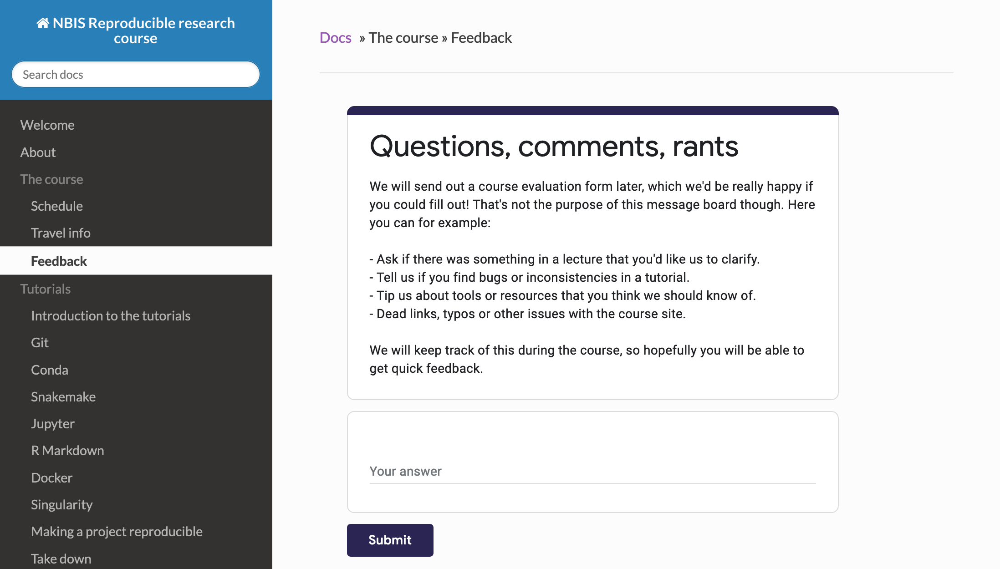
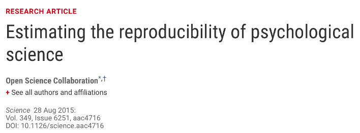
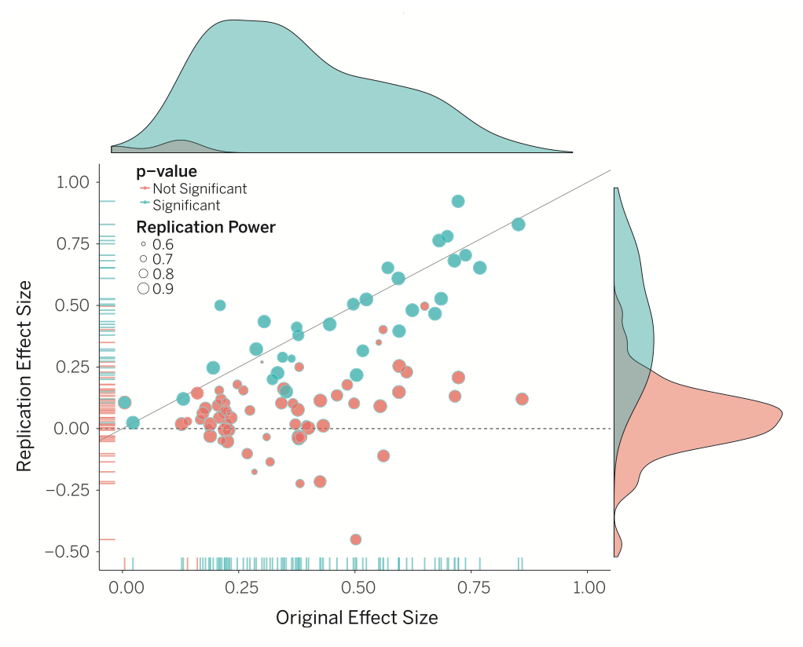
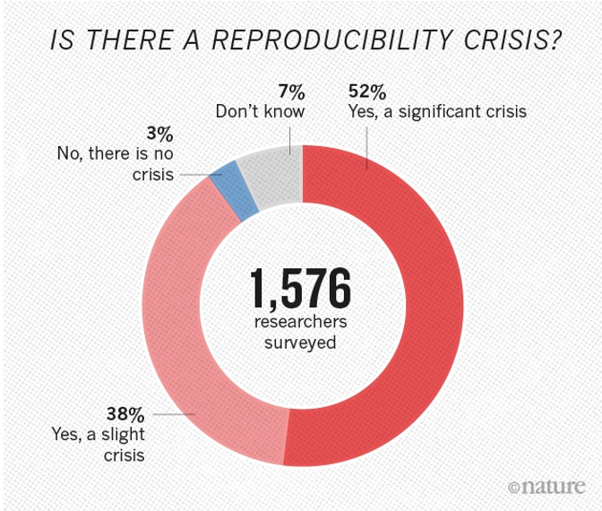
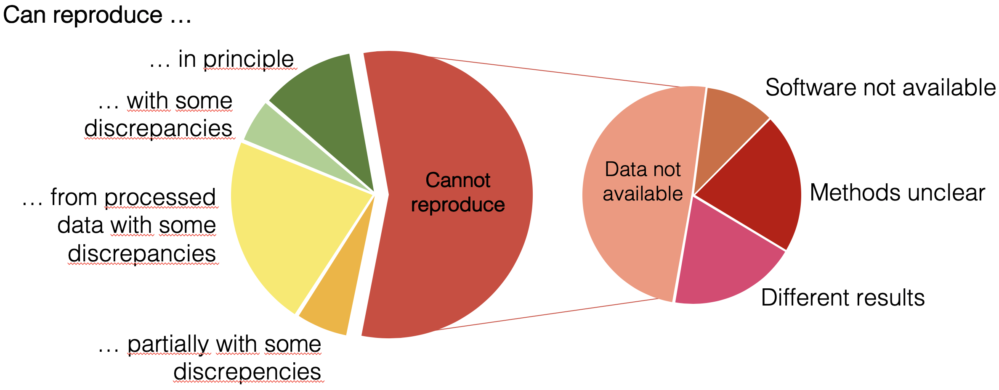
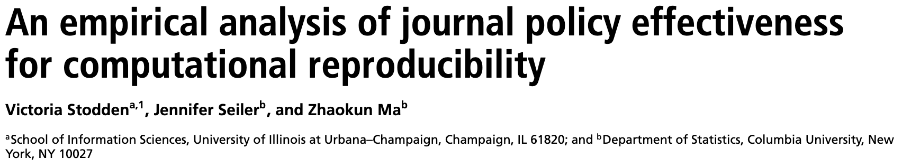
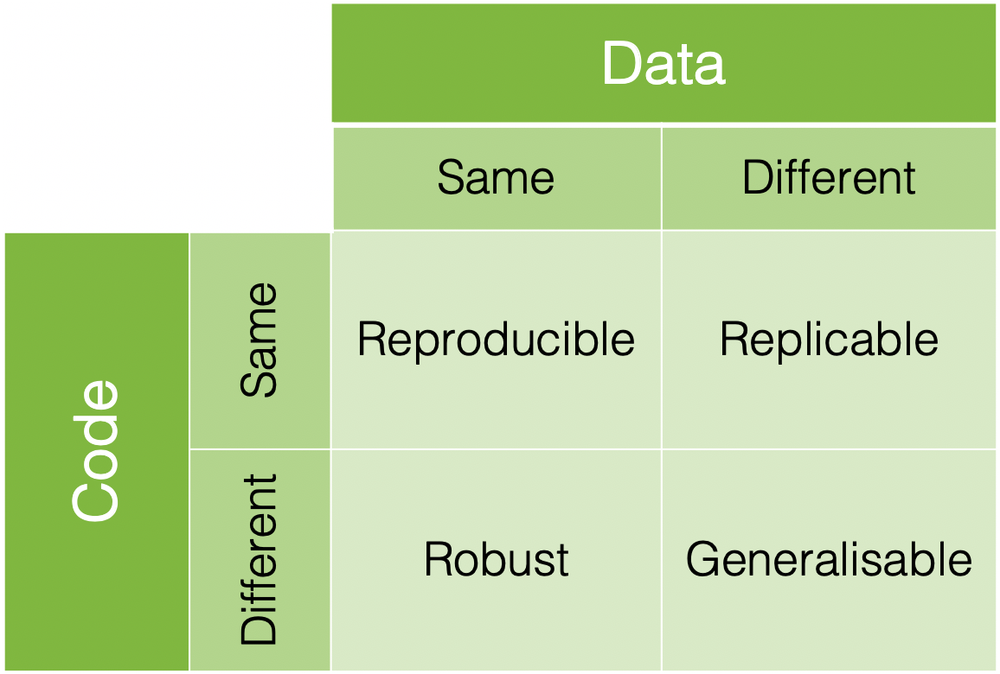
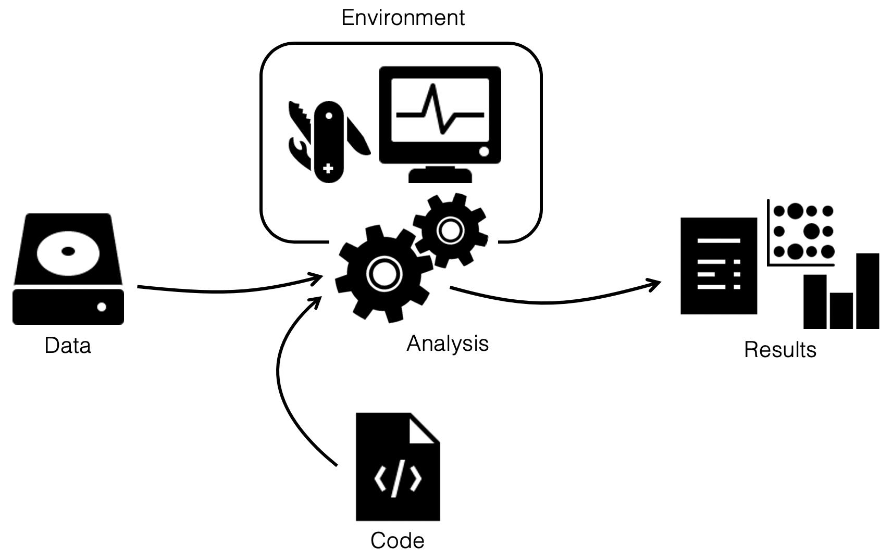
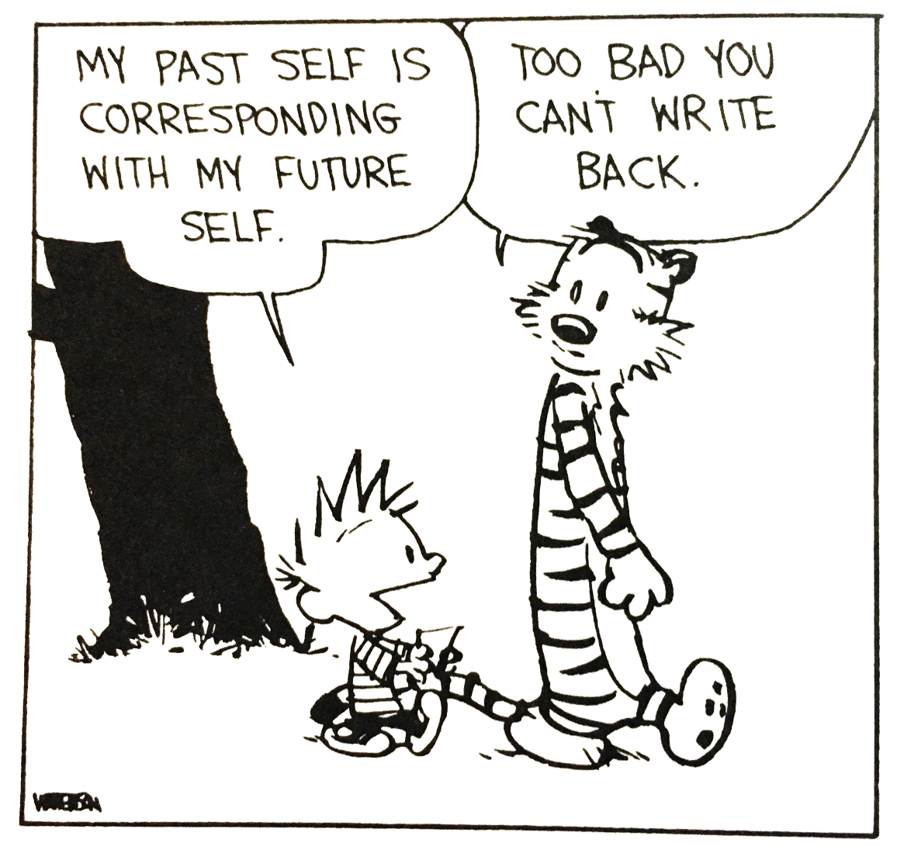

---
output:
  xaringan::moon_reader:
      self-contained: true
      seal: false
      css: ["default", "../template.css"]
      nature:
          slideNumberFormat: ""
---

layout: true

---

class: center, middle
.HUGE[Tools for reproducible research]

.green[Stockholm, April 27-29]

---

class: center, middle
.HUGE[The teachers]

---

# Course content

* Good practices for working with data

* How to use the version control system .green[git] to track changes to code

* How to use the package and environment manager .green[Conda]

* How to use the workflow manager .green[Snakemake]

* How to use .green[R Markdown] to generate automated reports

* How to use .green[Jupyter] notebooks to document your analysis

* How to use .green[Docker] and .green[Singularity] to distribute containerized
  computational environments

---

# Students' experiences

*Students' experiences go here*

---

# Schedule

*Schedule goes here*

---

# Please provide feedback!

---

# Why all the talk about reproducible research?

.pull-left[

The *Reproducibility project* set out to replicate 100 experiments published in
high-impact psychology journals.

About one-half to two-thirds of the original findings could not be observed in
the replication study.
]

.pull-right[
 

]

---

# Why all the talk about reproducible research?

.pull-left[

]

.pull-right[
A survey in Nature revealed that irreproducible experiments are a problem
across all domains of science.1
]

.tiny[1 "1,500 scientists lift the lid on reproducibility", Nature. 533: 452–454]

---

# Why all the talk about reproducible research?

.pull-left[

]

.pull-right[
Medicine is among the most affected research fields. A study in Nature found
that 47 out of 53 medical research papers focused on cancer research were
irreproducible.2

 
Common features were failure to show all the data and inappropriate use of
statistical tests.
]

.tiny[2 Begley, C. G.; Ellis, L. M. (2012). "Drug development: Raise standards for preclinical cancer research". Nature. 483 (7391): 531–533]

---

# Why all the talk about reproducible research?

*Replication of data analyses in 18 articles on microarray-based gene
expression profiling published in Nature Genetics in 2005–2006:*

.tiny[Adopted from Ioannidis *et al.* "Repeatability of published microarray gene expression analyses", Nature Genetics 41 (2009) doi:10.1038/ng.295]

---

# Reproducibility is rarer than you think

> Many journals are revising author guidelines to include data and code
> availability.

--

The study found that the results of only 26% out of 204 randomly selected
papers in the journal *Science* could be reproduced.

--

> (...) an improvement over no policy, but currently insufficient for
> reproducibility.

---

# Reproducibility is rarer than you think

There are many so-called excuses not to work reproducibly:

> “Thank you for your interest in our paper. For the [redacted] calculations I
> used my own code, and there is no public version of this code, which could be
> downloaded. Since this code is not very user-friendly and is under constant
> development I prefer not to share this code.”

> “We do not typically share our internal data or code with people outside our
> collaboration.”

> “When you approach a PI for the source codes and raw data, you better explain
> who you are, whom you work for, why you need the data and what you are going
> to do with it.”

> “I have to say that this is a very unusual request without any explanation!
> Please ask your supervisor to send me an email with a detailed, and I mean
> detailed, explanation.”

---

# What does reproducible research mean?

 
.center[]

---

# What does reproducible research mean?

.center[]

--

> ”Why call the course Reproducible Research, when it could just as well  
>  be called Research?”
>
> .right.small[\- Niclas Jareborg, NBIS data management expert]

---

# How are you handling your .green[data]?

.left-column[
## Decent
]

.right-column[
* Data available on request
* All meta data required for generating the results available
]

---

# How are you handling your .green[data]?

.left-column[
## .light-grey[Decent]
## Good
]

.right-column[
* .light-grey[Data available on request]
* .light-grey[All meta data required for generating the results available]
* Data deposited in public repositories
* Raw data available in unedited form
* If the raw data needed preprocessing, scripts were used rather than modifying
  it manually
]

---

# How are you handling your .green[data]?

.left-column[
## .light-grey[Decent]
## .light-grey[Good]
## Great
]

.right-column[
* .light-grey[Data available on request]
* .light-grey[All meta data required for generating the results available]
* .light-grey[Data deposited in public repositories]
* .light-grey[Raw data available in unedited form]
* .light-grey[If the raw data needed preprocessing, scripts were used rather than modifying it manually]
* Section in the paper to aid in reproduction
* Used non-proprietary and machine-readable formats, *e.g.* `.csv` rather than
  `.xls`.
]

---

# How are you handling your .green[code]?

.left-column[
## Decent
]

.right-column[
* All code for generating results from processed data available on request
]

---

# How are you handling your .green[code]?

.left-column[
## .light-grey[Decent]
## Good
]

.right-column[
* .light-grey[All code for generating results from processed data available on request]
* All code for generating results from raw data is available
* The code is publicly available with timestamps or tags
]

---

# How are you handling your .green[code]?

.left-column[
## .light-grey[Decent]
## .light-grey[Good]
## Great
]

.right-column[
* .light-grey[All code for generating results from processed data available on request]
* .light-grey[All code for generating results from raw data is available]
* .light-grey[The code is publicly available with timestamps or tags]
* All code for generating results from publicly available raw data is
  available
* Code is documented and contains instructions for reproducing results
* Seeds were used and documented for heuristic methods
]

---

# How are you handling your .green[environment]?

.left-column[
## Decent
]

.right-column[
* Key programs used are mentioned in the methods section
]

---

# How are you handling your .green[environment]?

.left-column[
## .light-grey[Decent]
## Good
]

.right-column[
* .light-grey[Key programs used are mentioned in the methods section]
* List of all programs used and their respective versions are available
]

---

# How are you handling your .green[environment]?

.left-column[
## .light-grey[Decent]
## .light-grey[Good]
## Great
]

.right-column[
* .light-grey[Key programs used are mentioned in the methods section]
* .light-grey[List of all programs used and their respective versions are available]
* Instructions for reproducing the environment publicly available
]

---

# "What's in it for me?"

## .green[Before] the project
* Improved structure and organization
* Forced to think about scope and limitations

--

## .green[During] the project
* Easier to rerun analyses and generate results after updating data, tools,
  parameters, *etc.*
* Closer interaction between collaborators
* Much of the manuscript "writes itself"

--

## .green[After] the project
* Faster resumption of research by others (or, more likely, your future self),
  thereby increasing the impact of your work
* Increased visibility in the scientific community

---

class: center, middle

# Questions so far?

