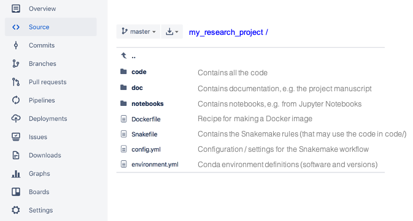
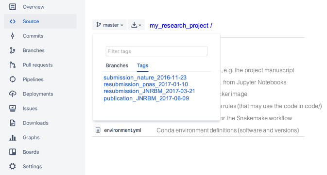

```{r Setup, include = FALSE}
# Chunk options
knitr::opts_chunk$set(include = FALSE,
                      echo    = FALSE)
```

layout: true
<div class="scilife-logo"></div>
<div class="nbis-logo"></div>

---

class: center, middle
.HUGE[Putting it all together]


---


# What have we learned?

* How to use the version control system .green[Git] to track changes to code

--

* How to use the package and environment manager .green[Conda]

--

* How to use the workflow manager .green[Snakemake]

--

* How to use .green[RMarkdown] to generate automated reports

* How to use .green[Jupyter] notebooks to document your analysis

--

* How to use .green[Docker] and .green[Singularity] to distribute containerized
  computational environments

---

# Options for reproducing a project

Everything can be a project

* Divide your work into .green[distinct projects]

--

* Keep all files needed to go .green[from raw data to final results] in a dedicated directory

--

* Use .green[relevant subdirectories]

--

* Many software support the “project way of working”, e.g. .green[Rstudio] and the text editors .green[Sublime Text] and .green[Atom]


---

# Options for reproducing a project



---

# Options for reproducing a project



---

# Options for reproducing a project


* .green[Git] clone and run .green[code or workflow]

--

* .green[Git] clone, activate .green[conda] env, and run .green[code or workflow]

--

* .green[Git] clone, .green[docker] build, and run .green[code or workflow] in container

--

* .green[Docker] pull (from online repository) and run .green[code or workflow] in container

---

# What is reasonable for your project?

.pull-left[]

.pull-right[

Code:
* Code in .green[RMarkdown] or .green[Jupyter notebooks] for reproducible results
* Track your code with .green[Git]
* Manage your software dependencies using .green[Conda]

]

---

# What is reasonable for your project?

.pull-left[]

.pull-right[

Environment:
* Track your .green[code] with .green[Git]
* Use .green[Conda] or .green[Containers] to manage your software dependencies and compute environment

]

---

# What is reasonable for your project?

.pull-left[]

.pull-right[

Workflow:
* Convert your code into a .green[Snakemake workflow]
* Track your code with .green[Git]
* Manage your software dependencies using .green[Conda]

]

---

# What is reasonable for your project?

.pull-left[]

.pull-right[

...or do it all!

]

---


class: center, middle

# Questions?

