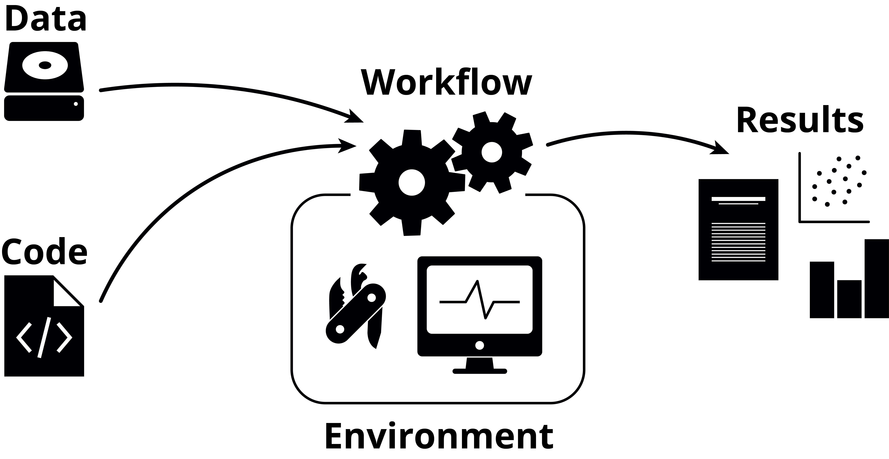
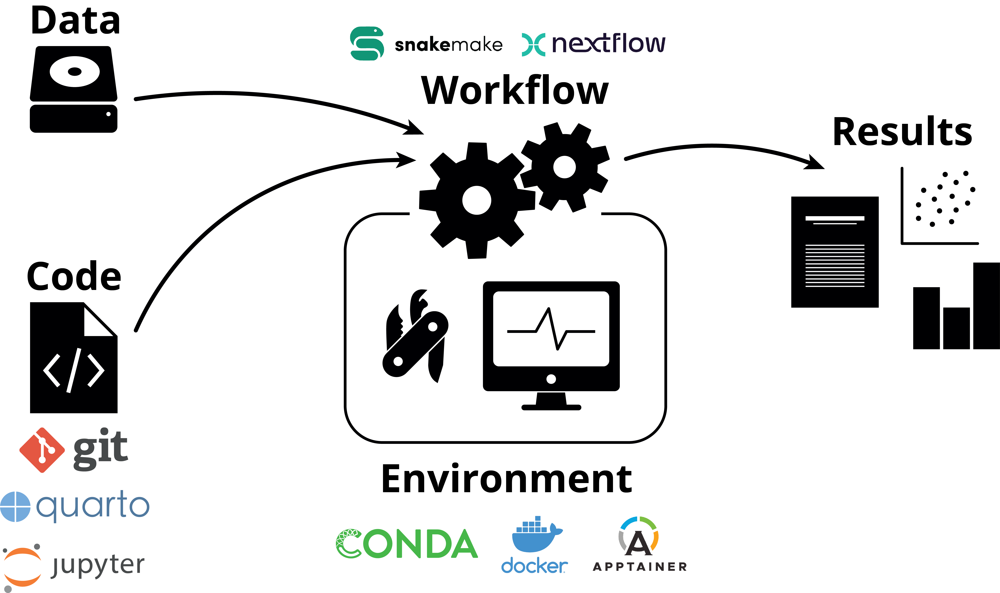

```{r Setup, include = FALSE}
# Chunk options
knitr::opts_chunk$set(include = FALSE,
                      echo    = FALSE)
```

layout: true
<div class="scilife-logo"></div>
<div class="nbis-logo"></div>

---

class: center, middle
.HUGE[Putting it all together]

---

# Putting it all together


1. .green[Lecture]: Summary of the week & how to put all the tools and procedures together

2. .green[Q&A]: How to implement these procedures on a day-to-day basis

3. .green[Project]: Time for you to apply the tools on one of your own research projects

---

class: center, middle

Take control of your research project by making its different components reproducible



---

class: center, middle

By moving towards a reproducible way of working you will quickly realize that you at the same time make your own life a lot easier! 


---

# What have we learned?

<center></center>

* How to use the version control system .green[Git] to track changes to code
* How to use the package and environment manager .green[Conda]
* How to use the workflow managers .green[Snakemake] and .green[Nextflow]
* How to use .green[R Markdown] to generate automated reports
* How to use .green[Jupyter] notebooks to document your analysis
* How to use .green[Docker] and .green[Singularity] to distribute containerized
  computational environments

---

# Divide your work into distinct projects

--

* Keep all .green[files] needed to go from raw data to final results in a dedicated directory

--

* Use relevant .green[subdirectories]

--

* Many software support the “project way of working”, e.g. .green[Rstudio] and the text editors .green[Sublime Text] and .green[Atom]

--

* Use .green[Git] to create structured and version controlled project repositories

---

# Everything can be a project

Project directory templates, e.g. NBIS project template:

.center[]

  * https://github.com/NBISweden/project_template
  * https://github.com/snakemake-workflows/cookiecutter-snakemake-workflow

---

# Treasure your data

--

* Keep your input data .green[read-only] - consider it static

--

* Don't create different versions of the input data - write a .green[script], .green[R Markdown] document, .green[Jupyter] notebook or a .green[Snakemake] workflow if you need to preprocess your input data so that the steps can be recreated

--

* .green[Backup]! Keep redundant copies in different physical locations

--

* Upload your raw data as soon as possible to a .green[public data repository]

---

# Organize your coding

--

* Avoid generating files .green[interactively] or doing things .green[by hand] - there is no way to track how they were made

--

* Write .green[scripts], .green[R Markdown] documents, .green[Jupyter] notebooks or .green[Snakemake] workflows for reproducible results to connect raw data to final results

--

* Keep the .green[parameters] separate (e.g. at top of file or in a separate configuration file)

---

class: center, middle

# Discuss in your groups

Which of these advices are most relevant to your work?

Are you going to change your way of working? If yes, how?

---

# Options for reproducing a research project


.small[www.bitbucket.org]

---

# Options for reproducing a research project


---

# Options for reproducing a research project


* .green[Git] clone and run code or workflow

--

* .green[Git] clone, create .green[Conda] env, and run code or workflow

--

* .green[Git] clone, .green[Docker] build, and run code or workflow in container

--

* .green[Docker] pull (from online repository) and run code or workflow in container

---

# Options for reproducing a research project

.pull-left[
[Example video](https://drive.google.com/file/d/1lXHlDdseHTe2Pb1JaCIhqDS7odTCVyRC/view?usp=sharing): 

Pulling the Docker image for the case study from an online repository and running the workflow in a container

]

.pull-right[

]

---

# What is reasonable for your project?

.pull-left[

   

]

---

# What is reasonable for your project?

.pull-left[<center></center>

.green[Minimal]: write code in a reproducible way

]

--

.pull-right[

Connect your results with the code:
* Use .green[R Markdown] documents or .green[Jupyter] notebooks

Take another step:
* Convert your code into a .green[Snakemake] workflow

]

---

# What is reasonable for your project?

.pull-left[<center></center>

.green[Minimal]: write code in a reproducible way

.green[Good]: versioned and structured repository

]

--

.pull-right[

Use .green[Git] for version controlling and collaboration:
* Create one .green[Git] repository per project
* Track your changes with .green[Git]
* Publish your code along with your results on <a href="https://github.com" .green[GitHub] </a> or <a href="https://bitbucket.org" .green[BitBucket] </a>

]

---

# What is reasonable for your project?

.pull-left[<center></center>

.green[Minimal]: write code in a reproducible way

.green[Good]: versioned and structured repository

.green[Better]: organize software dependencies

]

--

.pull-right[

Manage your depencencies:
* Use .green[Conda] to install software in environments that can be easily exported and installed on a different system

]

---

# What is reasonable for your project?

.pull-left[<center></center>

.green[Minimal]: write code in a reproducible way

.green[Good]: versioned and structured repository

.green[Better]: organize software dependencies

.green[Best]: export everything!

]

--

.pull-right[

Completely recreate the compute system:
* Consider packaging your project in a .green[Docker] or .green[Singularity] container

]

---

class: center, middle

# Discuss in your groups

Which of the suggested ambition levels seems most reasonable for your work?

Are you going to use one of the suggested combinations of tools in your research? 
Or are you planning to use a different combination?

---

# Alternatives

--

.green[Version control]

* **Git** – Widely used and a lot of tools available + GitHub/BitBucket.
* **Mercurial** – Distributed model just like Git, close to sourceforge.
* **Subversion** – Centralized model unlike git/mercurial; no local repository on your computer and somewhat easier to use.

--

.green[Environment / package managers]

* **Conda** – General purpose environment and package manager. Community-hosted collections of tools at bioconda or conda-forge.
* **Pip** – Package manager for Python, has a large repository at pypi.
* **Apt/yum/brew** – Native package managers for different OS. Integrated in OS and might deal with e.g. update notifications better.
* **Virtualenv** – Environment manager used to set up semi-isolated python environments.

---

# Alternatives

.green[Workflow managers]

* **Snakemake** – Based on Python, easily understandable format, relies on file names.
* **Nextflow** – Based on Groovy, uses data pipes rather than file names to construct the workflow.
* **Make** – Used in software development and has been around since the 70s. Flexible but notoriously obscure syntax.
* **Galaxy** -  attempts to make computational biology accessible to researchers without programming experience by using a GUI.

---

# Alternatives

.green[Literate programming]

* **Jupyter** – Create and share notebooks in a variety of languages and formats by using a web browser.
* **R Markdown** – Developed by Rstudio, focuses on generating high-quality documents.
* **Zeppelin** – Developed by Apache. Closely integrated with Spark for distributed computing and Big Data applications.
* **Beaker** – Newcomer based on Ipython, just as Jupyter. Has a focus on integrating multiple languages in the same notebook.

---

# Alternatives

.green[Containerization / virtualization]

* **Docker** – Used for packaging and isolating applications in containers. Dockerhub allows for convenient sharing. Requires root access.
* **Singularity** – Simpler Docker alternative geared towards high performance computing. Does not require root.
* **Shifter** – Similar ambition as Singularity, but less focus on mobility and more on resource management.
* **VirtualBox/VMWare** – Virtualization rather than containerization. Less lightweight, but no reliance on host kernel.

---

class: center, middle

# "What's in it for me?"


---

# NBIS Bioinformatics drop-in

Any questions related to reproducible research tools and concepts? Talk to an NBIS expert!

* Online (.green[zoom])
* Every .green[Tuesday, 14.00-15.00] (except public holidays)
* Check .green[www.nbis.se/events] for zoom link and more info

---

class: center, middle

# Q&A: How to implement these procedures on a day-to-day basis

