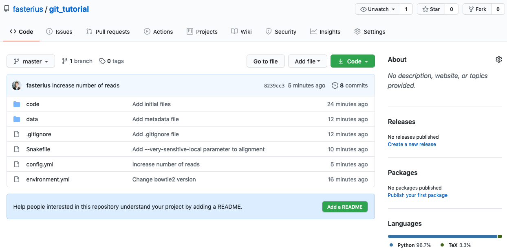

So far we've only been working on files present on our own computer, *i.e.*
locally. While Git is an amazing tool for reproducibility even if you're
working alone, it really starts to shine in collaborative work. This entails
working with *remote* repositories, *i.e.* repositories that are stored
somewhere online; some of the most common places to store your repositories are
[GitHub](https://github.com), [BitBucket](https://bitbucket.org) and
[GitLab](https://about.gitlab.com/). GitHub is the most popular of these, and is
what we'll be using for this tutorial.

An important thing to keep in mind here is the difference between *Git* (the
version control system) and online hosting of *Git repositories* (such as
GitHub): the former is the core of keeping track of your code's history, while
the latter is how to store and share that history with others.

## GitHub setup

If you have not done so already, go to [github.com](https://github.com/join)
and create an account. You can also create an account on another online hosting
service for version control, *e.g.* [Bitbucket](https://bitbucket.org) or
[GitLab](https://about.gitlab.com/). The exercises below are written with
examples from GitHub (as that is the most popular platform with the most
extensive features), but the same thing can be done on alternative services,
although the exact menu structure and link placements differ a bit.

Any upload to and from GitHub requires you to authenticate yourself. GitHub
used to allow authentication with your account and password, but this is no
longer the case - using SSH keys is favoured instead. Knowing exactly what these
are is not necessary to get them working, but we encourage you to read the box
below to learn more about them! GitHub has excellent, platform-specific
instructions both on how to [generate](https://docs.github.com/en/authentication/connecting-to-github-with-ssh/generating-a-new-ssh-key-and-adding-it-to-the-ssh-agent)
and [add](https://docs.github.com/en/authentication/connecting-to-github-with-ssh/adding-a-new-ssh-key-to-your-github-account)
SSH keys to your account, so please use them before moving on!

!!! quote "SSH keys and authentication"
    Using SSH (Secure Shell) for authentication basically entails setting up a
    pair of keys: one private and one public. You keep the private key on your
    local computer and give the public key to anywhere you want to be able to
    connect to, *e.g.* GitHub. The public key can be used to encrypt messages that
    *only* the corresponding private key can decrypt. A simplified description of
    how SSH authentication works goes like this:

    1. The client (*i.e.* the local computer) sends the ID of the SSH key pair it
      would like to use for authentication to the server (*e.g.* GitHub)
    2. If that ID is found, the server generates a random number and encrypts this
      with the public key and sends it back to the client
    3. The client decrypts the random number with the private key and sends it
      back to the server

    Notice that the private key always remains on the client's side and is never
    transferred over the connection; the ability to decrypt messages encrypted
    with the public key is enough to ascertain the client's authenticity. This is
    in contrast with using passwords, which are themselves sent across a
    connection (albeit encrypted). It is also important to note that even though
    the keys come in pairs it is impossible to derive the private key from the
    public key. If you want to read more details about how SSH authentication work
    you can check out [this website](https://www.digitalocean.com/community/tutorials/understanding-the-ssh-encryption-and-connection-process),
    which has more in-depth information than we provide here.

## Create a remote repository

Log in to your GitHub account and press the *New* button:

* Make sure you are listed as the owner
* Add a repository name, *e.g.* `git_tutorial`
* You can keep the repo private or make it public, as you wish
* Skip including a README, a `.gitignore` and licence

> { width=600px }

You will now be redirected to the repository page which will list several ways
for you to start adding content (files) to the repository. What we will do is to
connect the local repository we've been working on so far to the remote GitHub
server using SSH:

* Add a remote SSH address to your local repository (make sure you change
  `user` to your GitHub username and `git_tutorial` to your repository name):

```bash
git remote add origin git@github.com:user/git_tutorial.git
```

* Run `git remote -v`. This will show you what remote location is connected to
  your local Git clone. The short name of the default remote is usually
  "*origin*" by convention.

!!! Note
    Make sure you've used an SSH address (*i.e.* starting with `git@github.com`
    rather than an HTTPS address (starting with `https://github.com`)!

* We have not yet synced the local and remote repositories, though, we've simply
  connected them. Let's sync them now:

```bash
git push origin main
```

The `push` command sends our local history of the `main` branch to the same
branch on the remote (`origin`). Our Git repository is now stored on GitHub!

* Run `git status`. This should tell you that:

```bash
On branch main
nothing to commit, working tree clean
```

You always need to specify `git push origin main` by default, but you can
circumvent this by telling Git that you always want to push to
`origin/main` when you're on your local `main` branch. To do this, use
the command `git branch --set-upstream-to origin/main`. **Try it out now**.

* Now run `git-status` again. You should see that now git additionally tells you
that your local branch is up to date with the remote branch.

If you go to the repository's GitHub page you should now be able to see all your
files and your code there! It should look something like this:

> { width=600px }

You can see a lot of things there, such as each file and the latest commit that
changed them, the repository's branches and a message from GitHub at the bottom:
*"Help people interested in this repository understand your project by adding
a README."* This refers to GitHub's built-in functionality of automatically
rendering any *markdown* document named `README` or `README.md` in the
repository's root directory and displaying it along with what you can already
see. Let's try it out!

* Let's create a `README.md` file and fill it with the following text:

```markdown
# A Git tutorial

This repository contains tutorial information related to the **NBIS/ELIXIR** course
*Tools for Reproducible Research*, specifically the session on using the `git`
software for version control.

## Links

You can find the latest stable version of the Git tutorial for the course
[here](https://uppsala.instructure.com/courses/73110/pages/git-1-introduction?module_item_id=367079).
```

* Add, commit and push these changes to GitHub.

```bash
git add README.md
git commit -m "Add README.md"
git push origin main
```

You should now be able to see the rendered markdown document, which looks a bit
different from the text you copied in from above. Note that there are two
different header levels, which come from the number of hash signs (`#`) used.
You can also see bold text (which was surrounded by two asterisks), italic
text (surrounded by one asterisk), in-line code (surrounded by acute accents)
and a link (link text inside square brackets followed by link address inside
parentheses).

It is important to add README-files to your repositories so that they are better
documented and more easily understood by others and, more likely, your future self.
In fact, documentation is an important part of reproducible research! While the
tools that you are introduced to by this course are all directly related to
making science reproducible, you will *also* need good documentation. Make it
a habit of always adding README-files for your repositories, fully explaining
the ideas and rationale behind the project. You can even add README-files to
sub-directories as well, giving you the opportunity to go more in-depth where
you so desire.

!!! Tip
    There are a lot more things you can do with markdown than what we show here.
    Indeed, this entire course is mostly written in markdown! You can read
    more about markdown [here](https://www.markdownguide.org/getting-started/).

!!! Success "Quick recap"
    We learned how to connect local Git repositories to remote locations such as
    GitHub and how to upload commits using `git push`. We also learned the
    basics of *markdown* and how it can be used to document Git repositories.

## Browsing GitHub

GitHub and the rest of the websites that offer remote hosting of git
repositories all have numerous features, which can be somewhat difficult to
navigate in the beginning. We here go through some of the basics of what you can
do with GitHub.

* Go to your GitHub repository in your browser again and click on *Code* to the
  left. Click on `config.yml`. You will see the contents of the file. Notice
  that it is the latest version, where we previously changed the `genome_id`
  variable:

> { width=600px }

* Click on *History*. You will see an overview of the commits involving changes
  made to this file:

> { width=600px }

* Click on the `Change to ST398 for alignment` commit. You will see the changes
  made to `config.yml` file compared to the previous commit.

> { width=600px }

* Go back to the repository's main page and click on the commit tracker on the
  right above the list of files, which will give you an overview of all commits
  made. Clicking on a specific commit lets you see the changes introduced by
  that commit. Click on the commit that was the initial commit, where we added
  all the files.

> { width=600px }

You will now see the files as they were when we first added them. Specifically
you can see that the `Dockerfile` is back, even though we deleted it! Click on
the *Code* tab to the left to return to the overview of the latest repository
version.

!!! Success "Quick recap"
    We learned some of the most important features of the GitHub interface and
    how repositories can be viewed online.

## Working with remote repositories

While remote repositories are extremely useful as backups and for collaborating
with others, that's not their only use: remotes also help when you are working
from different computers, a computer cluster or a cloud service.

* Let's pretend that you want to work on this repository from a different
  computer. First, create a different directory (*e.g.* `git_remote_tutorial`)
  in a separate location that is not already tracked by Git and `cd` into it.
  Now we can download the repository we just uploaded using the following:

```bash
git clone git@github.com:user/git_tutorial.git .
```

Again, make sure to replace `user` with your GitHub user name.

Notice the dot at the end of the command above, which will put the clone into
the current directory, instead of creating a new directory with the same name as
the remote repository. You will see that all your files are here, identical to
the original `git_tutorial` repository!

* Since you already gave the address to Git when you cloned the repository, you
  don't have to add it manually as before. Verify this with `git remote -v`.

* Let's say that we now want to change the `multiqc` software to an earlier
  version: open the `environment.yml` file in the second local repo and change
  `multiqc=1.12` to `multiqc=1.7`; add and commit the change.

* We can now use `push` again to sync our remote repository with the new local
  changes. Refresh your web page again and see that the changes have taken
  effect.

Since we have now updated the remote repository with code that came from the
second local repository, the first local repository is now outdated. We thus
need to update the first local repo with the new changes. This can be done with
the `pull` command.

* `cd` back into the first local repository (*e.g.* `git_tutorial`) and run the
  `git pull` command. This will download the newest changes from the remote
  repository and merge them locally automatically.

* Check that everything is up-to-date with `git status`.

Another command is `git fetch`, which will download remote changes *without*
merging them. This can be useful when you want to see if there are any remote
changes that you *may* want to merge, without actually doing it, such as in
a collaborative setting. In fact, `git pull` in its default mode is just
a shorthand for `git fetch` followed by `git merge FETCH_HEAD` (where
`FETCH_HEAD` points to the tip of the branch that was just fetched).

That's quite a few concepts and commands you've just learnt! It can be a bit
hard to keep track of everything and the connections between local and remote
Git repositories and how you work with them, but hopefully the following figure
will give you a short visual summary:

{ width=600px }

!!! Success "Quick recap"
    We have learned the difference between local and remote copies of git
    repositories and how to sync them:

    - `git push` uploads commits to a remote repository
    - `git pull` downloads commits from a remote repository and merges them
    to the local branch
    - `git fetch` downloads commits from a remote repository without merging
    them to the local branch
    - `git clone` makes a local copy of a remote repository

## Remote branches

Remote branches work much in the same way a local branches, but you have to
push them separately; you might have noticed that GitHub only listed our
repository as having one branch (you can see this by going to the *Code* tab).
This is because we only pushed our `main` branch to the remote. Let's create
a new local branch and add some changes that we'll push as a separate branch to
our remote - you should do this in the original `git_tutorial` repository, so
move back into that directory.

* Create a new branch named `trimming` and add the `--trim5 5` flag to the
  bowtie2-command part of the `Snakefile`, which should now look like this:

```bash
bowtie2 --trim5 5 --very-sensitive-local -x $indexBase -U {input.fastq} > {output} 2> {log}
```

* Add and commit the change to your local repository.

* Instead of doing what we previously did, *i.e.* merge the `trimming` branch
  into the `main` branch, we'll push `trimming` straight to our remote:

```bash
git push origin trimming
```

* Go the repository at GitHub and see if the new branch has appeared. Just above
  the file listing click the *Branch* drop-down and select the new branch to
  view it. Can you see the difference in the `Snakefile` depending on which
  branch you choose?

We now have two branches both locally and remotely: `main` and `trimming`. We
can continue working on our `trimming` branch until we're satisfied (all the
while pushing to the remote branch with the same name), at which point we want
to merge it into `main`.

* Checkout your local `main` branch and merge it with the `trimming` branch.

* Push your `main` branch to your remote and subsequently delete your local
  `trimming` branch.

The above command only deleted the local branch. If you want to remove the
branch from the remote repository as well, run:

```bash
git push origin --delete trimming
```

!!! Success "Quick recap"
    We learned how to push local branches to a remote with `git push origin
    <branch>` and how to delete remote branches with `git push origin --delete
    <branch>`.

## Sharing tags

Your local repository tags are not included when you do a normal push. To push
tags to the remote you need to supply the `--tags` flag to the `git push`
command:

```bash
git push --tags
```

* Go to the repository overview page on GitHub. You will see that the repository
  now has three tags! If you click on *Tags* you will be given an overview of
  the existing tags for your repository - if you click *Releases* you will see
  more or less the same information. Confusing? Well, a *tag* is a Git concept
  while a *release* is a GitHub concept that is based on Git tags. Releases add
  some extra features that can be useful for distributing software and are done
  manually from the repository's GitHub page.

* Click on one of the tags. Here users can download a compressed file
  containing the repository at the version specified by the tags.

> { width=600px }

Alternatively, Git users who want to reproduce your analysis with the code used
for the publication can clone the GitHub repository and then run `git checkout
publication`.

!!! Success "Quick recap"
    We learned how to push Git tags to a remote by using the `--tags` flag.
