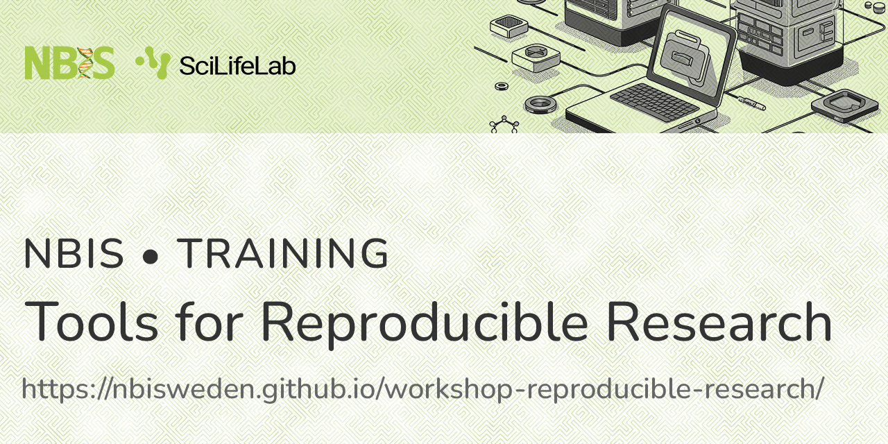

# Course overview

[Course website](https://nbisweden.github.io/workshop-reproducible-research/)

[GitHub repository](https://github.com/NBISweden/workshop-reproducible-research/)

25 - 29 November, 2024

[SciLifeLab Stockholm, Sweden](https://www.scilifelab.se/about-us/campus-solna/)

One of the key principles of proper scientific procedure is the act of
repeating an experiment or analysis and being able to reach similar
conclusions. Published research based on computational analysis (_e.g._
bioinformatics or computational biology) have often suffered from incomplete
method descriptions (_e.g._ list of used software versions); unavailable raw
data; and incomplete, undocumented and/or unavailable code. This essentially
prevents any possibility of reproducing the results of such studies. The term
“reproducible research” has been used to describe the idea that a scientific
publication should be distributed along with all the raw data and metadata used
in the study, all the code and/or computational notebooks needed to produce
results from the raw data, and the computational environment or a complete
description thereof.

Reproducible research not only leads to proper scientific conduct, but also
enables other researchers to build upon previous work. Most importantly, the
person who organises their work with reproducibility in mind will quickly
realize the immediate personal benefits: an organised and structured way of
working. The person that most often has to reproduce your own analysis is your
future self!

# Course content and learning outcomes

The following topics and tools are covered in the course:

- Data management
- Project organisation
- Git
- Conda
- Snakemake
- Nextflow
- Quarto
- Jupyter
- Docker
- Apptainer

At the end of the course, students should be able to:

- Use good practices for data analysis and management
- Clearly organise their bioinformatic projects
- Use the version control system Git to track and collaborate on code
- Use the package and environment manager Conda
- Use and develop workflows with Snakemake and Nextflow
- Use Quarto and Jupyter Notebooks to document and generate automated reports
  for their analyses
- Use Docker and Apptainer to distribute containerized computational
  environments

# Application

This is an NBIS / Elixir course. The course is open for PhD students, postdocs,
group leaders and core facility staff. International applications are welcome,
but we will give approximately half of the participant slots to applicants from
Swedish universities, due to the national role NBIS plays in Sweden.

The only entry requirements for this course is a basic knowledge of Unix systems
(_i.e._ being able to work on the command line) as well as at least a basic
knowledge of either R or Python.

Due to limited space the course can accommodate maximum of 20 participants. If
we receive more applications, participants will be selected based on several
criteria. Selection criteria include correct entry requirements, motivation to
attend the course as well as gender and geographical balance.

Please note that NBIS training events do not provide any formal university
credits. The training content is estimated to correspond to a certain number of
credits, however the estimated credits are just guidelines. If formal credits
are crucial, the student needs to confer with the home department before
submitting a course application in order to establish whether the course is
valid for formal credits or not.

# Course fee

A course fee of 3000 SEK will be invoiced to accepted participants. This
includes lunches, coffee and snacks, and course dinner. Please note that NBIS
cannot invoice individuals

# Course material

All of the material for this workshop can be found at the [course
website](https://nbisweden.github.io/workshop-reproducible-research/), including
both lectures, tutorials and other information.

# Contact

To contact us, please send a mail to the follow address: [edu.trr@nbis.se](mailto:edu.trr@nbis.se).
